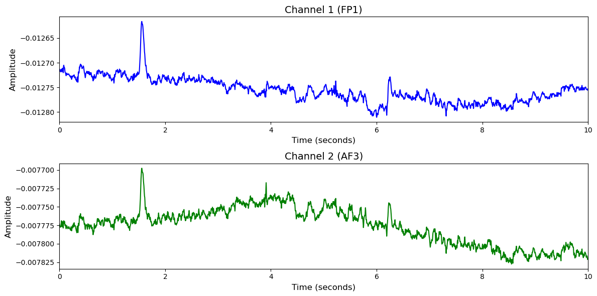

# 1. Dataset Information

HCI-Tagging (Emotion)데이터셋[1] 은 감정 인식을 위한 멀티모달 생체신호 데이터셋으로, 총 27명의 피험자를 대상으로 수집되었습니다.

감정 인식 실험에서는 피험자들이 감정을 유도하는 20개의 영상 클립을 시청하는 동안 EEG(32채널), ECG, GSR, 호흡, 피부 온도, 시선 추적, 얼굴 영상 등 다양한 생체신호가 정밀하게 동기화되어 기록되었습니다. 각 트라이얼 이후 피험자들은 valence, arousal, dominance 및 감정 키워드에 대한 자기평가를 수행하였습니다.

# 2. Dataset Basic Information

## 2.1 Data Information

| # of Subjects | # of Leads | Sampling Frequency (Hz) | Recording Duration (min) | File Fomat |
| --- | --- | --- | --- | --- |
| 27 | 32 | 256 | 715 | (EEG).bdf |

## 2.2 Data Statistics

*EEG 전극에 해당하는 데이터만을 사용해 통계 분석을 수행하였습니다.

Emotion

| Label Type | #of recordings | EEG Mean | EEG Std | EEG Max | EEG Median | EEG Min |
| --- | --- | --- | --- | --- | --- | --- |
| Neutral (0) | 111     (21.1%) | -0.004219 | 0.007229 | 0.017457 | -0.004181 | -0.018748 |
| Anger (1) | 14       (2.7%) | -0.005724 | 0.007265 | 0.011509 | -0.004855 | -0.02153 |
| Disgust (2) | 55     (10.4%) | -0.003434 | 0.007043 | 0.015678 | -0.003195 | -0.018315 |
| Fear (3) | 39       (7.4%) | -0.002295 | 0.006965 | 0.015846 | -0.002047 | -0.017479 |
| Joy (4) | 85      (16.1%) | -0.002951 | 0.00683 | 0.015774 | -0.002798 | -0.01719 |
| Sadness (5) | 66     (12.5%) | -0.002686 | 0.007144 | 0.018151 | -0.002624 | -0.016903 |
| Surprise(6) | 26      (4.9%) | -0.003301 | 0.006372 | 0.013836 | -0.003337 | -0.016048 |
| Amusement (11) | 98     (18.6%) | -0.003292 | 0.006919 | 0.017119 | -0.003297 | -0.017745 |
| Anxiety (12) | 33      (6.3%) | -0.004176 | 0.007135 | 0.01646 | -0.003981 | -0.019251 |
| **Total** | 527 | -0.004 | 0.0069891 | 0.01575889 | -0.00337 | -0.01813433 |

Arousal

| Label Type | #of recordings | EEG Mean | EEG Std | EEG Max | EEG Median | EEG Min |
| --- | --- | --- | --- | --- | --- | --- |
| Low (0) | 257     (48.8%) | -0.003469 | 0.006633 | 0.014341 | -0.003204 | -0.017834 |
| High(1) | 270     (51.2%) | -0.003369 | 0.007368 | 0.018560 | -0.003394 | -0.017985 |
| **Total** | 527 | -0.003 | 0.0070005 | 0.0164505 | -0.0033 | -0.0179095 |

Valence

| Label Type | #of recordings | EEG Mean | EEG Std | EEG Max | EEG Median | EEG Min |
| --- | --- | --- | --- | --- | --- | --- |
| Low (0) | 240     (45.5%) | -0.003758 | 0.006942 | 0.014576 | -0.003498 | -0.018660 |
| High(1) | 287     (54.5%) | -0.003135 | 0.007067 | 0.018115 | -0.003138 | -0.017288 |
| **Total** | 527 | -0.003 | 0.0070045 | 0.0163455 | -0.00332 | -0.017974 |

Dominance

| Label Type | #of recordings | EEG Mean | EEG Std | EEG Max | EEG Median | EEG Min |
| --- | --- | --- | --- | --- | --- | --- |
| Low (0) | 208     (39.5%) | -0.003186 | 0.006906 | 0.016680 | -0.003161 | -0.017498 |
| High(1) | 319     (60.5%) | -0.003569 | 0.007078 | 0.016395 | -0.003393 | -0.018180 |
| **Total** | 527 | -0.003 | 0.006992 | 0.0165375 | -0.00328 | -0.017839 |

## 2.3 Raw Dataset

!!! note ""
    ```
    HCI-Tagging_emotion/
    ├── Sessions/
    │   ├── 10/
    │   │   ├── P1-Rec1-Guide-Cut.tsv
    │   │   ├── Part_1_S_Trial5_emotion.bdf
    │   │   └── session.xml
    │   ├── 1042/
    │   │   ├── P9-Rec1-Guide-Cut.tsv
    │   │   ├── Part_9_S_Trial1_emotion.bdf
    │   │   └── session.xml
    │   └── 1044/
    │       ├── P9-Rec1-Guide-Cut.tsv
    │       ├── Part_9_S_Trial2_emotion.bdf
    │       └── session.xml
    │   ... (524 more directories)
    └── Subjects/
    ├── subject1.xml
    ├── subject10.xml
    └── subject11.xml
    ... (26 more files)
    529 directories, 38 files
    ```

각 bdf 파일의 evt 채널에 라벨정보가 기록되어 있습니다.

## 2.4 Raw Dataset Example



## 2.5 Preprocessed Dataset

!!! note ""
    ```
    HCI-Tagging_emotion/
    ├── npy_files/
    │   ├── sub01_trial01.npy
    │   ├── sub01_trial02.npy
    │   └── sub01_trial03.npy
    │   ... (524 more files)
    ├── HCI-Tagging_emotion.h5
    ├── HCI-Tagging_emotion.npz
    └── channels.csv
    ... (4 more files)
    1 directories, 534 files
    ```

한 trial(자극)별로 split하고 .npy로 변환하였으며 이 파일명은 labels.csv의 1열과 대응되고, 2열엔 정수형 레이블이 있습니다.

# 3. Applications and Use Cases

| 인용 논문 | 연구 과제 | 모델 구조 | 방법론 |
| --- | --- | --- | --- |
| Soleymani et al. (2011) [1] | 다중 모달 감정 인식 및 암시적 태깅 연구 | 통계적 머신러닝 기반 다중 모달 융합 | 얼굴 비디오, 오디오, EEG, 심장 신호(GSR 포함) 등 다양한 생리 및 행동 신호를 융합하여 특징 추출 후 감정 상태 분류 |
| Gu et al. (2023) [2] | EEG 기반 감정 분류에서의 연속 라벨링 시스템 개발 및 성능 비교 연구 | EEGNet, GCN 등 다양한 분류기 기반의 연속 라벨 기반 감정 분류 모델 | SEED 데이터 기반 영상 자극 동안 EEG 수집 및 연속적 감정 유도 정도 라벨링, DE Feature 추출 후 SVM, CNN, LSTM 등 다양한 모델로 분류 실험 수행. 기존 discrete 라벨과의 성능 비교, cross-dataset 적용 실험 포함 |

# 4. References

[1] Soleymani, M., Lichtenauer, J., Pun, T., & Pantic, M. (2011). A multimodal database for affect recognition and implicit tagging. IEEE Transactions on Affective Computing, 3(1), 42-55. [https://doi.org/10.1109/T-AFFC.2011.25](https://doi.org/10.1109/T-AFFC.2011.25)

[2] Gu, R.-F., Zhao, L.-M., Zheng, W.-L., & Lu, B.-L. (2023). *Tagging continuous labels for EEG-based emotion classification*. IEEE Transactions on Affective Computing
