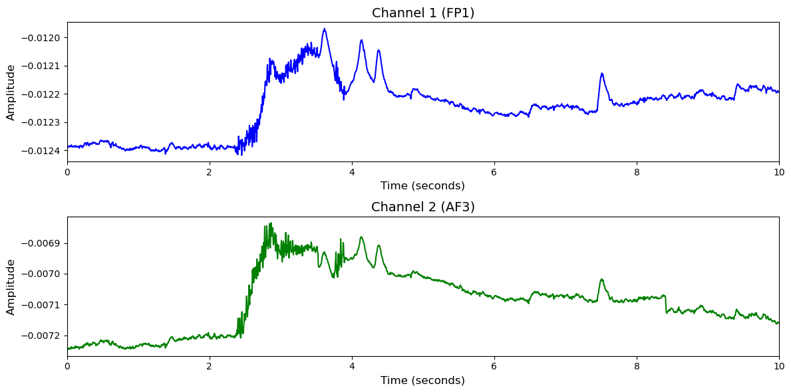

# 1. Dataset Information

HCI-Tagging (ERP) 데이터셋[1] 은 감정 인식과 암묵적 태깅을 위한 멀티모달 생체신호 데이터셋으로, 총 27명의 피험자를 대상으로 수집되었습니다. 암묵적 태깅 실험에서는 피험자들에게 정적 이미지와 짧은 영상이 제시되었으며, 동일한 자극에 대해 정답 또는 오답 태그가 부착된 상태로 반복 제시되었습니다. 피험자는 제시된 태그의 적절성에 대해 동의 여부를 버튼으로 응답하였고, 이때의 얼굴 표정과 시선 반응이 기록되어 자극에 대한 무의식적 반응을 통해 태그의 정확성을 추론할 수 있도록 구성되었습니다.

# 2. Dataset Basic Information

## 2.1 Data Information

| # of Subjects | # of Leads | Sampling Frequency (Hz) | Recording Duration (min) | File Fomat |
| --- | --- | --- | --- | --- |
| 27 | 32 | 256 | 715 | (EEG).bdf |

## 2.2 Data Statistics

*EEG 전극에 해당하는 데이터만을 사용해 통계 분석을 수행하였습니다.

| Label Type | #of recordings | EEG Mean | EEG Std | EEG Max | EEG Median | EEG Min |
| --- | --- | --- | --- | --- | --- | --- |
| Correct(0) | 2284     (93.8%) | -0.001731 | 0.008554 | 0.030855 | -0.002230 | -0.015957 |
| Incorrect(1) | 152      (6.2%) | -0.002591 | 0.008254 | 0.020470 | -0.001989 | -0.020457 |
| **Total** | 2436 | -0.002 | 0.008404 | 0.0256625 | -0.00211 | -0.018207 |

## 2.3 Raw Dataset

!!! note ""
     HCI-Tagging_ERP/
     ├── hci-tagging-image1/
     │   ├── Sessions/
     │   │   ├── 1082/
     │   │   │   ├── P9-Rec2-Guide-Cut.tsv
     │   │   │   ├── Part_9_Trial1_taggingImages1.bdf
     │   │   │   └── session.xml
     │   │   ├── 1083/
     │   │   │   ├── P9-Rec2-Guide-Cut.tsv
     │   │   │   ├── Part_9_Trial2_taggingImages1.bdf
     │   │   │   └── session.xml
     │   │   └── 1084/
     │   │       ├── P9-Rec2-Guide-Cut.tsv
     │   │       ├── Part_9_Trial3_taggingImages1.bdf
     │   │       └── session.xml
     │   │   ... (809 more directories)
     │   └── Subjects/
     │       ├── subject1.xml
     │       ├── subject10.xml
     │       └── subject11.xml
     │       ... (26 more files)
     ├── hci-tagging-image2/
     │   ├── Sessions/
     │   │   ├── 1000/
     │   │   │   ├── P8-Rec3-Guide-Cut.tsv
     │   │   │   ├── Part_8_Trial19_taggingImages2.bdf
     │   │   │   └── session.xml
     │   │   ├── 1001/
     │   │   │   ├── P8-Rec3-Guide-Cut.tsv
     │   │   │   ├── Part_8_Trial20_taggingImages2.bdf
     │   │   │   └── session.xml
     │   │   └── 1002/
     │   │       ├── P8-Rec3-Guide-Cut.tsv
     │   │       ├── Part_8_Trial21_taggingImages2.bdf
     │   │       └── session.xml
     │   │   ... (809 more directories)
     │   └── Subjects/
     │       ├── subject1.xml
     │       ├── subject10.xml
     │       └── subject11.xml
     │       ... (26 more files)
     └── hci-tagging-video/
     ├── Sessions/
     │   ├── 1012/
     │   │   ├── P8-Rec4-Guide-Cut.tsv
     │   │   ├── Part_8_Trial1_taggingVideos.bdf
     │   │   └── session.xml
     │   ├── 1013/
     │   │   ├── P8-Rec4-Guide-Cut.tsv
     │   │   ├── Part_8_Trial2_taggingVideos.bdf
     │   │   └── session.xml
     │   └── 1014/
     │       ├── P8-Rec4-Guide-Cut.tsv
     │       ├── Part_8_Trial3_taggingVideos.bdf
     │       └── session.xml
     │   ... (809 more directories)
     └── Subjects/
     ├── subject1.xml
     ├── subject10.xml
     └── subject11.xml
     ... (26 more files)
    2445 directories, 114 files

각 bdf 파일의 evt 채널에 라벨정보가 기록되어 있습니다.

## 2.4 Raw Dataset Example

## 2.5 Preprocessed Dataset

!!! note ""
     HCI-Tagging_ERP/
     ├── npy_files/
     │   ├── sess01_sub01_trial01.npy
     │   ├── sess01_sub01_trial02.npy
     │   └── sess01_sub01_trial03.npy
     │   ... (2433 more files)
     ├── (labels).csv
     ├── HCI-Tagging_ERP.h5
     └── HCI-Tagging_ERP.npz
     ... (2 more files)
    1 directories, 2441 files

한 trial(자극)별로 split하고 .npy로 변환하였으며 이 파일명은 labels.csv의 1열과 대응되고, 2열엔 정수형 레이블이 있습니다.

# 3. Applications and Use Cases

| 인용 논문 | 연구 과제 | 모델 구조 | 방법론 |
| --- | --- | --- | --- |
| Soleymani (2011) [1] | 생리신호 기반 영상 자동 태깅 (Implicit Tagging) | Binary Relevance 기반 다중 SVM 분류기 구조 | 영상 시청 중 측정된 EEG, GSR, ECG, Respiration 등의 생리신호로부터 통계 기반 피처 추출 후, 각 태그별로 개별 SVM 학습. Leave-one-subject-out 교차검증 및 AUC로 성능 평가 수행 |
| Soleymani & Pantic (2013) [2] | EEG 신호를 활용한 감정 태깅(emotional tagging) 및 태그 적합성 평가(tag relevance assessment) | SVM (감정 분류), LDA (태그 적합성 분류), EEG ERP 기반 분석 | MAHNOB-HCI 데이터셋 기반 실험: 감정 유발 영상 시청 후 자가 평가, 이미지와 태그에 대한 ERP 반응 기반 자동 적합성 판별, electrode 수 축소 및 참가자 응답 집계를 통한 정확도 향상 검증 |

# 4. References

[1] Soleymani, M., Lichtenauer, J., Pun, T., & Pantic, M. (2011). A multimodal database for affect recognition and implicit tagging. IEEE Transactions on Affective Computing, 3(1), 42-55. [https://doi.org/10.1109/T-AFFC.2011.25](https://doi.org/10.1109/T-AFFC.2011.25)
[2] Soleymani, M., & Pantic, M. (2013). Multimedia implicit tagging using EEG signals. *IEEE Transactions on Affective Computing*, 3(1), 42–55.
