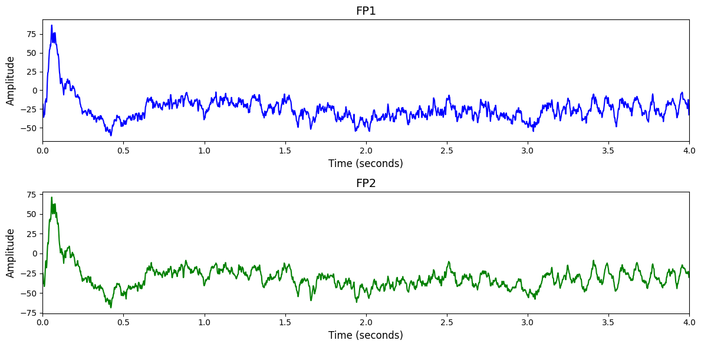

# 1. Dataset Information

이 데이터셋은 14명의 건강한 피험자가 128채널 EEG로 손과 발의 움직임 또는 휴식 상태를 수행하며 수집된 고감마 뇌파 데이터입니다. 각 피험자는 4초 길이의 trial을 총 13번의 run에 걸쳐 수행하였으며, 좌/우 손, 양발, 휴식의 4가지 클래스가 포함됩니다. 자극은 화살표 형태로 제시되었고, 실험은 BCI2000을 통해 수행되었습니다 [1].

# 2. Dataset Basic Information

## 2.1 Data Information

| # of Subjects | # of Leads | Sampling Frequency (Hz) | Recording Duration (min) | File Fomat |
| --- | --- | --- | --- | --- |
| 14 | 128 | 500 | 0.0667 | (EEG).edf, (EEG).mat |

## 2.2 Data Statistics

*EEG 전극에 해당하는 데이터만을 사용해 통계 분석을 수행하였습니다.

| Label Type | #of recordings | EEG Mean | EEG Std | EEG Max | EEG Median | EEG Min |
| --- | --- | --- | --- | --- | --- | --- |
| LH | 2810 | 70.315554 | 140.017974 | 81815.720000 | 103.974486 | -6929.467534 |
| RH | 2812 | 70.018788 | 136.263332 | 6554.624238 | 103.419824 | -10989.263575 |
| BF | 2812 | 72.112846 | 137.429742 | 3436.377821 | 106.350308 | -11069.800000 |
| RE | 2810 | 70.376785 | 135.724591 | 7203.863993 | 104.134555 | -7663.017510 |
| Total | 11244 | 70.564832 | 141.205774 | 81815.720000 | 104.235601 | -11069.800000 |

## 2.3 Raw Dataset

!!! note ""
     High-Gamma/
    ├── data/
    │   ├── test/
    │   │   ├── 1.edf
    │   │   ├── 1.mat
    │   │   └── 10.edf
    │   │   ... (25 more files)
    │   ├── train/
    │   │   ├── 1.edf
    │   │   ├── 1.mat
    │   │   └── 10.edf
    │   │   ... (25 more files)
    │   └── trained-parameters/
    │       ├── deep/
    │       │   ├── 1.pkl
    │       │   ├── 10.pkl
    │       │   └── 11.pkl
    │       │   ... (11 more files)
    │       └── shallow/
    │           ├── 1.pkl
    │           ├── 10.pkl
    │           └── 11.pkl
    │           ... (11 more files)
    ├── LICENSE.txt
    ├── [README.md](http://readme.md/)
    └── [example.py](http://example.py/)
    6 directories, 77 files
    

각 피험자별로 .edf 형식의 원시 EEG 신호와 .mat 형식의 라벨 및 메타데이터가 쌍으로 존재하며, 데이터는 train과 test 폴더로 구분되어 있습니다. 신호는 128채널로 500Hz로 기록되었으며, 각 trial은 4초 길이로 총 4개 클래스(좌손, 우손, 양발, 휴식)를 포함합니다.

## 2.4 Raw Dataset Example

## 2.5 Preprocessed Dataset

!!! note ""
     High_Gamma/
     ├── npy_files/
     │   ├── sess1_sub10_trial1.npy
     │   ├── sess1_sub10_trial10.npy
     │   └── sess1_sub10_trial100.npy
     │   ... (11241 more files)
     ├── channels.csv
     └── labels.csv
    1 directories, 11246 files

# 3. Applications and Use Cases

| 인용 논문 | 연구 과제 | 모델 구조 | 방법론 |
| --- | --- | --- | --- |
| Song (2022) [2] | EEG 기반 Motor Imagery 및 감정 인식 EEG 분류 및 시각화 | Convolution + Transformer 기반 EEG Conformer | CNN으로 시간 및 공간상의 로컬 특징을 추출하고, Self-Attention 모듈로 글로벌 시계열 상관관계를 포착하여 통합된 EEG 분류 수행. 클래스 활성 시각화 기법을 도입해 해석 가능성 강화. |
| Altaheri (2023) [3] | EEG 기반 Motor Imagery 분류 및 재활 BCI 시스템 개발 | ATCNet (Attention-based Temporal Convolutional Network) | Convolutional block으로 저수준 시공간 특징을 추출한 후, self-attention으로 중요한 특징을 강조하고, Temporal Convolutional block으로 장기 temporal 패턴을 포착. 전처리 없이 raw EEG에서 직접 MI 특징 추출. |

# 4. References

[1] Schirrmeister, Robin Tibor, et al. "Deep learning with convolutional neural networks for EEG decoding and visualization." *Human brain mapping* 38.11 (2017): 5391-5420.
[2] Song, Yonghao, et al. "EEG conformer: Convolutional transformer for EEG decoding and visualization." *IEEE Transactions on Neural Systems and Rehabilitation Engineering* 31 (2022): 710-719.
[3] Altaheri, Hamdi, Ghulam Muhammad, and Mansour Alsulaiman. "Physics-informed attention temporal convolutional network for EEG-based motor imagery classification." *IEEE transactions on industrial informatics* 19.2 (2022): 2249-2258.
