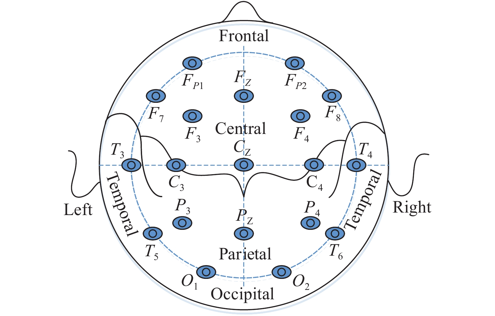

# EEG Dataset

# 1. 서론

최근 생체 신호 기반 헬스케어 기술이 급속히 발전함에 따라, 뇌전도(EEG, Electroencephalogram) 데이터를 활용한 인공지능(AI) 연구도 활발히 이루어지고 있습니다. EEG는 뇌의 전기적 활동을 비침습적으로 측정할 수 있는 대표적인 생체신호로, 신경과학 및 임상 진단, 뇌-컴퓨터 인터페이스(BCI), 수면 분석, 정신질환 감지 등 다양한 분야에서 활용되고 있습니다. 특히, 다채널 EEG 데이터를 대규모로 수집하고 이를 정밀하게 분석함으로써, 인간의 인지 상태나 뇌 질환의 조기 진단이 가능해지고 있으며, 이를 기반으로 한 AI 기반 예측 및 진단 시스템의 가능성이 점차 현실화 되고 있습니다.

그러나 EEG 데이터의 특성과 AI 적용 과정에서는 여러 기술적 도전 과제가 존재합니다. 첫째, 고품질의 라벨링된 EEG 데이터셋은 수집 및 주석 작업이 매우 복잡하고 비용이 많이 들기 때문에, 대부분의 연구 환경에서는 학습에 충분한 라벨 데이터를 확보하기 어렵습니다. 둘째, EEG 신호는 매우 낮은 신호 대 잡음 비(SNR)를 가지며, 근전도(EMG), 안구 운동(EOG), 전극 접촉 잡음 등 다양한 아티팩트(artifact)에 취약합니다. 셋째, EEG 신호는 개인 차가 매우 크고, 뇌의 상태에 따라 동적인 변화를 보이기 때문에, 특정 조건에서 훈련된 모델이 일반화되기 어렵다는 한계가 있습니다. 이러한 요인들은 EEG 기반 AI 시스템의 신뢰성과 임상 적용 가능성을 제한하는 주요 요소입니다.

이러한 배경에서, 다양한 조건과 주석 정보를 갖춘 고품질 EEG 데이터셋의 필요성이 크게 증가하고 있습니다. 예를 들어, Temple University Hospital EEG Corpus(TUH EEG)는 대규모 임상 EEG 데이터셋으로서, 발작(epileptic seizure) 감지 및 분류를 위한 풍부한 라벨 정보를 제공하며, 여러 연구에서 고성능 AI 모델 개발에 활용되고 있습니다. 이 외에도, 수면 단계 분석, 감정 인식, 집중도 측정 등 다양한 응용 사례에 적합한 EEG 데이터셋들이 점차 공개되고 있으며, 이를 기반으로 실제 제품 화가 가능한 AI 헬스케어 솔루션이 개발되고 있습니다.

또한, 최근에는 원격 정신 건강 모니터링, 웨어러블 EEG 디바이스, 개인 맞춤형 BCI 솔루션의 수요가 증가함에 따라, 비 대면 환경에서도 EEG 기반 실시간 분석이 가능한 기술에 대한 연구가 활발히 진행되고 있습니다. 정부 및 보건 의료 산업에서도 디지털 치료기기 및 정신 질환 조기 진단 기기의 인증 기준과 보험 적용 방안을 마련하는 등, EEG 데이터셋의 사회적·경제적 가치가 빠르게 증명되고 있는 추세입니다.

본 백서는 뇌 신경 과학 연구자, 의료인, 디지털 헬스케어 기업, AI 개발자 등 EEG 데이터를 기반으로 새로운 진단 및 모니터링 솔루션을 개발하고자 하는 전문가를 대상으로 작성되었습니다. EEG 데이터셋의 기술적 개요, 채널 구성 및 수집 조건, 신호 특성과 라벨링 정보를 정리하고, 대표적인 공개 데이터셋의 비교와 활용 사례, 그리고 최신 AI 기법(Few-shot 학습, 전이 학습 등)을 적용한 연구 동향을 종합적으로 소개합니다.

# 2. **EEG 데이터 설명**

EEG(뇌파, Electroencephalogram)는 뇌의 전기 생리적 활동을 두피 표면에 부착된 전극을 통해 기록하는 기술입니다. 뇌는 수십억 개의 뉴런으로 구성되어 있으며, 각 뉴런은 신경전달 과정에서 미세한 전기 신호를 발생시킵니다. 

이러한 전기적 활동이 모여 국소적인 전위차를 형성하게 되며, 이는 피부 표면에 위치한 전극을 통해 측정 가능합니다. EEG는 뇌의 기능적 상태를 비침습적으로 실시간 감지할 수 있는 대표적인 방법으로, 임상 진단부터 뇌-컴퓨터 인터페이스(BCI), 정신 상태 추정, 감정 인식 등 다양한 분야에서 광범위하게 활용되고 있습니다.

EEG는 특히 시간 해상도가 매우 뛰어나 수 ms 수준의 빠른 뇌 반응을 측정할 수 있지만, 공간 해상도는 비교적 낮은 편입니다. 이에 따라 EEG는 "어디서"보다 "언제" 뇌에서 어떤 일이 일어났는지를 관찰하는 데 매우 적합합니다. 아래는 EEG 데이터의 주요 구성 요소에 대한 상세한 설명입니다.

## 2.1 전극 배치 및 채널 수 (Electrode Placement & Channels)

EEG 측정은 전극을 두피 위 여러 지점에 부착하여 수행됩니다. 전극의 위치는 국제 표준화된 시스템에 따라 명명되며, 가장 대표적으로는 **10-20 시스템**이 사용됩니다. 

이 시스템은 두개골의 크기와 형태에 따라 전극을 일정한 간격으로 배치하여 신뢰할 수 있는 측정을 가능하게 합니다.

전극 이름은 위치에 따라 결정되며, 일반적으로 다음과 같은 패턴을 따릅니다:

- **Fp** (Frontal pole), **F** (Frontal), **C** (Central), **P** (Parietal), **O** (Occipital), **T** (Temporal)
- 예: Fp1, F3, C4, Pz, Oz 등

**전극 배치 시스템**

| **10-20 시스템** | 21개 전극 배치, 가장 일반적인 임상/연구 표준 | 대부분의 상용 EEG 시스템 |
| --- | --- | --- |
| **10-10 시스템** | 10-20의 중간점을 더 세분화 (64~128채널까지 확장 가능) | 고해상도 연구용 |
| **10-5 시스템** | 약 345개 전극, 매우 고밀도 EEG | 세밀한 공간 해상도 연구 |

일반적으로 채널 수가 많을수록 분석 정밀도가 높아지지만, 장비 비용, 착용 시간, 아티팩트 가능성도 증가하게 됩니다.

## 2.2 기록 시간 (Recording Duration)

EEG는 실험의 목적에 따라 수 초 단위의 짧은 기록부터 수 시간~수 일 단위의 장기 기록까지 다양한 시간 범위를 가질 수 있습니다.

- **Short-term EEG**
    - 실험실 조건에서 주로 수행되며, 특정 자극 제시나 과제를 통해 유도된 뇌 반응을 분석합니다.
    - 일반적으로 수 초에서 수 분 정도의 시간 범위입니다.
    - ERP(Event-Related Potential), Motor Imagery, Emotion Recognition 등에 주로 사용됩니다.
- **Long-term EEG**
    - 수면 연구, 간질 탐지 등의 임상 영역에서 수 시간~수 일 단위로 연속 측정합니다.
    - 환자의 자연 상태에서 수면 단계, 발작 발생 여부 등을 파악합니다.
    - 웨어러블 장비 또는 병원용 장비(Holter EEG, ambulatory EEG)를 활용됩니다.
    

Long-term EEG는 artifact 관리, 데이터 저장, 라벨링 등에서 기술적 난이도가 높기 때문에 전처리 기술이 중요합니다.

## 2.3 샘플링 주파수 (Sampling Frequency)

EEG는 아날로그 전기 신호를 디지털 신호로 변환하여 저장하며, 이때 샘플링 주파수(Sampling Frequency)가 중요합니다. 이는 1초에 몇 번 EEG 신호를 측정할 것인지 나타내는 지표로, 단위는 Hz(헤르츠)입니다.

### **128–256 Hz**

- **적용 분야**: 상용 EEG 기기, 감정 인식, 피로도 측정, 인지 상태 분석
- **설명**: 주로 저주파 대역(Delta~Beta)을 사용하는 태스크에 적합하며, 감정 인식 및 피로 추정과 같은 실시간 인터페이스에서도 충분한 해상도를 제공합니다.

---

### **500–1000 Hz**

- **적용 분야**: ERP(Event-Related Potential) 분석, 뇌 질환 진단, 병리적 신호 탐지
- **설명**: 빠르게 나타나는 ERP 반응(P300, N200 등)을 정확히 포착하기 위해 필수적인 주파수 대역입니다. 시간 해상도가 높아 ERP 피크 검출, 반응 시간 분석, 발작 전조 신호 탐지에 적합합니다.

---

### **1000 Hz 이상**

- **적용 분야**: 고주파 기반 인지 분석, 뇌 미세 진동 측정, EMG/잡음 분리
- **설명**: 고주파 성분 분석이 필요한 경우(예: Gamma 대역, 뇌전도 ECoG, 미세 진동 분석 등)에 사용합니다. 근전도(EMG) 신호, 심장 간섭 등과의 분리에도 효과적이며, 고속 샘플링이 가능한 고급 의료기기 또는 연구용 장비에서 사용됩니다.

일반적으로 Nyquist 이론에 따라 분석하려는 주파수보다 최소 2배 이상의 샘플링 주파수가 요구됩니다. 예를 들어, 100Hz까지 분석하려면 최소 200Hz로 샘플링 해야합니다.

## 2.4 주파수 밴드와 의미 (Frequency Bands)

EEG 신호는 여러 주파수 대역으로 분해되어 분석됩니다. 각각의 밴드는 뇌의 상태나 기능과 밀접하게 연관되어 있습니다.

### **Delta (1–4 Hz)**

- **관련 뇌 기능**: 깊은 수면, 무의식, 뇌 손상 가능성
- **특징**: 주로 수면 중 나타나며, 깨어 있는 상태에서의 과도한 Delta 활동은 뇌 손상이나 인지 저하와 관련될 수 있습니다.

---

### **Theta (4–8 Hz)**

- **관련 뇌 기능**: 졸림, 명상, 창의적 사고, 기억 형성
- **특징**: 이완된 상태나 인지적 몰입 시 증가하며, 어린이에게서 자연스럽게 많이 나타납니다.

---

### **Alpha (8–12 Hz)**

- **관련 뇌 기능**: 이완, 눈을 감은 안정 상태
- **특징**: 후두엽에서 뚜렷하며, 눈을 뜨거나 주의를 기울일 때 억제됩니다. (Alpha suppression은 집중 신호)

---

### **Beta (12–25 Hz)**

- **관련 뇌 기능**: 주의 집중, 논리적 사고, 인지적 각성
- **특징**: 전두엽 중심으로 활성화되며, 문제 해결이나 스트레스 상태에서 뚜렷해집니다.

---

### **Gamma (25Hz 이상)**

- **관련 뇌 기능**: 고도 인지, 작업 기억, 의식적 사고
- **특징**: 뇌의 여러 영역 간 통합적 정보 처리를 반영하며, 복잡한 인지 작업 중 증가합니다.

## 2.5 다운스트림 태스크 설명 (Downsteam Task)

### **1) Seizure Detection**

- **정의**: EEG에서 간질(발작) 여부를 탐지하는 과제
- **분야**: 임상진단, 실시간 경보, 신경 자극 제어
- **특징**: Spike, sharp wave, burst-suppression 등 발작 관련 뇌파 패턴을 포착하여 조기 경고 가능

---

### **2) Vigilance Estimation / Variability Prediction**

- **정의**: 사용자의 집중도 또는 각성 상태 수준을 추정하거나 시간에 따른 변동성을 분석
- **분야**: 졸음운전 방지, 피로 모니터링, 장시간 작업 안정성 분석
- **특징**: Alpha 감소 + Theta 증가 → 졸음 상태 및 주의력 저하의 생체 지표

---

### **3) Event Type Classification**

- **정의**: 외부 자극(시각, 청각)이나 병리적 이상 이벤트(스파이크, 샤프파 등)에 대한 뇌 반응을 분류
- **분야**: BCI 인터페이스, 감각 모달리티 분석, 병리적 EEG 이벤트 탐지
- **특징**: ERP 기반 시간적 패턴 또는 병리적 이상 파형(예: spike, sharp wave) 분류에 사용되며 시간-주파수 특성 기반의 이벤트 탐지가 가능함

---

### **4) Abnormal Detection**

- **정의**: EEG 내에서 일반적이지 않은 이상 신호나 잡음을 감지
- **분야**: 신경 질환 조기 진단, EEG 데이터 정제 및 품질 관리
- **특징**: 비정상 spike-wave, burst, motion artifact 등을 자동 탐지

---

### **5) Mental Workload Classification**

- **정의**: 과제 수행 중의 뇌 인지 부하 정도를 정량화
- **분야**: 조종/운전 중 부하 감시, 맞춤형 교육, 스마트 작업환경
- **특징**: Frontal Theta 증가, Parietal Alpha 감소 → 고부하 지표

---

### **6) Emotion Recognition**

- **정의**: EEG를 이용해 사용자의 감정 상태(긍정/부정/중립 등)를 분류
- **분야**: 감성 컴퓨팅, 감정 기반 인터랙션, HCI
- **특징**: 감정 유도 자극 → 자율신경 반응 변화 및 뇌파 패턴으로 감정 판별

---

### **7) Error-Related Potentials (ErrP) Detection**

- **정의**: 사용자가 실수를 인지했을 때 발생하는 ERP를 탐지
- **분야**: BCI 보정, 인간-로봇 상호작용 오류 감지
- **특징**: 실수 인식 후 200–300ms 부근에서 N200/Pe 신호 등 음의 편향 발생

---

### **8) Cognitive Workload Estimation**

- **정의**: 문제 해결, 암기 등 고차 인지 수행 시의 뇌 활성도를 추정
- **분야**: 인지 훈련, 학습 피드백 시스템, 작업 적정성 평가
- **특징**: 전두엽 활성 증가 + Theta 밴드 증가 → 높은 인지 부하 상태

---

### **9) Mental Disorder Diagnosis**

- **정의**: 우울증, 조현병, ADHD 등 정신질환의 존재 여부나 정도를 분류
- **분야**: 정신과 진단 보조, 뇌 기반 생체표지자(Biomarker) 탐색
- **특징**: 연결성 약화, 비선형성, 복잡도 저하 등 비정상 패턴 탐지

---

### **10) Motor Imagery Classification**

- **정의**: 움직임을 실제로 하지 않고 상상만 했을 때의 뇌파를 분류
- **분야**: 뇌-컴퓨터 인터페이스(BCI), 재활 로봇, 의수 제어
- **특징**: Sensorimotor Rhythm의 ERD/ERS 분석 → Mu/Beta 억제 패턴 반영

---

### **11) Sleep Stage Detection**

- **정의**: EEG로 수면 단계를 자동으로 분류 (Wake, N1, N2, N3, REM)
- **분야**: 수면장애 진단, 수면 질 평가, 수면 모니터링 시스템
- **특징**: 수면 단계별 고유 주파수 패턴(Delta, Spindle 등) 활용

---

### **12) P300 Speller**

- **정의**: 사용자가 주목한 자극에 대한 P300 반응을 탐지하여 문자를 입력
- **분야**: 전신 마비/ALS 환자 의사소통 보조 시스템
- **특징**: 300ms 부근에서의 명확한 ERP 반응을 기반으로 선택된 자극을 판단

---

### **13) Galvanic Response Recognition**

- **정의**: EEG와 GSR(피부 전도) 등의 신호를 통합하여 감정 상태 등을 추정
- **분야**: 스트레스 측정, 감정 기반 인터페이스, 멀티모달 감성 분석
- **특징**: EEG + GSR 등 Modal Fusion → 감정 인식 정확도 향상

---

### **14) Imagined Speech Classification**

- **정의**: 발화를 하지 않고 머릿속에서 상상한 단어나 문장을 EEG로 분류
- **분야**: Silent Speech BCI, 무언어 커뮤니케이션 시스템
- **특징**: ERP가 매우 약하고 개인차 커서 고난이도 과제

---

### **15) Gait Prediction**

- **정의**: EEG로 보행 의도, 리듬, 속도 등을 예측
- **분야**: 외골격 로봇 제어, 재활 보조 시스템, 보행 피드백 시스템
- **특징**: Motor Imagery 기반 실시간 보행 제어 가능성 탐색

# 3. **EEG 연구 동향**

EEG(뇌전도)는 두피에 부착된 전극을 통해 뇌의 전기적 활동을 비침습적으로 측정하는 생체신호로, 간질 발작, 수면 단계, 인지 기능, 정서 상태 등을 반영할 수 있는 중요한 지표로 널리 활용되어 왔습니다. 최근에는 AI 기술의 발달로 EEG 분석의 자동화 및 정밀화가 가속화되면서, 의료와 헬스케어뿐만 아니라 뇌-컴퓨터 인터페이스(BCI), 웨어러블 기기, 정신 건강 관리 등 다양한 영역에서 활용 범위가 빠르게 확장되고 있습니다.

## 3.1 과거: 전통적 EEG 해석 방식의 한계와 전환 배경

기존 EEG 분석은 주로 다음과 같은 방식으로 이루어졌습니다:

- **신호처리 기반 특징 추출**: PSD(Power Spectral Density), 공통 공간 패턴(CSP), 파형 형태 분석 등
- **기계학습 기반 분류**: SVM, k-NN, LDA 등을 활용해 뇌 질환 유무나 수면 단계 분류 시도

이러한 방법들은 명확한 해석력을 제공하지만, 다음과 같은 한계도 있었습니다:

- **수작업 기반 전처리 필요**: 노이즈 제거, 채널 선택 등 전문가 개입 필요
- **잡음과 아티팩트에 민감**: 눈 깜빡임, 근육 움직임 등의 영향을 크게 받음
- **시간적 패턴 반영 어려움**: 고정된 창(window) 단위 분석으로 전체 맥락 포착에 한계

이러한 한계로 인해, 복잡한 EEG 패턴을 자동으로 학습하고 해석할 수 있는 딥러닝 기반 접근 방식으로의 전환이 시작되었습니다.

## 3.2 현재: 딥러닝 기반 EEG 분석 기술의 급속한 확산

최근 EEG 분석은 AI, 특히 딥러닝 기술의 도입을 통해 큰 전환기를 맞이하고 있습니다. 주요 특징은 다음과 같습니다:

- **모델 다양화**:
    - CNN은 채널 간 공간 정보를 자동 추출
    - RNN/LSTM은 시계열 패턴을 학습하여 시간적 연속성 반영
    - Transformer는 자기 주의(attention)를 통해 장기 의존성 정보까지 처리
    - GNN(Graph Neural Network)은 EEG 채널 간 기능적 연결성을 그래프 구조로 모델링
- **응용 확장**:
    - 간질, 알츠하이머, ADHD, 우울증 등 질환 진단 정확도 향상
    - 수면 단계 분류에서 전문가 수준에 근접한 자동화 모델 등장
    - P300, SSVEP 기반 BCI에서 실시간 제어 가능성 확보
    - 웨어러블 EEG를 통한 스트레스·집중도 실시간 측정
- **기술적 성과**:
    - 대규모 EEG 데이터셋을 기반으로 학습된 딥러닝 모델이 향상된 정확도를 기록
    - 주의 메커니즘을 활용해 해석 가능성(Explainability) 확보
    - 단일 채널 또는 축소형 장비로도 상용 수준의 분석 성능 확보

이와 같은 기술 발전은 병원 외부에서도 EEG 분석을 가능하게 하며, 진단 및 모니터링의 패러다임을 바꾸고 있습니다.

## 3.3 미래 전망: 실시간, 맞춤형, 설명 가능한 EEG AI의 진화

딥러닝 기반 EEG 분석은 향후 다음과 같은 방향으로 진화할 것으로 예상됩니다:

- **개인화(Personalization)**:
    
    전이 학습 및 few-shot learning을 활용한 사용자 맞춤형 EEG 분석 모델 개발. 개인 뇌파 특성에 따라 피드백·진단 정밀도 향상.
    
- **설명 가능한 AI(Explainable AI)**:
    
    의료적 신뢰 확보를 위한 시각화 및 주의 메커니즘 기반 해석 기능 강화. 딥러닝이 학습한 EEG 특징의 생리적 의미를 추적 가능하게.
    
- **경량화 및 실시간 처리**:
    
    모바일 환경에서도 구동 가능한 경량 신경망 개발. 웨어러블 기기와의 결합을 통해 일상 속 실시간 모니터링 및 경고 시스템 구현.
    
- **다중모달 융합**:
    
    EEG + 영상, 음성, 행동 데이터와의 결합을 통한 맥락 기반 상태 예측. 정신건강, 인지기능, 피로도 예측 정확도 향상.
    
- **산업화 가속**:
    
    디지털 헬스케어, BCI 기반 게임·교육·재활, 감정 기반 UX 등에 적용. OpenBCI, Dreem, Emotiv 등 기업이 시장 확대를 선도.
    

# 4. **EEG 데이터셋의 정제 및 활용 방안**

## 4.1 전처리(Preprocessing) 방법

EEG 데이터는 센서 수, 샘플링 주파수, 기록 길이, 채널 배치 등에서 데이터셋마다 다양한 특성을 지니고 있습니다. 이러한 차이를 효과적으로 처리하기 위해 전처리(Preprocessing) 과정이 필수적이며, 주요 방법은 다음과 같습니다.

- **4.1.1 Sampling Frequency 및 Duration 통일**
    
    EEG 데이터는 샘플링 주파수(예: 128Hz, 256Hz, 1,000Hz) 및 기록 시간(수 초~수 시간)이 데이터셋마다 다르므로 이를 표준화하는 과정이 필요합니다.
    
    - **Resampling**: 분석 목적에 따라 동일한 샘플링 레이트로 상향/하향 변환
    - **Windowing**: 긴 기록을 일정한 길이(예: 2초, 10초 등)의 윈도우로 나누어 처리
    - **Zero Padding**: 짧은 신호를 일정 길이로 맞추기 위해 0을 채워 입력 형태 통일
- **4.1.2 채널 수(Lead) 차이에 따른 처리**
    
    EEG 장비마다 측정 채널 수가 다르며(예: 1채널 ~ 128채널), 분석 목적에 따라 채널 정렬이 필요합니다.
    
    - **공통 채널 정렬**: 여러 데이터셋 간 공통된 채널만 추출하여 통일된 입력 구성
    - **채널 보간 (Interpolation)**: 결측 채널 데이터를 주변 채널을 바탕으로 보간
- **4.1.3 Noise Filtering**
    
    EEG 신호는 근전도(EMG), 안구운동(EOG), 전극 접촉 잡음 등의 노이즈가 섞여 있어 필터링이 매우 중요합니다.
    
    - **Bandpass Filter**: 일반적으로 0.5Hz~45Hz 범위의 뇌파 신호를 통과시키는 필터 적용
    - **Notch Filter**: 전원 주파수 간섭(60Hz/50Hz)을 제거
    - **ICA(Independent Component Analysis)**: 독립 성분 분석을 통한 아티팩트 제거
- **4.1.4 Normalization & Imputation**
    - **Normalization**: 신호 진폭의 편차를 줄이기 위한 정규화 기법 (예: Min-Max Scaling, Z-score)
    - **Imputation**: 결측 구간을 선형 혹은 다항 보간 방법 등으로 보완하여 안정적인 입력 구성

## 4.2 통합 활용 방안

- **4.2.1 단일 모델 학습**
    
    여러 소스에서 수집된 EEG 데이터셋을 통합하여 단일 모델로 학습할 수 있습니다. 이 과정에서 원본 데이터셋 간의 특성 차이로 인한 성능 저하를 방지하기 위해서는 정교한 정규화 및 채널 정렬, 입력 통일이 요구됩니다.
    
- **4.2.2 Transfer Learning**
    
    사전 학습된 EEG 분석 모델을 기반으로 새로운 EEG 데이터셋에서 추가 학습하는  방식입니다. 소규모 데이터셋에서도 높은 성능을 얻을 수 있으며, 뇌 질환 감지, 스트레스 분석 등 다양한 분야에서 활용됩니다.
    
- **4.2.3 Foundation Model**
    
    Foundation Model은 대규모 EEG 데이터셋을 Self-supervised 방식으로 학습한 범용 모델로, 다양한 신경 생리학적 분석 및 건강 모니터링 task에 적용 가능합니다. 특히 감정 인식, 집중도 측정, 인지 부하 분석 등 다양한 downstream task에 높은 확장성을 가집니다.
    

# 5. 데이터셋별 상세 소개

1. **사전훈련 (Pretraining)**
    
    [TUEG](tueg/)
    
    [Resting State EEG Data](resting-state-eeg-data/)
    
2. **발작 탐지 (Seizure Detection)**
    
    [TUSZ](tusz/)
    
    [TUSL](tusl/)
    
    [Neonate](neonate/)
    
    [Siena](siena/)
    
    [CHB-MIT](chb-mit/)
    
3. **주의력(피로도) 예측 Vigilance Variability Prediction**
    
    [Fatigueset](fatigueset/)
    
    [SPIS Resting State Dataset](spis-resting-state-dataset/)
    
4. **이벤트 유형 분류 Event Type Classification**
    
    [NMT(Events)](nmtevents/)
    
    [TUEV](tuev/)
    
5. **정상/비정상 분류 Abnormal Detection**
    
    [NMT(Scalp-EEG)](nmtscalp-eeg/)
    
    [TUAB](tuab/)
    
6. **정신적 부하 수준 분류 Mental Workload Classification**
    
    [Raw EEG Data](raw-eeg-data/)
    
    [Stew](stew/)
    
7. **감정 인식 (Emotion Recognition)**
    
    [SEED](seed/)
    
    [SEED-IV](seed-iv/)
    
    [SEED-V](seed-v/)
    
    [DREAMER](dreamer/)
    
    [DEAP](deap/)
    
    [Emobrain](emobrain/)
    
    [HCI-Tagging (Emotion)](hci-tagging-emotion/)
    
8. **실수 관련 전위 (Error-Related Potential)**
    
    [HCI-Tagging (ERP)](hci-tagging-erp/)
    
    [BCI-NER Challenge](bci-ner-challenge/)
    
9. **인지 부하 측정 (Cognitive Workload)**
    
    [Mental Arithmetic](mental-arithmetic/)
    
    [Berlin (dsr)](berlin-dsr/)
    
    [Berlin (nback)](berlin-nback/)
    
    [Berlin (wg)](berlin-wg/)
    
10. **정신 질환 진단 (Mental Disorder Diagnosis)**
    
    [Mumtaz2016](mumtaz2016/)
    
11. **운동 상상 분류 (Motor Imagery Classification)**
    
    [BCI IV-1](bci-iv-1/)
    
    [BCI IV-2a](bci-iv-2a/)
    
    [BCI IV-2b](bci-iv-2b/)
    
    [Physionet MI EEG](physionet-mi-eeg/)
    
    [SHU-MI](shu-mi/)
    
    [High Gamma](high-gamma/)
    
12. **P300 철자 입력 시스템 (P300 Speller)**
    
    [Inria BCI Challenge](inria-bci-challenge/)
    
    [Target Versus Non Target](target-versus-non-target/)
    
13. **수면 단계 탐지 (Sleep Stage Detection)**
    
    [2018 Physionnet Challenge](2018-physionnet-challenge/)
    
    [ISRUC Sleep](isruc-sleep/)
    
    [Sleep-EDF](sleep-edf/)
    
14. **발화 상상 분류 (Imagined Speech Classification)**
    
    [BCI2020-3](bci2020-3/)
    
15. **보행 예측 (Gait Prediction)**
    
    [MoBI](mobi/)
    
16. **파지-리프트 동작 인식 (Gal Recognintion)**
    
    [Grasp and Lift Challenge](grasp-and-lift-challenge/)
    

# 6. 결론

EEG는 뇌의 전기적 활동을 반영하는 생체 신호로서, 인지 상태, 감정, 질환 상태 등을 실시간으로 파악할 수 있는 중요한 정보를 담고 있습니다. 이러한 EEG의 잠재력은 최근 AI 기술의 발전과 맞물려 다양한 응용 가능성을 현실화시키고 있으며, 의료 진단 보조 시스템, 정신 건강 모니터링, 뇌-컴퓨터 인터페이스(BCI), 감성 컴퓨팅 등에서 핵심 기술로 부상하고 있습니다. 특히 고해상도 EEG 데이터와 딥러닝 기반 분석 기술의 결합은 기존의 수작업 중심 신호 해석을 대체하며, 더 높은 정밀도와 확장성을 확보하고 있습니다.

본 백서에서는 EEG의 기본 원리와 채널 구성, 주파수 대역, 다운스트림 태스크의 분류 및 특징을 상세히 소개하고, 다양한 공개 데이터셋과 그 활용 방식에 대해 종합적으로 정리하였습니다. 또한, EEG 데이터 분석에 필수적인 전처리 과정과 통합 모델 학습 전략, 최근 주목받는 전이 학습 및 Foundation Model의 적용 가능성까지 포함하여 실질적인 분석 및 개발 관점을 제공합니다. 이러한 기술적 논의는 실제 연구 및 산업 응용 현장에서 EEG 기반 AI 시스템을 설계하고 적용하는 데 있어 기초이자 실무적인 참고 자료가 될 수 있습니다.

EEG 기반 AI 기술 개발을 위해서는 대규모 고품질 EEG 데이터셋 확보, 신뢰도 높은 정제 및 정규화 기술, 개인화와 설명 가능성을 모두 고려한 AI 모델 개발이 중요합니다. 본 백서가 EEG 데이터를 기반으로 한 다양한 헬스케어 및 뇌과학 기술 개발에 있어 이론과 실무를 연결하는 출발점이 되기를 기대하며, 연구자, 의료인, 산업 관계자들이 함께 EEG 기반 디지털 헬스케어 생태계를 발전시키는 데 기여할 수 있기를 바랍니다.

# 7. EEG 기반모델

## LaBraM (ICLR 2024)

EEG는 뇌의 전기적 활동을 반영하는 생체 신호로서, 인지 상태, 감정, 질환 상태 등을 실시간으로 파악할 수 있는 중요한 정보를 담고 있습니다. 이러한 EEG의 잠재력은 최근 AI 기술의 발전과 맞물려 다양한 응용 가능성을 현실화시키고 있으며, 의료 진단 보조 시스템, 정신 건강 모니터링, 뇌-컴퓨터 인터페이스(BCI), 감성 컴퓨팅 등에서 핵심 기술로 부상하고 있습니다. 특히 고해상도 EEG 데이터와 딥러닝 기반 분석 기술의 결합은 기존의 수작업 중심 신호 해석을 대체하며, 더 높은 정밀도와 확장성을 확보하고 있습니다.

본 백서에서는 EEG의 기본 원리와 채널 구성, 주파수 대역, 다운스트림 태스크의 분류 및 특징을 상세히 소개하고, 다양한 공개 데이터셋과 그 활용 방식에 대해 종합적으로 정리하였습니다. 또한, EEG 데이터 분석에 필수적인 전처리 과정과 통합 모델 학습 전략, 최근 주목받는 전이 학습 및 Foundation Model의 적용 가능성까지 포함하여 실질적인 분석 및 개발 관점을 제공합니다. 이러한 기술적 논의는 실제 연구 및 산업 응용 현장에서 EEG 기반 AI 시스템을 설계하고 적용하는 데 있어 기초이자 실무적인 참고 자료가 될 수 있습니다.

EEG 기반 AI 기술 개발을 위해서는 대규모 고품질 EEG 데이터셋 확보, 신뢰도 높은 정제 및 정규화 기술, 개인화와 설명 가능성을 모두 고려한 AI 모델 개발이 중요합니다. 본 백서가 EEG 데이터를 기반으로 한 다양한 헬스케어 및 뇌과학 기술 개발에 있어 이론과 실무를 연결하는 출발점이 되기를 기대하며, 연구자, 의료인, 산업 관계자들이 함께 EEG 기반 디지털 헬스케어 생태계를 발전시키는 데 기여할 수 있기를 바랍니다.