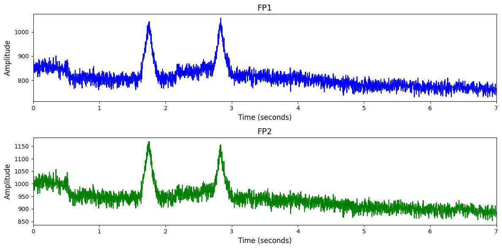

# Inria BCI Challenge

# 1. Dataset Information

이 데이터셋은 P300-Speller 기반의 BCI 실험에서 수집된 EEG 데이터로, 26명의 건강한 피험자가 시각 자극을 이용해 단어를 철자하는 과정에서 발생한 뇌파를 기록한 것이다. 실험은 빠른(4회 플래시) 및 느린(8회 플래시) 조건에서 수행되었으며, 오답 발생 여부를 피드백 이후의 뇌파 신호만으로 예측하는 것이 주요 과제이다. EEG는 56채널로 600Hz로 기록되었으며, 피험자는 총 5개의 복사 철자 세션을 수행하였다 [^1].

# 2. Dataset Basic Information

## 2.1 Data Information

| # of Subjects | # of Leads | Sampling Frequency (Hz) | Recording Duration (min) | File Fomat |
| --- | --- | --- | --- | --- |
| 16 | 56 | 200 | 5 | (EEG).csv |

## 2.2 Data Statistics

*EEG 전극에 해당하는 데이터만을 사용해 통계 분석을 수행하였습니다.

| Label Type | #of recordings | EEG Mean | EEG Std | EEG Max | EEG Median | EEG Min |
| --- | --- | --- | --- | --- | --- | --- |
| Correct | 1590 | 6.215279 | 253.787879 | 1920.892434 | 8.615577 | -7862.389167 |
| Incorrect | 3850 | 9.316399 | 278.172856 | 2146.673998 | 11.187745 | -21586.909373 |
| Total | 5440 | 8.406752 | 271.251024 | 2146.673998 | 10.401996 | -21586.909373 |

## 2.3 Raw Dataset


!!! note ""
    ```
    new_Inria_BCI_Challenge/
    ├── test/
    │   ├── Data_S01_Sess01.csv
    │   ├── Data_S01_Sess02.csv
    │   └── Data_S01_Sess03.csv
    │   ... (47 more files)
    ├── train/
    │   ├── Data_S02_Sess01.csv
    │   ├── Data_S02_Sess02.csv
    │   └── Data_S02_Sess03.csv
    │   ... (77 more files)
    ├── SampleSubmission.csv
    ├── TrainLabels.csv
    └── true_labels.csv
    
    2 directories, 133 files
    ```


이 데이터셋은 56채널 EEG 데이터를 200Hz로 다운샘플링한 것으로, 각 피험자의 세션별 EEG 신호가 CSV 파일 형식으로 저장되어 있다. train.zip은 16명 × 5세션으로 총 80개 파일, test.zip은 10명 × 5세션으로 총 50개 파일로 구성되어 있으며, 각 CSV 파일에는 타임스탬프와 채널별 EEG 값이 포함된다. 채널의 위치 정보는 ChannelsLocation.csv에 저장되어 있고, 정답 레이블은 TrainLabels.csv에 제공된다.

## 2.4 Raw Dataset Example



## 2.5 Preprocessed Dataset


!!! note ""
    ```
    Inria_BCI_Challenge/
    ├── npy_files/
    │   ├── sess1_sub11_trial1.npy
    │   ├── sess1_sub11_trial10.npy
    │   └── sess1_sub11_trial11.npy
    │   ... (5437 more files)
    ├── channels.csv
    └── labels.csv
    
    1 directories, 5442 files
    ```


# 3. Applications and Use Cases

| 인용 논문 | 연구 과제 | 모델 구조 | 방법론 |
| --- | --- | --- | --- |
| Lawhern (2018) [^2] | EEG 기반 BCI 분류의 범용성 및 해석력 향상 | Compact CNN | CNN으로 시간 및 공간상의 로컬 특징을 추출하고, Self-Attention 모듈로 글로벌 시계열 상관관계를 포착하여 통합된 EEG 분류 수행. 클래스 활성 시각화 기법을 도입해 해석 가능성 강화.  |
| 
Wang (2024) [^3]         
   | 범용 EEG 표현 학습을 위한 대규모 self-supervised pretraining   | Transformer | Depthwise separable convolution을 기반으로 한 경량 CNN 아키텍처를 통해 다양한 BCI 패러다임(P300, MRCP, ERN, SMR)에 대해 적은 데이터로도 높은 성능을 달성. EEGNet은 해석 가능한 EEG feature를 학습. |

# 4. References

[^1]: Margaux, Perrin, et al. "Objective and Subjective Evaluation of Online Error Correction during P300‐Based Spelling." *Advances in Human‐Computer Interaction* 2012.1 (2012): 578295.

[^2]: Lawhern, Vernon J., et al. "EEGNet: a compact convolutional neural network for EEG-based brain–computer interfaces." *Journal of neural engineering* 15.5 (2018): 056013.

[^3]: Wang, Guangyu, et al. "Eegpt: Pretrained transformer for universal and reliable representation of eeg signals." *Advances in Neural Information Processing Systems* 37 (2024): 39249-39280.