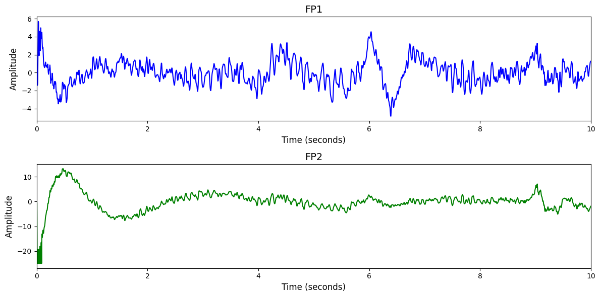

# 1. Dataset Information

ISRUC-Sleep는 건강한 성인과 수면 장애 환자를 대상으로 수집된 PSG(다원 생리 신호) 데이터셋으로, 수면 연구를 지원하기 위해 설계되었습니다. 총 세 그룹(100명 1회 측정, 8명 2회 측정, 10명 환자-비환자 비교)을 포함하며, EEG, 호흡 신호 등 다양한 생리 신호가 전문가에 의해 시각적으로 수면 단계로 라벨링되어 있습니다 [1].

# 2. Dataset Basic Information

## 2.1 Data Information

| # of Subjects | # of Leads | Sampling Frequency (Hz) | Recording Duration (min) | File Fomat |
| --- | --- | --- | --- | --- |
| 118 | 19 | 200 | 0.5 | (EEG).txt, (EEG).xlsx |

## 2.2 Data Statistics

*EEG 전극에 해당하는 데이터만을 사용해 통계 분석을 수행하였습니다.

| Label Type | #of recordings | EEG Mean | EEG Std | EEG Max | EEG Median | EEG Min |
| --- | --- | --- | --- | --- | --- | --- |
| Wakefulness | 47476 | 0.054421 | 33.489808 | 5013.000000 | 0.026322 | -5013.000000 |
| Stage 1 | 24728 | 0.037939 | 29.387658 | 5013.000000 | 0.037995 | -2950.429892 |
| Stage 2 | 68025 | 0.046336 | 29.101781 | 5013.000000 | 0.037995 | -5013.000000 |
| Stage 3 | 38359 | 0.058728 | 26.163601 | 5013.000000 | 0.035477 | -5013.000000 |
| REM | 28392 | 0.041222 | 22.955359 | 5013.000000 | 0.037003 | -2682.549737 |
| Total | 206980 | 0.041176 | 29.1469677 | 5013.000000 | 0.0209812 | -5013.000000 |

## 2.3 Raw Dataset

!!! note ""
    ```
    ISRUC-Sleep/
    ├── Subgropup_1/
    │   ├── 1/
    │   │   ├── 1.rec
    │   │   ├── 1_1.txt
    │   │   └── 1_1.xlsx
    │   │   ... (2 more files)
    │   ├── 10/
    │   │   ├── 10.rec
    │   │   ├── 10_1.txt
    │   │   └── 10_1.xlsx
    │   │   ... (2 more files)
    …
    │   └── 99/
│       ├── 99.rec
│       ├── 99_1.txt
│       └── 99_1.xlsx
│       ... (2 more files)
├── Subgropup_2/
│   ├── 1/
│   │   ├── 1/
│   │   │   ├── 1.rec
│   │   │   ├── 1_1.txt
│   │   │   └── 1_1.xlsx
│   │   │   ... (2 more files)
│   │   └── 2/
│   │       ├── 2.rec
│   │       ├── 2_1.txt
│   │       └── 2_1.xlsx
│   │       ... (2 more files)
│   ├── 2/
│   │   ├── 1/
│   │   │   ├── 1.rec
│   │   │   ├── 1_1.txt
│   │   │   └── 1_1.xlsx
│   │   │   ... (2 more files)
│   │   └── 2/
│   │       ├── 2.rec
│   │       ├── 2_1.txt
│   │       └── 2_1.xlsx
│   │       ... (2 more files)
…
    │   └── 8/
│       ├── 1/
│       │   ├── 1.rec
│       │   ├── 1_1.txt
│       │   └── 1_1.xlsx
│       │   ... (2 more files)
│       └── 2/
│           ├── 2.rec
│           ├── 2_1.txt
│           └── 2_1.xlsx
│           ... (2 more files)
    …
    └── 9/
    ├── 9.rec
    ├── 9_1.txt
    └── 9_1.xlsx
    ... (2 more files)
    137 directories, 630 files
    ```

Subgroup_1, Subgroup_2, Subgroup_3의 세 하위 그룹으로 구성되어 있으며, 각 피험자 폴더는 개별 녹화 세션을 포함하고 있다. 각 세션은 .rec 형식의 생리신호 원시 데이터, .txt 파일의 수면 주석 정보, .xlsx 파일의 피험자 메타데이터 등을 포함한다. Subgroup_1은 1회 기록된 100명의 데이터를, Subgroup_2는 2회 기록된 8명의 데이터를, Subgroup_3은 건강한 사람과 환자의 비교를 위한 10명의 데이터를 담고 있다.

## 2.4 Raw Dataset Example



## 2.5 Preprocessed Dataset

!!! note ""
    ```
    ISRUC_Sleep/
    ├── npy_files/
    │   ├── sess1_sub100_trial1.npy
    │   ├── sess1_sub100_trial10.npy
    │   └── sess1_sub100_trial100.npy
    │   ... (196359 more files)
    ├── channels.csv
    └── labels.csv
    1 directories, 196364 files
    ```

# 3. Applications and Use Cases

| 인용 논문 | 연구 과제 | 모델 구조 | 방법론 |
| --- | --- | --- | --- |
| Jia (2021) [2] | EEG 기반 수면 단계 분류 및 도메인 일반화 | Multi-View Spatial-Temporal Graph CNN (MSTGCN) | 두 개의 spatial view를 구성하여 뇌 영역 간 기능적 연결성과 물리적 거리 기반의 그래프를 정의하고, 이에 대해 GCN을 적용하여 공간 정보를 추출. 이후 temporal convolution과 attention 메커니즘으로 시간-공간 정보를 통합. 도메인 일반화 기법을 통해 피험자 간 생리적 차이에 강인한 subject-invariant 특징 표현을 학습함. |
| Wang (2024) [3] | 시공간 다변량 시계열(MTS) 데이터의 복합 의존성 모델링 | Fully-Connected Spatial-Temporal GNN (FC-STGCN) | 각 시점마다 센서 간 spatial graph를 구성하고, 모든 시점 간 센서 쌍의 연결을 포함하는 fully-connected edge를 통해 temporal dependency까지 포함된 그래프를 생성. FC-GCN과 이동 window 기반 GNN layer로 시간-공간 상의 모든 상호작용(dependency)을 통합적으로 학습함. |

# 4. References

[1] Khalighi, Sirvan, et al. "ISRUC-Sleep: A comprehensive public dataset for sleep researchers." *Computer methods and programs in biomedicine* 124 (2016): 180-192.

[2] Jia, Ziyu, et al. "Multi-view spatial-temporal graph convolutional networks with domain generalization for sleep stage classification." *IEEE Transactions on Neural Systems and Rehabilitation Engineering* 29 (2021): 1977-1986.

[3] Wang, Yucheng, et al. "Fully-connected spatial-temporal graph for multivariate time-series data." *Proceedings of the AAAI conference on artificial intelligence*. Vol. 38. No. 14. 2024.
