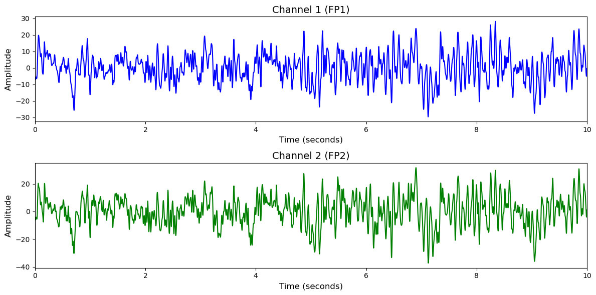

# Mental Arithmetic

# 1. Dataset Information

Mental Arithmetic 데이터셋 [^1]은 피험자들이 정신 산술(Mental Arithmetic) 과제를 수행하기 전과 수행 중의 EEG 데이터를 포함한 공개 뇌파 데이터셋으로, 총 36명의 성인 피험자를 대상으로 수집되었습니다. 모든 피험자는 4자리 수에서 2자리 수를 반복적으로 빼는 연산 과제를 수행하였으며, 각 피험자에 대해 배경(rest) 상태와 과제 수행(task) 상태의 EEG가 각각 60초씩 기록되었습니다.

# 2. Dataset Basic Information

## 2.1 Data Information

| # of Subjects | # of Leads | Sampling Frequency (Hz) | Recording Duration (min) | File Fomat |
| --- | --- | --- | --- | --- |
| 23 | 19 | 500 | 144 | (EEG).edf |

## 2.2 Data Statistics

*EEG 전극에 해당하는 데이터만을 사용해 통계 분석을 수행하였습니다.

| Label Type | #of recordings | EEG Mean | EEG Std | EEG Max | EEG Median | EEG Min |
| --- | --- | --- | --- | --- | --- | --- |
| Good quality count (0) | 20     
(27.8%) | -0.017632   | 10.837362 | 95.629883  | -0.000849   | -111.609604  |
| Bad quality count (1) | 52     
(72.2%) | -0.005946   | 10.487578 | 89.179886   | -0.008339 | -93.787682  |
| **Total** | 72 | -0.012 | 10.66247 | 92.4048845 | -0.00459 | -102.698643 |

## 2.3 Raw Dataset


!!! note ""
    ```
    Mental Arithmetic/
    ├── files/
    │   └── eegmat/
    │       └── 1.0.0/
    │           ├── README.txt
    │           ├── RECORDS
    │           └── SHA256SUMS.txt
    │           ... (74 more files)
    └── robots.txt
    
    3 directories, 78 files
    ```


subject-info.csv에 라벨링 정보가 저장되어 있으며, *_1.edf는 task 수행 전, *2.edf는 task 수행 중 기록입니다.

## 2.4 Raw Dataset Example



## 2.5 Preprocessed Dataset


!!! note ""
    ```
    Mental Arithmetic/
    ├── npy_files/
    │   ├── sess01_sub00_trial01.npy
    │   ├── sess01_sub01_trial01.npy
    │   └── sess01_sub02_trial01.npy
    │   ... (69 more files)
    ├── Mental Arithmetic.h5
    └── Mental Arithmetic.npz
    ... (2 more files)
    
    1 directories, 76 files
    ```


한 trial(자극)별로 split하고 .npy로 변환하였으며 이 파일명은 labels.csv의 1열과 대응되고, 2열엔 정수형 레이블이 있습니다.

# 3. Applications and Use Cases

| 인용 논문 | 연구 과제 | 모델 구조 | 방법론 |
| --- | --- | --- | --- |
| Varshney et al. (2021) [^2] | EEG 기반 정신 산술 과제 수행 전/중(BFMAC/DMAC) 및 수행 능력 그룹(GMAC/BMAC) 분류 | RNN 기반 LSTM, BiLSTM, GRU | 23채널 EEG 신호에서 다양한 엔트로피 기반 특징(Slope, Dispersion, Permutation 등) 추출 후, Recurrent Neural Network 계열 모델을 통해 분류. 10-fold 교차 검증 및 hold-out 검증 수행. 최고의 성능은 GRU+Slope Entropy 조합에서 달성됨 (정확도 > 99%). |

# 4. References

[^1]: Zyma, I., Tukaev, S., Seleznov, I., Kiyono, K., Popov, A., Chernykh, M., & Shpenkov, O. (2019). Electroencephalograms during mental arithmetic task performance. *Data*, 4(1), 14. [https://doi.org/10.3390/data4010014](https://doi.org/10.3390/data4010014)

[^2]: Varshney, A., Ghosh, S. K., Padhy, S., Tripathy, R. K., & Acharya, U. R. (2021). Automated classification of mental arithmetic tasks using recurrent neural network and entropy features obtained from multi-channel EEG signals. *Electronics*, 10(9), 1079. [https://doi.org/10.3390/electronics10091079](https://doi.org/10.3390/electronics10091079)