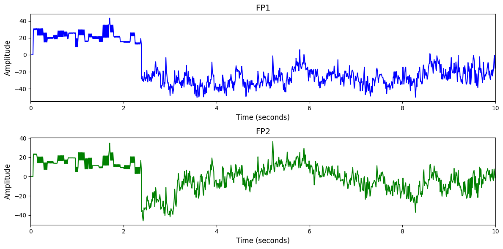

# MoBI

# 1. Dataset Information

이 데이터셋은 뇌-컴퓨터 인터페이스(BCI) 과제를 수행하며 트레드밀 위를 걷는 동안 수집된 모바일 뇌-신체 영상(MoBI) EEG 데이터이다. 8명의 건강한 피험자가 세 가지 조건(서 있는 상태, 걷기, 폐쇄 루프 BCI 걷기)에서 반복 세션을 수행했고, 총 60채널 EEG, EOG, 관절 각도(엉덩이, 무릎, 발목) 정보가 동기화되어 수집되었다. 이 데이터는 걷는 동안의 뇌 활동, BCI의 운동 조절 영향, 디코더 최적화 연구에 활용될 수 있다 [^1].

# 2. Dataset Basic Information

## 2.1 Data Information

| # of Subjects | # of Leads | Sampling Frequency (Hz) | Recording Duration (min) | File Fomat |
| --- | --- | --- | --- | --- |
| 8 | 60 | 100 | 24 | (EEG).txt, (impedances-before, after).txt, (conductor).txt, (digitizier).bvct, (joints).txt |

## 2.2 Data Statistics

*EEG 전극에 해당하는 데이터만을 사용해 통계 분석을 수행하였습니다.

| Label Type | #of recordings | EEG Mean | EEG Std | EEG Max | EEG Median | EEG Min |
| --- | --- | --- | --- | --- | --- | --- |
| Total  | 24 | 161.301651 | 546.79248 | 3276.699951 | -0.7 | -3276.800049 |

## 2.3 Raw Dataset


!!! note ""
    ```
    MoBI/
    ├── SL01-T01/
    │   ├── conductor.txt
    │   ├── digitizer.bvct
    │   └── eeg.txt
    │   ... (3 more files)
    ├── SL01-T02/
    │   ├── conductor.txt
    │   ├── digitizer.bvct
    │   └── eeg.txt
    │   ... (3 more files)
    …
    └── SL08-T03/
    
    ├── conductor.txt
    ├── digitizer.bvct
    └── eeg.txt
    ... (3 more files)
    
    24 directories, 144 files
    ```


총 8명의 건강한 피험자가 각각 3회의 동일한 세션에 참여하여 수집된 모바일 뇌-신체 이미징 데이터로 구성되어 있다. 데이터는 피험자 번호와 세션 번호를 조합한 24개의 하위 폴더로 정리되어 있으며, 각 폴더는 하나의 실험 세션을 나타낸다. 각 세션 폴더에는 EEG 신호(eeg.txt), 관절 각도(joints.txt), 이벤트 정보(conductor.txt), 전극 위치(digitizer.bvct), 임피던스 정보(impedances-before.txt, impedances-after.txt) 등 총 7개의 텍스트 기반 파일이 포함되어 있다. EEG는 60채널로 수집되었으며, 4채널의 EOG와 함께 100Hz로 샘플링되었다. 실험은 서기(walk), BCI 기반 걷기(walk+BCI), 정적 대기(stand)로 구성되며, 각 데이터는 공통된 timestamp로 정렬되어 있어 동기화가 보장된다. 전극 위치는 3D 스캐너로 기록되었고, BCI 디코더는 UKF 기반으로 동작하여 오른쪽 다리 관절을 실시간으로 제어하였다.

## 2.4 Raw Dataset Example



## 2.5 Preprocessed Dataset


!!! note ""
    ```
    MoBI/
    ├── MoBI_npy/
    │   ├── SL01_T01.npy
    │   ├── SL01_T02.npy
    │   └── SL01_T03.npy
    │   ... (21 more files)
    ├── npy_files/
    │   ├── sess1_sub1_trial1.npy
    │   ├── sess1_sub2_trial1.npy
    │   └── sess1_sub3_trial1.npy
    │   ... (21 more files)
    ├── preprocessed/
    ├── regression_target/
    │   ├── SL01_T01_targets.npy
    │   ├── SL01_T02_targets.npy
    │   └── SL01_T03_targets.npy
    │   ... (21 more files)
    ├── channels.csv
    ├── encoded_labels.csv
    └── labels.csv
    ... (1 more files)
    
    4 directories, 76 files
    ```


# 3. Applications and Use Cases

| 인용 논문 | 연구 과제 | 모델 구조 | 방법론 |
| --- | --- | --- | --- |
| Fu (2025) [^2] | EEG 기반 보행 패턴 디코딩 및 재활 응용 | Hierarchical GCN Pyramid + HTSR Loss | EEG 채널의 시공간 패턴을 GCN Pyramid 구조로 모델링하고, 시간/주파수/보상 기반 손실(HTSR)을 결합해 디코딩 성능 향상. EEG-Gait Dataset 수집 및 MoBI 기반 fMRI와의 연계 분석을 통해 실험 검증 수행.  |
| 
Wang (2024) [^3]         
   | 범용 EEG 표현 학습을 위한 대규모 self-supervised pretraining   | Transformer | Depthwise separable convolution을 기반으로 한 경량 CNN 아키텍처를 통해 다양한 BCI 패러다임(P300, MRCP, ERN, SMR)에 대해 적은 데이터로도 높은 성능을 달성. EEGNet은 해석 가능한 EEG feature를 학습. |

# 4. References

[^1]: He, Yongtian, et al. "A mobile brain-body imaging dataset recorded during treadmill walking with a brain-computer interface." *Scientific data* 5.1 (2018): 1-10.

[^2]: Fu, Xi, et al. "EEG2GAIT: A Hierarchical Graph Convolutional Network for EEG-based Gait Decoding." *arXiv preprint arXiv:2504.03757* (2025).

[^3]: Wang, Guangyu, et al. "Eegpt: Pretrained transformer for universal and reliable representation of eeg signals." *Advances in Neural Information Processing Systems* 37 (2024): 39249-39280.