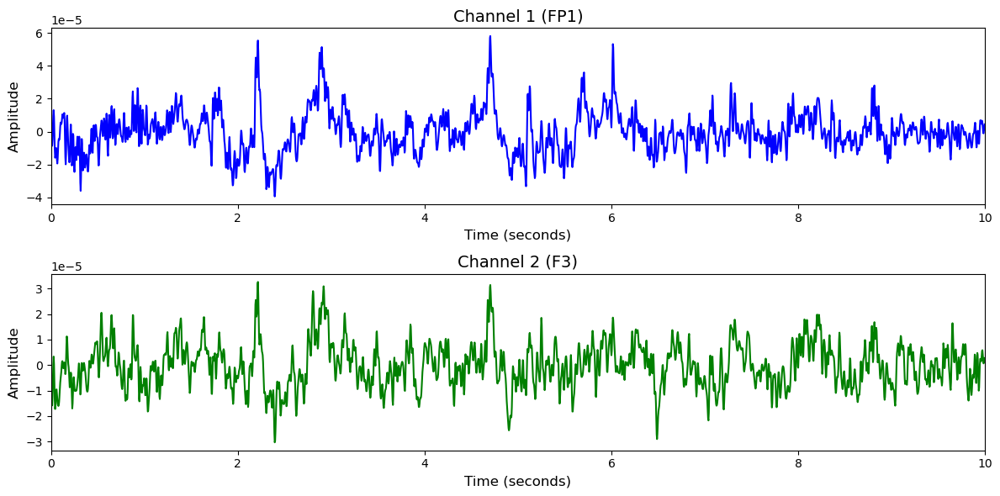

# Mumtaz2016

# 1. Dataset Information

Mumtaz2016 데이터셋[^1] 은 우울장애(MDD) 환자의 치료 반응을 EEG 기반으로 예측하기 위해 수집된 것으로, 총 34명의 MDD 환자와 30명의 건강한 대조군으로 구성되어 있습니다. 각 피험자는 SSRI 계열 항우울제를 복용하기 전과 치료 기간(6주) 동안 주기적으로 EEG 데이터를 수집하였으며, 분석에는 치료 전(pre-treatment) EEG가 주로 사용되었습니다. EEG는 19채널로 구성되었고, 눈 감은 상태와 눈 뜬 상태에서 각각 5분간 측정되었으며, 일부 세션에서는 P300 ERP를 수집하기 위한 시각적 Oddball 과제도 수행되었습니다. 

# 2. Dataset Basic Information

## 2.1 Data Information

| # of Subjects | # of Leads | Sampling Frequency (Hz) | Recording Duration (min) | File Fomat |
| --- | --- | --- | --- | --- |
| 64 | 19 | 256 | 595 | (EEG).edf |

## 2.2 Data Statistics

*EEG 전극에 해당하는 데이터만을 사용해 통계 분석을 수행하였습니다.

| Label Type | #of recordings | EEG Mean | EEG Std | EEG Max | EEG Median | EEG Min |
| --- | --- | --- | --- | --- | --- | --- |
| Normal (0) | 57     (47.9%) | 5.091061e-08 | 0.000014 | 0.000395  | 3.071663e-07 | -0.000404   |
| Patient (1) | 62     (52.1%) | 3.253488e-08 | 0.000017 | 0.000751  | 4.839079e-08 | -0.000710   |
| **Total** | 119 | 4E-08 | 0.0000155 | 0.000573 | 1.78E-07 | -0.000557 |

## 2.3 Raw Dataset


!!! note ""
    ```
    Mumtaz2016/
    ├── 6921143_H S15 EO.edf
    ├── 6921959_H S15 EO.edf
    └── H S1 EC.edf
    ... (178 more files)
    
    0 directories, 181 files
    ```


EO.edf는 eyes-open, EC.edf는 eyes-closed, Task.edf는 Task 상태의 기록입니다.

## 2.4 Raw Dataset Example



## 2.5 Preprocessed Dataset


!!! note ""
    ```
    Mumtaz2016/
    ├── npy_files/
    │   ├── sessH_sub01_trialEC.npy
    │   ├── sessH_sub01_trialEO.npy
    │   └── sessH_sub02_trialEC.npy
    │   ... (116 more files)
    ├── Mumtaz2016.h5
    ├── Mumtaz2016.npz
    └── channels.csv
    ... (1 more files)
    
    1 directories, 123 files
    ```


한 trial(자극)별로 split하고 .npy로 변환하였으며 이 파일명은 labels.csv의 1열과 대응되고, 2열엔 정수형 레이블이 있습니다. 일부 세션인 Task 파트는 제거하였습니다.

# 3. Applications and Use Cases

| 인용 논문 | 연구 과제 | 모델 구조 | 방법론 |
| --- | --- | --- | --- |
| Mumtaz et al. (2017) [^1] | EEG 기반 주요우울장애(MDD) 치료 반응 예측 | 웨이블릿 기반 특징 추출 후  순위 기반 특징 선택, 머신러닝 분류기 | 19채널 EEG 데이터를 웨이블릿 변환하여 시간-주파수 특징 추출 후, ROC 기반 순위 특징 선택을 통해 차원 축소. 다양한 머신러닝 분류기를 사용하여 치료 반응 예측 수행. |
| Wang et al. (2024) [^2] |
  EEG 기반 범용 디코딩 모델 개발
   | 
  Criss-cross attention 기반 모델
   | 
  Criss-Cross Attention과 ACPE 채널 임베딩으로 다양한 EEG 태스크에 높은 성능 달성
   |

# 4. References

[^1]: Mumtaz, W., Xia, L., Yasin, M. A. M., Ali, A. A., & Malik, A. S. (2017). A wavelet-based technique to predict treatment outcome for Major Depressive Disorder. *PLOS ONE*, 12(2), e0171409. [https://doi.org/10.1371/journal.pone.0171409](https://doi.org/10.1371/journal.pone.0171409)

[^2]: Wang, J., Zhao, S., Luo, Z., Zhou, Y., Jiang, H., Li, S., Li, T., & Pan, G. (2024). *CBraMod: A criss-cross brain foundation model for EEG decoding*. arXiv preprint arXiv:2403.06752.