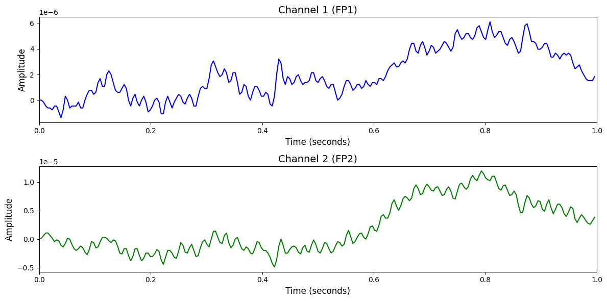

# 1. Dataset Information

Neonate[1] 데이터셋은 신생아 발작 탐지를 목적으로 설계된 데이터셋으로, 총 79명의 신생아로부터 수집 된 EEG 기록으로 구성되어 있습니다. 각 피험자는 한 번의 연속적인 EEG 세션만 기록되었습니다. 모든 EEG는 신생아 중환자실(NICU)에서 임상 적으로 발작이 의심되는 경우에 한해 표준 10–20 시스템 기반 19채널 EEG 장비를 사용하여 측정 되었습니다. 수집 된 데이터는 전문가 세 명이 독립적으로 시각적 검토를 통해 1초 단위로 발작 발생 여부를 주석 하였습니다.

# 2. Dataset Basic Information

## 2.1 Data Information

| # of Subjects | # of Leads | Sampling Frequency (Hz) | Recording Duration (min) | File Fomat |
| --- | --- | --- | --- | --- |
| 79 | 19 | 256 | Average 74 min | (EEG).edf/(주석).mat,.csv/(임상정보).csv |

## 2.2 Data Statistics

*EEG 전극에 해당하는 데이터만을 사용해 통계 분석을 수행하였습니다.

| Label Type | #of recordings | EEG Mean | EEG Std | EEG Max | EEG Median | EEG Min |
| --- | --- | --- | --- | --- | --- | --- |
| Non-seizure (0) | 529 | 0.000003 | 0.000035 | 0.000633 | 0.000002 | -0.000478 |
| Seizure (1) | 344 | 0.000004 | 0.000037 | 0.000331 | 0.000003 | -0.000307 |
| **Total** | 873 | 0.000002 | 0.000091 | 0.005482 | 0.000000 | 0.005482 |

## 2.3 Raw Dataset

!!! note ""
    ```
    Neonate/
    ├── eeg1.edf
    ├── eeg2.edf
    │   ... (77 more files)
    ├── clicinal_information.csv
    ├── Ethics_approval.pdf
    ├── annotations_2017_A.csv
├── annotations_2017_B.csv
├── annotations_2017_C.csv
└── annotations_2017.mat
... (82 more files)
    1 directories, 85 files
    ```

eeg#.edf는 신생아 한 명에 대해 진행한 단일 세션에 관한 파일이며 총 79개가 존재합니다. annotations_2017_A,  annotations_2017_B, annotations_2017_C는 전문가 한 명이 1초 단위로 발작 발생 여부를 주석한 정보가 담긴 파일이며 annotations_2017은 주석 정보가 모두 담겨있는 파일입니다. 

## 2.4 Raw Dataset Example



## 2.5 Preprocessed Dataset

!!! note ""
    ```
    Neonate/
    ├── npy_files/
    │   ├── sub11_trial1.npy
    │   ├── sub11_trial2.npy
    │   └── sub11_trial3.npy
    │   ... (870 more files)
    ├── channels.csv
├── labels.csv
├── Neonate.h5
    └── Neonate.npz
    1 directories, 877 files
    ```

# 3. Applications and Use Cases

| 인용 논문 | 연구 과제 | 모델 구조 | 방법론 |
| --- | --- | --- | --- |
| Chen et al. (2024) [2] | 범용 EEG 사전학습 모델 개발 및 전이 학습 적용 | Vector-Quantized Transformer (EEGFormer) | TUH EEG 데이터셋(1.7TB)으로 벡터 양자화 진행 후 마스킹 예측 기반 self-supervised 사전 학습 수행. 이후 TUSZ, TUAB, Neonate 데이터셋에 대해 전이 학습하여 발작 탐지, 병리 분류 작업 등 수행. |
| Gramacki et al. (2022) [3] | 신생아 EEG 신호를 기반으로 뇌전증 발작을 자동으로 탐지하는 딥러닝 기반 프레임워크 개발 | 합성곱 신경망(Convolutional Neural Network, CNN) 구조를 적용한 분류 모델 | 슬라이딩 윈도우 방식으로 균형 잡힌 학습 데이터를 생성하고, 이를 활용해 EEG 발작 여부를 분류하는 합성곱 신경망을 학습함. 모델 성능 검증을 위해 5-fold 교차검증을 수행하고, 학습 정확도는 최대 97%에 도달함. |

# 4. References

[1] Stevenson, N. J., Tapani, K., Lauronen, L., & Vanhatalo, S. (2019).*A dataset of neonatal EEG recordings with seizure annotations*. Scientific Data, 6, 190039.

[2] Chen, Y., Ren, K., Song, K., Wang, Y., Wang, Y., Li, D., Qiu, L. (2024).*EEGFormer: Towards Transferable and Interpretable Large-Scale EEG Foundation Model*. arXiv preprint arXiv:2401.10278.

[3] Gramacki, A., & Gramacki, J. (2022). A deep learning framework for epileptic seizure detection based on neonatal EEG signals. *Scientific Reports*, *12*, Article 13010.
