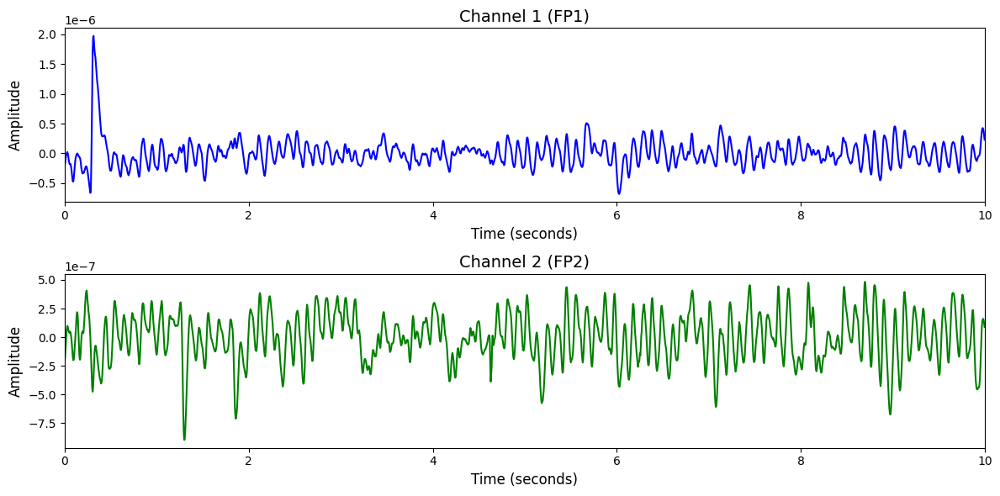

# NMT(Events)

# 1. Dataset Information

NMT-Events 데이터셋[^1]은 총 21명의 피험자를 대상으로 병원 환경에서 수집된 두피 EEG 데이터로, 병리적 이상 이벤트(Spike and Sharp Waves, Slow Waves)의 자동 탐지를 목적으로 구성되어 있습니다. 각 EEG 기록은 21채널(국제 10–20 시스템 기준), 200Hz 샘플링 속도로 측정 되었으며, 평균 약 20분간 연속적으로 기록되었습니다. 총 1,075개의 세션 중 113개는 병리적 이상이 포함되어 있으며, 각 이벤트는 시간 및 채널 수준에서 정밀하게 주석 처리되었습니다. 데이터는 2초 단위로 분할되어 있으며, wavelet 기반의 시간-주파수 특징 추출을 통해 이벤트 검출 모델 학습에 사용됩니다.

# 2. Dataset Basic Information

## 2.1 Data Information

| # of Subjects | # of Leads | Sampling Frequency (Hz) | Recording Duration (min) | File Fomat |
| --- | --- | --- | --- | --- |
| 21 | 21 | 200 | Average 20 min | (EEG).edf, (label).csv |

## 2.2 Data Statistics

*EEG 전극에 해당하는 데이터만을 사용해 통계 분석을 수행하였습니다.

| Label Type | #of recordings | EEG Mean | EEG Std | EEG Max | EEG Median | EEG Min |
| --- | --- | --- | --- | --- | --- | --- |
| Normal (0) | 956 (8.84%) | -0.0000000018 | 0.0000002527 | 0.000005 | -0.0000000004 | -0.000006 |
| SW (1) | 4882 (45.14%) | 0.00000000006 | 0.0000005277 | 0.000002 | -0.0000000016 | -0.000002 |
| SSW (2) | 4978 (46.02%) | 0.00000000063 | 0.0000005633 | 0.000002 | 0.0000000025 | -0.000002 |
| Total | 10816 | 0.000000   | 0.000001 | 0.000002   | 0.000000   | -0.000002   |

## 2.3 Raw Dataset


!!! note ""
    ```
    NMT(Events)/
    └── raw_data/
        ├── csv/
        │   └── SW & SSW CSV Files/
        │       ├── 1004.csv
        │       ├── 1005.csv
        │       └── 1018.csv
        │       ... (110 more files)
        └── edf/
            ├── Abnormal EDF Files/
            │   ├── 0000004.edf
            │   ├── 0000006.edf
            │   └── 0000008.edf
            │   ... (110 more files)
            └── Normal EDF Files/
                ├── 0000001.edf
                ├── 0000002.edf
                └── 0000003.edf
                ... (953 more files)
    
    6 directories, 1182 files
    ```


Abnormal EDF Files의 각 세트는 Abnormal EDF File 안에 존재하는 EDF 형식의 EEG 기록과 csv 폴더 안에 존재하는 해당 레코딩에 대한 주석 CSV 파일로 구성되어 있습니다. 라벨링은 CSV 파일에서 이루어지며, 이벤트 발생 시점과 종료 시점, 감지된 채널명, 이벤트 클래스에 대한 정보가 포함되어 있습니다. 이벤트 클래스는 ‘Spike and Sharp Waves(SSW)’와 ‘Slow Waves(SW)’의 두 가지 상위 클래스 중 하나로 구분되며, 모든 이벤트는 200Hz 기준으로 주석 처리되어 있습니다. 또한 병리적 이벤트가 포함되지 않은 정상 EEG 레코딩도 Normal EDF Files에 별도로 제공됩니다. 

## 2.4 Raw Dataset Example



## 2.5 Preprocessed Dataset


!!! note ""
    ```
    NMT(Events)/
    ├── npy_files/
    │   ├── sub1000_trial1.npy
    │   ├── sub1001_trial1.npy
    │   └── sub1002_trial1.npy
    │   ... (10813 more files)
    ├── NMT(Events).h5
    ├── NMT(Events).npz
    
    ├── labels.csv
    └── channels.csv
    
    1 directories, 10820 files
    ```


# 3. Applications and Use Cases

| 인용 논문 | 연구 과제 | 모델 구조 | 방법론 |
| --- | --- | --- | --- |
|  |  |  |  |

# 4. References

[^1]: Mohammad Ali Alqarni, Hira Masood, Adil Jowad Qureshi, Muiz Alvi, Haziq Arbab, Hassan Aqeel Khan, Awais Mehmood Kamboh, Saima Shafait, and Faisal Shafait. NeuroAssist: Open-Source Automatic Event Detection in Scalp EEG. *IEEE Access*, vol. 12, pp. 170321–170334, 2024.