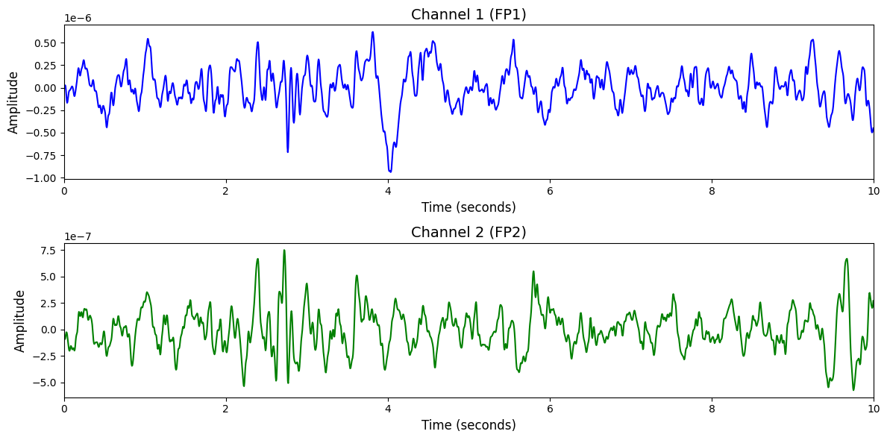

# 1. Dataset Information

NMT Scalp EEG Dataset은[1] 정상 및 신경 질환 환자의 EEG 데이터를 포함하는 공개형 데이터셋입니다. 본 데이터는 정상/비정상 EEG 구분을 위한 머신러닝 기반 사전 진단 모델 개발을 목적으로 설계되었습니다. 총 2,417명의 고유 피험자로부터 EEG 데이터를 수집하였으며, 모든 참여자는 1회 세션만 기록되었습니다. EEG는 표준 10–20 전극 시스템 방식으로 21개의 채널로 수집되었으며, 라벨링은 병원 소속 EEG 전문가 및 2인의 신경과 전문의가 상호 합의한 결과를 기준으로 정상 또는 비정상으로 지정되었습니다.

# 2. Dataset Basic Information

## 2.1 Data Information

| # of Subjects | # of Leads | Sampling Frequency (Hz) | Recording Duration (min) | File Fomat |
| --- | --- | --- | --- | --- |
| 2417 | 21 | 200 | Ave 15 | (EEG).edf/(주석).csv/(Readme).txt |

## 2.2 Data Statistics

*EEG 전극에 해당하는 데이터만을 사용해 통계 분석을 수행하였습니다.

| Label Type | #of recordings | EEG Mean | EEG Std | EEG Max | EEG Median | EEG Min |
| --- | --- | --- | --- | --- | --- | --- |
| Normal (0) | 2002 (82.83%) | 0.02175 | 33.677 | 223.759 | 0.2784 | -203.759 |
| Abnormal (1) | 415 (17.17%) | -0.0141 | 36.076 | 208.902 | 0.2649 | -178.215 |
| **Total** | 2417 | 0.000000 | 0.000000 | 0.000005 | 0.000000 | -0.000005 |

## 2.3 Raw Dataset

!!! note ""
    ```
    SEED-VIG/
    ├── SEED-VIG/
    │   ├── EEG_Feature_2Hz/
    │   │   ├── 10_20151125_noon.mat
    │   │   ├── 11_20151024_night.mat
    │   │   └── 12_20150928_noon.mat
    │   │   ... (20 more files)
    │   ├── EEG_Feature_5Bands/
    │   │   ├── 10_20151125_noon.mat
    │   │   ├── 11_20151024_night.mat
    │   │   └── 12_20150928_noon.mat
    │   │   ... (20 more files)
    │   ├── EOG_Feature/
    │   │   ├── 10_20151125_noon.mat
    │   │   ├── 11_20151024_night.mat
    │   │   └── 12_20150928_noon.mat
    │   │   ... (20 more files)
    │   ├── Forehead_EEG/
    │   │   ├── EEG_Feature_2Hz/
    │   │   │   ├── 10_20151125_noon.mat
    │   │   │   ├── 11_20151024_night.mat
    │   │   │   └── 12_20150928_noon.mat
    │   │   │   ... (20 more files)
    │   │   └── EEG_Feature_5Bands/
    │   │       ├── 10_20151125_noon.mat
    │   │       ├── 11_20151024_night.mat
    │   │       └── 12_20150928_noon.mat
    │   │       ... (20 more files)
    │   ├── Raw_Data/
    │   │   ├── 10_20151125_noon.mat
    │   │   ├── 11_20151024_night.mat
    │   │   └── 12_20150928_noon.mat
    │   │   ... (20 more files)
    │   ├── perclos_labels/
    │   │   ├── 10_20151125_noon.mat
    │   │   ├── 11_20151024_night.mat
    │   │   └── 12_20150928_noon.mat
    │   │   ... (20 more files)
    │   ├── Readme_Chinese.txt
    │   ├── Readme_English.txt
    │   └── channel_62_pos.locs
    └── SEED-VIG eeg_channels.csv
    9 directories, 165 files
    ```

총 2417개의 edf파일이 존재하며 각 파일은 참가자 한 명이 단일 세션으로 기록된 eeg 신호 파일을 의미합니다. 파일별로 normal/abnormal여부가 Labels.csv에 기록되어 있으며 abnormal 445개, normal 1972 개의 파일이 존재합니다. Train 셋으로는 총 2,232개 evaluation 셋으로는 총 185개의 파일이 존재합니다. Labels.csv 파일에는 라벨에 관한 정보 외에도 참가자 나이, 성별, 폴더위치 정보까지 포함됩니다.

## 2.4 Raw Dataset Example



## 2.5 Preprocessed Dataset

!!! note ""
    ```
    NMT(Scalp-EEG)/
    ├── test_npy_files/
    │   ├── sub1016.npy
    │   ├── sub1033.npy
    │   └── sub1056.npy
    │   ... (182 more files)
    ├── train_npy_files/
    │   ├── sub1.npy
    │   ├── sub10.npy
    │   └── sub100.npy
    │   ... (2229 more files)
    ├── channels.csv
    ├── test_labels.csv
    ├── train_labels.csv
    ├── NMT(Scalp-EEG)_test.h5
    ├── NMT(Scalp-EEG)_train.h5
    └── NMT(Scalp-EEG)_train.npz
    1 directories, 2426 files
    ```

# 3. Applications and Use Cases

| 인용 논문 | 연구 과제 | 모델 구조 | 방법론 |
| --- | --- | --- | --- |
| Darvishi-Bayazi et al. (2024) [2] | 병적 EEG 탐지를 위한 교차 데이터셋 전이 학습 | ShallowNet, TCN 기반 분류 모델 구조 | TUAB와 NMT 데이터셋 간 전이 학습을 적용하여 다양한 분포 편향(distribution shift) 환경에서의 병적 EEG 탐지 성능 향상. 모델 구조별 비교, Centered Kernel Alignment(CKA) 기반 표현 분석, 데이터량 및 모델 크기에 따른 성능 변화 분석 수행. |

# 4. References

[1] Khan, H. A., Ul Ain, R., Kamboh, A. M., et al., 2022. The NMT Scalp EEG Dataset: An Open-Source Annotated Dataset of Healthy and Pathological EEG Recordings for Predictive Modeling. Frontiers in Neuroscience, 15, 755817. 

[2] Darvishi-Bayazi, M.-J., Ghaemi, M. S., Lesort, T., Arefin, M. R., Faubert, J., & Rish, I. (2024). Amplifying pathological detection in EEG signaling pathways through cross-dataset transfer learning. Computers in Biology and Medicine, 169, 107893.
