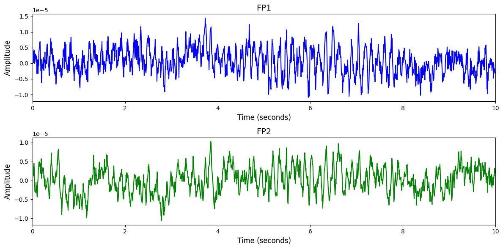

# Physionet MI EEG

# 1. Dataset Information

이 데이터셋은 BCI2000 시스템을 이용해 64채널 EEG를 기록하며 수집되었으며, 피실험자들은 총 14회의 실험을 수행했습니다. 실험에는 눈을 뜨거나 감은 상태의 기준선 측정과, 실제 혹은 상상으로 손이나 발을 움직이는 4가지 종류의 운동/운동 이미지 과제가 포함됩니다. 각 과제는 화면에 표시되는 목표 위치(좌/우, 상/하)에 따라 해당 손이나 발을 움직이거나 상상하는 방식으로 진행되었습니다 [^1].

# 2. Dataset Basic Information

## 2.1 Data Information

| # of Subjects | # of Leads | Sampling Frequency (Hz) | Recording Duration (min) | File Fomat |
| --- | --- | --- | --- | --- |
| 109 | 64 | 160 | 2 | (EEG).edf, (annotation).edf.event |

## 2.2 Data Statistics

*EEG 전극에 해당하는 데이터만을 사용해 통계 분석을 수행하였습니다.

| Label Type | #of recordings | EEG Mean | EEG Std | EEG Max | EEG Median | EEG Min |
| --- | --- | --- | --- | --- | --- | --- |
| T0 | 18271 | -8.319274 | 76.123284 | 846.000000 | -6.000000 | -713.000000 |
| T1 | 9806 | -5.598800 | 72.954082 | 846.000000 | -4.000000 | -711.000000 |
| T2 | 9774 | -6.444091 | 72.773266 | 815.000000 | -4.000000 | -714.000000 |
| Total | 37851 | -7.122781 | 74.454303 | 846.000000 | -5.000000 | -714.000000 |

## 2.3 Raw Dataset


!!! note ""
    ```
    Physionet MI-EEG/
    ├── S001/
    │   ├── S001R01.edf
    │   ├── S001R01.edf.event
    │   └── S001R02.edf
    │   ... (25 more files)
    ├── S002/
    │   ├── S002R01.edf
    │   ├── S002R01.edf.event
    │   └── S002R02.edf
    │   ... (25 more files)
    …
    ├── S109/
    │   ├── S109R01.edf
    │   ├── S109R01.edf.event
    │   └── S109R02.edf
    │   ... (25 more files)
    ├── 64_channel_sharbrough-old.png
    ├── 64_channel_sharbrough.pdf
    └── 64_channel_sharbrough.png
    ... (4 more files)
    
    109 directories, 3059 files
    ```


이 데이터셋은 PhysioNet에서 제공하는 motor/imagery 기반 EEG 데이터로, 총 109명의 피험자가 참여하였으며, 각 피험자별로 최대 14개의 세션이 존재합니다. 예를 들어 S001 폴더에는 S001R01.edf부터 S001R14.edf까지의 EDF 형식 파일과 해당 세션에 대한 이벤트 정보를 담은 .event 파일이 쌍으로 존재합니다. 각 EDF 파일에는 64채널 EEG가 포함되어 있으며, 피험자는 실제 또는 상상으로 손/발을 움직이는 다양한 과제를 수행하였습니다. .event 파일에는 자극의 위치 및 동작 구간이 포함되어 있어 trial 단위의 정밀 분석이 가능합니다.

## 2.4 Raw Dataset Example



## 2.5 Preprocessed Dataset


!!! note ""
    ```
    Physionet_MI_EEG/
    ├── npy_files/
    │   ├── sess100_sub10_trial0.npy
    │   ├── sess100_sub10_trial1.npy
    │   └── sess100_sub10_trial10.npy
    │   ... (39372 more files)
    ├── channels.csv
    └── labels.csv
    
    1 directories, 39377 files
    ```


# 3. Applications and Use Cases

| 인용 논문 | 연구 과제 | 모델 구조 | 방법론 |
| --- | --- | --- | --- |
|
  Kim (2023) [^2] 
   | EEG 기반 Motor Imagery 데이터 증강 및 과적합 완화 | Spatial Variation Generation (SVG) 알고리즘 | 전극 위치 및 뇌 공간 패턴의 변이를 활용해 EEG 데이터를 증강함으로써 raw sample 주변의 밀도를 높이고, 데이터의 vicinal 분포를 생성하여 모델의 과적합 문제를 완화하고 분류 성능을 향상시킴 |
|
  Wang (2023) [^3]         
   | 
  EEG 기반 Motor Imagery 분류 및 재활 BCI 시스템 개발    
   | 다중 feature extractor 기반 앙상블 모델 + Curriculum Learning + Collaborative Training | 각 feature extractor에 대해 curriculum learning을 적용하고, knowledge distillation 기반의 협업 학습을 통해 모델 간 지식을 공유함으로써 cross-subject 일반화 성능을 향상시키고, 다양한 EEG 특성을 효과적으로 반영함 |

# 4. References

[^1]: Goldberger, A.L., Amaral, L.A., Glass, L., Hausdorff, J.M., Ivanov, P.C., Mark, R.G., Mietus, J.E., Moody, G.B., Peng, C.K., Stanley, H.E. and PhysioBank, P., PhysioNet: components of a new research resource for complex physiologic signals Circulation 2000 Volume 101 Issue 23 pp. E215–E220.

[^2]: Qin, Chengxuan, et al. "Spatial variation generation algorithm for motor imagery data augmentation: Increasing the density of sample vicinity." *IEEE Transactions on Neural Systems and Rehabilitation Engineering* 31 (2023): 3675-3686.

[^3]: Zoumpourlis, Georgios, and Ioannis Patras. "Motor imagery decoding using ensemble curriculum learning and collaborative training." *2024 12th International Winter Conference on Brain-Computer Interface (BCI)*. IEEE, 2024.