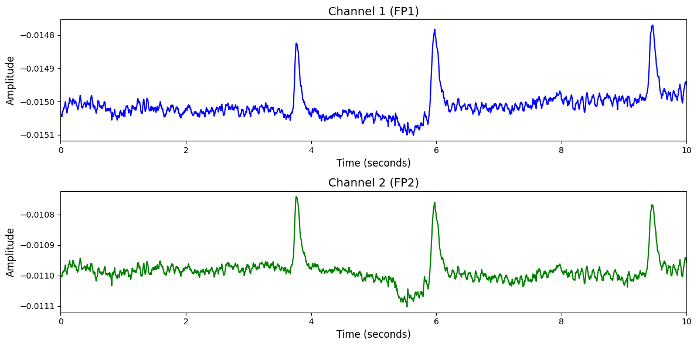

# 1. Dataset Information

Raw EEG Data 데이터셋[1]은 피험자들이 Information-Integration categorization task와 multidimensional Rule-Based categorization task를 수행하는 동안 수집된 EEG(뇌파) 신호를 포함하고 있습니다. EEG는 64채널, 256Hz의 설정으로 기록되었으며, 전체 기록 시간은 총 34.35시간입니다. 이 데이터는 범주화 과제 수행 중의 뇌 활동을 분석하고, 인지 처리 메커니즘을 이해하는 데 활용될 수 있습니다.

# 2. Dataset Basic Information

## 2.1 Data Information

| # of Subjects | # of Leads | Sampling Frequency (Hz) | Recording Duration (min) | File Fomat |
| --- | --- | --- | --- | --- |
| unknown | 64 | 256 | unknown | (EEG).bdf |

## 2.2 Data Statistics

*EEG 전극에 해당하는 데이터만을 사용해 통계 분석을 수행하였습니다.

| Label Type | #of recordings | EEG Mean | EEG Std | EEG Max | EEG Median | EEG Min |
| --- | --- | --- | --- | --- | --- | --- |
| (0) | 48 (50.0%) | -0.001767 | 0.006511 | 0.023195 | -0.001904 | -0.017646 |
| (1) | 48 (50.0%) | -0.001741 | 0.006703 | 0.027600 | -0.001855 | -0.027594 |
| Total | 96 | -0.001803 | 0.009248 | 0.259354 | -0.001698 | -0.259571 |

## 2.3 Raw Dataset

!!! note ""
    ```
    Raw_EEG_Data/
    ├── EEG_Cat_Study4_II_II_S1.bdf
    ├── EEG_Cat_Study4_II_II_S10.bdf
    └── EEG_Cat_Study4_II_II_S11.bdf
    ... (93 more files)
    0 directories, 96 files
    ```

각 EEG 신호는 BDF 포맷의 파일로 저장되어 있습니다. ‘.bdf’ 포맷은 BioSemi 장비에서 생성된 고해상도 EEG 데이터를 담고 있으며, 채널 수와 샘플링 주파수 등의 정보가 포함됩니다. ‘EEG_Cat_Study4_II_II_S1.bdf’의 예로 S1은 세션 번호를 의미합니다.

## 2.4 Raw Dataset Example



## 2.5 Preprocessed Dataset

!!! note ""
    ```
    Raw_EEG_Data/
    ├── Raw_EEG_Data_npy/
    │   ├── II_S1.npy
    │   ├── II_S10.npy
    │   └── II_S11.npy
    │   ... (93 more files)
    ├── npy_files/
    │   ├── sess1_sub10_trial1.npy
    │   ├── sess1_sub11_trial1.npy
    │   └── sess1_sub12_trial1.npy
    │   ... (93 more files)
    ├── channels.csv
    ├── encoded_labels.csv
    ├── labels_original.csv
    └── labels.csv
    4 directories, 244 files
    ```

# 3. Applications and Use Cases

| 인용 논문 | 연구 과제 | 모델 구조 | 방법론 |
| --- | --- | --- | --- |
| Jiang et al. (2024) [2] | EEG 기반 범용 표현 학습 및 다양한 과제 전이 | Transformer 기반 EEG 인코더 모델 (LaBraM) | 마스킹 기반 자기지도 학습 방식을 통해 2,500시간 이상의 EEG 데이터를 사전학습하며, 복원 기반 학습을 통해 일반화 가능한 표현을 확보함. 이후 감정 인식, 보행 예측 등 다양한 다운스트림 과제에 전이하여 기존 최고 성능을 초과함. |

# 4. References

[1] Logan Trujillo. Raw EEG Data. 2020. doi: 10.18738/T8/SS2NHB. URL [ https://doi.org/10.18738/T8/SS2NHB](https://doi.org/10.18738/T8/SS2NHB). 

[2] Jiang, W., Zhao, L.-M., & Lu, B.-L. (2024). LaBraM: Large Brain Model for Learning Generic Representations with Tremendous EEG Data in BCI. *International Conference on Learning Representations (ICLR)*.
