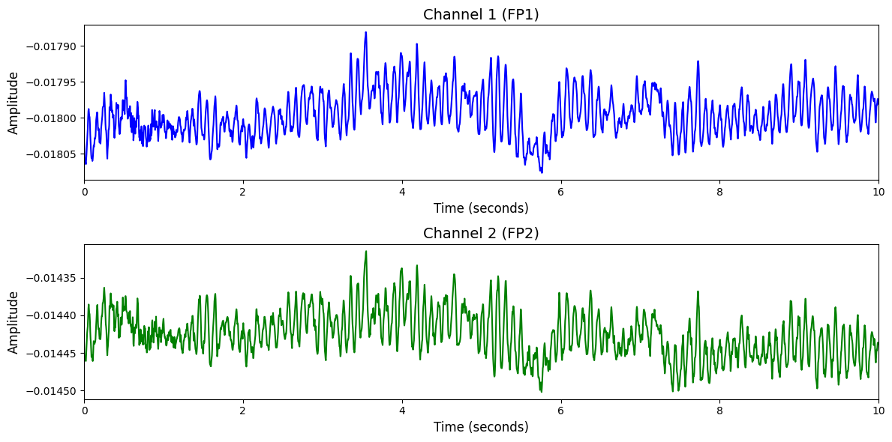

# 1. Dataset Information

Resting State EEG Data[1]에서 사용된 EEG 데이터는 22명의 건강한 피실험자들을 대상으로 수집 되었습니다. 피험자들은 암실에서 편안한 상태로 4분간 눈을 뜨고, 4분간 눈을 감는 과정을 1분 단위로 교차하며 총 8분간 휴식 상태 EEG를 기록하였습니다. 본 연구는 EEG의 참조 전극 선택이 복잡도 및 통합도 지표에 미치는 영향을 평가하기 위해 설계되었습니다. 

# 2. Dataset Basic Information

## 2.1 Data Information

| # of Subjects | # of Leads | Sampling Frequency (Hz) | Recording Duration (min) | File Fomat |
| --- | --- | --- | --- | --- |
| 22 | 64 | 256 | 8 | (EEG).bdf |

## 2.2 Raw Dataset

!!! note ""
    ```
    Resting_State_EEG_Data/
    ├── EEG_Cat_Study4_Resting_S1.bdf
    ├── EEG_Cat_Study4_Resting_S10.bdf
    └── EEG_Cat_Study4_Resting_S11.bdf
    ... (20 more files)
    0 directories, 23 files
    ```

Resting_State_EEG_Data 폴더는 휴식 상태에서 측정된 EEG 신호를 포함하고 있으며, 각 실험은 BDF 포맷의 파일로 저장되어 있습니다. ‘.bdf’ 포맷은 BioSemi 장비에서 생성된 고해상도 EEG 데이터를 담고 있으며, 채널 수와 샘플링 주파수 등의 정보가 포함됩니다. EEG_Cat_Study4_Resting_S1.bdf에서 S1은 세션 번호를 의미합니다.

## 2.3 Raw Dataset Example



## 2.4 Preprocessed Dataset

!!! note ""
    ```
    Resting_State_EEG_data/
    ├── Resting_State_EEG_data_npy/
    │   ├── S1.npy
    │   ├── S10.npy
    │   └── S11.npy
    │   ... (19 more files)
    ├── npy_files/
    │   ├── sub10_trial1.npy
    │   ├── sub11_trial1.npy
    │   └── sub12_trial1.npy
    │   ... (19 more files)
    ├── Resting_State_EEG_data.h5
    ├── Resting_State_EEG_data.npz
    ├── encoded_labels.csv
    ├── labels_original.csv
    ├── labels.csv
    └── channels.csv
    1 directories, 69669 files
    ```

# 3. Applications and Use Cases

| 인용 논문 | 연구 과제 | 모델 구조 | 방법론 |
| --- | --- | --- | --- |
| Jiang et al. (2024) [2] | EEG 기반 범용 표현 학습 및 다양한 과제 전이 | Transformer 기반 EEG 인코더 모델 (LaBraM) | 마스킹 기반 자기지도 학습 방식을 통해 2,500시간 이상의 EEG 데이터를 사전학습하며, 복원 기반 학습을 통해 일반화 가능한 표현을 확보함. 이후 감정 인식, 보행 예측 등 다양한 다운스트림 과제에 전이하여 기존 최고 성능을 초과함. |

# 4. References

[1] Trujillo, L. T., Stanfield, C. T., & Vela, R. D. (2017). The Effect of Electroencephalogram (EEG) Reference Choice on Information-Theoretic Measures of the Complexity and Integration of EEG Signals. *Frontiers in Neuroscience, 11*, Article 425. 
[2] Jiang, W., Zhao, L.-M., & Lu, B.-L. (2024). LaBraM: Large Brain Model for Learning Generic Representations with Tremendous EEG Data in BCI. *International Conference on Learning Representations (ICLR)*.
