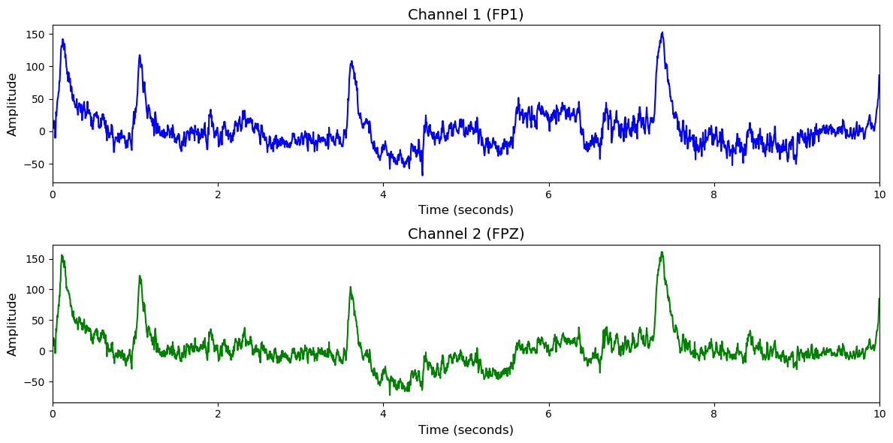

# 1. Dataset Information

SEED-IV 데이터셋[1] 은 15명의 피험자에 대한 EEG 및 안구 운동 데이터를 포함하며, 데이터는 피험자들이 감정을 유도하는 영화 클립을 시청하는 동안 수집되었습니다. 감정은 행복, 슬픔, 공포, 중립의 4가지로 구성되어 있으며, 각 피험자는 3일에 걸쳐 총 3번의 세션을 수행하였습니다. 각 세션은 24개의 트라이얼로 이루어져 있으며, 각 트라이얼에서 하나의 감정 유도 클립을 시청하고 관련 생체신호가 기록됩니다.

# 2. Dataset Basic Information

## 2.1 Data Information

| # of Subjects | # of Leads | Sampling Frequency (Hz) | Recording Duration (min) | File Fomat |
| --- | --- | --- | --- | --- |
| 15 | 62 | 200 | 216 | (EEG).mat |

## 2.2 Data Statistics

*EEG 전극에 해당하는 데이터만을 사용해 통계 분석을 수행하였습니다.

| Label Type | #of recordings | EEG Mean | EEG Std | EEG Max | EEG Median | EEG Min |
| --- | --- | --- | --- | --- | --- | --- |
| Neutral (0) | 270 (25.0%) | 0.010212 | 47.149811 | 1233.485474 | 0.089297 | -1053.78686 |
| Sad (1) | 270 (25.0%) | -0.039660 | 38.263618 | 836.776794 | 0.076445 | -689.507080 |
| Fear (2) | 270 (25.0%) | -0.036877 | 44.068462 | 1270.304688 | 0.014129 | -804.638000 |
| Happy (3) | 270 (25.0%) | 0.039550 | 49.441860 | 1728.114136 | 0.092222 | -994.331604 |
| **Total** | 1080 | -0.007 | 44.730938 | 1267.17027 | 0.068023 | -885.565886 |

## 2.3 Raw Dataset

!!! note ""
    ```
    SEED-IV/
    └── SEED_IV/
    ├── eeg_feature_smooth/
    │   ├── 1/
    │   │   ├── 10_20151014.mat
    │   │   ├── 11_20150916.mat
    │   │   └── 12_20150725.mat
    │   │   ... (12 more files)
    │   ├── 2/
    │   │   ├── 10_20151021.mat
    │   │   ├── 11_20150921.mat
    │   │   └── 12_20150804.mat
    │   │   ... (12 more files)
    │   └── 3/
    │       ├── 10_20151023.mat
    │       ├── 11_20151011.mat
    │       └── 12_20150807.mat
    │       ... (12 more files)
    ├── eeg_raw_data/
    │   ├── 1/
    │   │   ├── 10_20151014.mat
    │   │   ├── 11_20150916.mat
    │   │   └── 12_20150725.mat
    │   │   ... (12 more files)
    │   ├── 2/
    │   │   ├── 10_20151021.mat
    │   │   ├── 11_20150921.mat
    │   │   └── 12_20150804.mat
    │   │   ... (12 more files)
    │   └── 3/
    │       ├── 10_20151023.mat
    │       ├── 11_20151011.mat
    │       └── 12_20150807.mat
    │       ... (12 more files)
    ├── eye_feature_smooth/
    │   ├── 1/
    │   │   ├── 10_20151014.mat
    │   │   ├── 11_20150916.mat
    │   │   └── 12_20150725.mat
    │   │   ... (12 more files)
    │   ├── 2/
    │   │   ├── 10_20151021.mat
    │   │   ├── 11_20150921.mat
    │   │   └── 12_20150804.mat
    │   │   ... (12 more files)
    │   └── 3/
    │       ├── 10_20151023.mat
    │       ├── 11_20151011.mat
    │       └── 12_20150807.mat
    │       ... (12 more files)
    ├── eye_raw_data/
    │   ├── 10_20151014_PD.mat
    │   ├── 10_20151014_blink.mat
    │   └── 10_20151014_event.mat
    │   ... (267 more files)
    ├── Channel Order.xlsx
    ├── ReadMe.txt
    └── SEED-IV_stimulation.xlsx
    ... (2 more files)
    14 directories, 410 files
    ```

Raw EEG data는 .mat형식으로 제공되며,  SEED-IV_stimulation.xlsx와 ReadMe.txt에서 자극 순서 및 시간, 라벨링 정보를 알 수 있습니다. 

## 2.4 Raw Dataset Example



## 2.5 Preprocessed Dataset

!!! note ""
    ```
    SEED-IV/
    ├── npy_files/
    │   ├── sess01_sub01_trial01.npy
    │   ├── sess01_sub01_trial02.npy
    │   └── sess01_sub01_trial03.npy
    │   ... (1077 more files)
    ├── SEED-IV.h5
    ├── SEED-IV.npz
    └── channels.csv
    ... (1 more files)
    1 directories, 1084 files
    ```

한 trial(자극)별로 split하고 .npy로 변환하였으며 이 파일명은 labels.csv의 1열과 대응되고, 2열엔 정수형 레이블이 있습니다.

# 3. Applications and Use Cases

| 인용 논문 | 연구 과제 | 모델 구조 | 방법론 |
| --- | --- | --- | --- |
| Wei-Long Zheng et al. (2023) [2] | EEG 기반 감정 인식 (Emotion Recognition) | DFF-Net (Domain Adaptation with Few-shot Fine-tuning Network) | EEG 신호를 세그먼트로 분할하고 δ, θ, α, β, γ 대역에서 Differential Entropy(DE) 특징 추출; Vision Transformer(ViT)를 특징 추출기로 사용; Emo-DA 모듈을 이용한 도메인 적응과 소량의 타겟 도메인 데이터로 파인튜닝 수행해 교차 피험자 인식 성능 향상 |
| Xitsuka et al. (2024) [3] | EEG 기반 감정 인식 (Emotion Recognition) | SH-MDA (Sample Hybridization-based Multi-source Domain Adaptation) | 소스 도메인과 타겟 도메인 표본 간 코사인 유사도 기반 하이브리드 표본 생성; 공통 특징 추출기와 다중 브랜치 네트워크로 각 도메인별 분포 정렬; 최대 평균 차이(MMD) 및 조건부 엔트로피 손실을 적용하여 교차 피험자 및 교차 세션 감정 인식 성능 향상 |

# 4. References

[1] Wei-Long Zheng, Wei Liu, Yifei Lu, Bao-Liang Lu, and Andrzej Cichocki, EmotionMeter: A Multimodal Framework for Recognizing Human Emotions. IEEE Transactions on Cybernetics, Volume: 49, Issue: 3, March 2019, Pages: 1110-1122, DOI: 10.1109/TCYB.2018.2797176. [[link](https://ieeexplore.ieee.org/abstract/document/8283814/)] [[BibTex](https://bcmi.sjtu.edu.cn/home/seed/resource/bib/seed-iv-1.htm)]

[2] *Hybrid transfer learning strategy for cross-subject EEG emotion ...* (2023). https://pmc.ncbi.nlm.nih.gov/articles/PMC10687359/

[3] *Multi-source domain adaptation for EEG emotion recognition based ...* (2024). https://pmc.ncbi.nlm.nih.gov/articles/PMC11560783/
