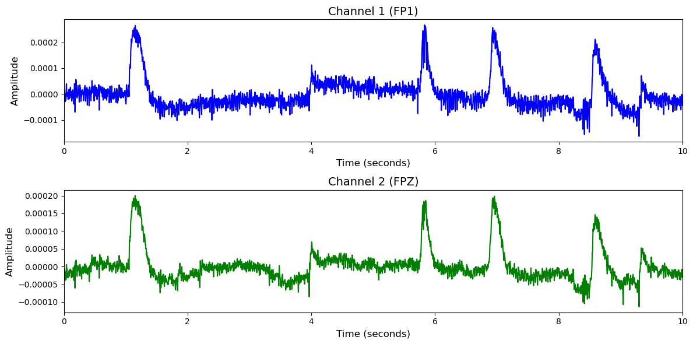

# SEED-V

# 1. Dataset Information

SEED-V 데이터셋[^1] 은 16명의 피험자에 대한 EEG(뇌파) 및 안구 운동 데이터를 포함하고 있습니다. 이 실험에서 사용된 감정 유도 방법은 자극 자료 유도 방식으로, 이는 피험자들에게 특정 감정 자극 자료를 시청하게 함으로써 해당 감정 상태를 유도하는 방식입니다. 감정의 범주는 다섯 가지로 확대되었으며, 각각 행복, 슬픔, 공포, 혐오, 중립입니다. 총 3번의 실험으로, 각 실험은 총 15개의 트라이얼로 구성되어 있습니다. 

# 2. Dataset Basic Information

## 2.1 Data Information

| # of Subjects | # of Leads | Sampling Frequency (Hz) | Recording Duration (min) | File Fomat |
| --- | --- | --- | --- | --- |
| 16 |   62 |   1000 |   50 |   (EEG).cnt/(eye).csv |

## 2.2 Data Statistics

*EEG 전극에 해당하는 데이터만을 사용해 통계 분석을 수행하였습니다.

| Label Type | #of recordings | EEG Mean | EEG Std | EEG Max | EEG Median | EEG Min |
| --- | --- | --- | --- | --- | --- | --- |
|
  Disgust (0)
   | 
141
(20%)
   | 
  7.5864e-08
   | 
  0.000045
   | 
  0.001810
   | 
  -4.692e-08
   | 
  -0.000946
   |
|
  Fear (1)
   | 
141
(20%)
   | 
  -7.588e-08
   | 
  0.000039
   | 
  0.000829
   | 
  -1.754e-08
   | 
  -0.001242
   |
|
  Sad (2)
   | 
141
(20%)
   | 
  -1.876e-08
   | 
  0.000026
   | 
  0.000473
   | 
  2.409e-08
   | 
  -0.000453
   |
|
  Neutral (3)
   | 
141
(20%)
   | 
  -4.645e-08
   | 
  0.000029
   | 
  0.000529
   | 
  -4.121e-08
   | 
  -0.000455
   |
|
  Happy (4)
   | 
141
(20%)
   | 
  7.7123e-09
   | 
  0.000028
   | 
  0.001050
   | 
  5.257e-08
   | 
  -0.000487
   |
|  Total | 705 | -1E-08 | 0.0000334 | 0.0009382 | -5.8E-09 | -0.0007166 |

## 2.3 Raw Dataset


!!! note ""
    ```
    SEED-V/
    └── SEED-V/
    ├── EEG_DE_features/
    │   ├── 10_123.npz
    │   ├── 11_123.npz
    │   └── 12_123.npz
    │   ... (14 more files)
    ├── EEG_raw/
    │   ├── 10_1_20180507.cnt
    │   ├── 10_2_20180524.cnt
    │   └── 10_3_20180626.cnt
    │   ... (46 more files)
    ├── Eye_movement_features/
    │   ├── 10_123.npz
    │   ├── 11_123.npz
    │   └── 12_123.npz
    │   ... (14 more files)
    ├── Eye_raw/
    │   └── seed_v_eye_feature_raw_excel/
    │       ├── Session_1/
    │       │   ├── 10_1_20180507.xlsx
    │       │   ├── 11_1_20180510.xlsx
    │       │   └── 12_1_20180515.xlsx
    │       │   ... (13 more files)
    │       ├── Session_2/
    │       │   ├── 10_2_20180524.xlsx
    │       │   ├── 11_2_20180508.xlsx
    │       │   └── 12_2_20180508.xlsx
    │       │   ... (13 more files)
    │       └── Session_3/
    │           ├── 10_3_20180626.xlsx
    │           ├── 11_3_20180522.xlsx
    │           └── 12_3_20180517.xlsx
    │           ... (13 more files)
    ├── src/
    │   ├── DCCA-with-attention-mechanism/
    │   │   ├── README.txt
    │   │   ├── [main.py](http://main.py/)
    │   │   └── [utils.py](http://utils.py/)
    │   └── MutualInformationComparison/
    │       ├── MI_plot-master.zip
    │       └── github-links.txt
    ├── Channel Order.xlsx
    ├── Participants_info.xlsx
    └── Read me.txt
    ... (5 more files)
    
    12 directories, 144 files
    ```


Raw EEG data는 .cnt 형식으로 제공되며, SEED-V_stimulation.xlsx에서 자극 순서 및 시간, 라벨링 정보를 알 수 있습니다. trial_start_end_timestamp.txt를 통해 한 cnt파일 별 자극단위 timepoint를 알 수 있습니다.

## 2.4 Raw Dataset Example



## 2.5 Preprocessed Dataset


!!! note ""
    ```
    SEED-V/
    ├── npy_files/
    │   ├── sess01_sub01_trial01.npy
    │   ├── sess01_sub01_trial02.npy
    │   └── sess01_sub01_trial03.npy
    │   ... (702 more files)
    ├── SEED-V.h5
    ├── channels.csv
    └── labels.csv
    
    1 directories, 708 files
    ```


한 trial(자극)별로 split하고 .npy로 변환하였으며 이 파일명은 labels.csv의 1열과 대응되고, 2열엔 정수형 레이블이 있습니다.

# 3. Applications and Use Cases

| 인용 논문 | 연구 과제 | 모델 구조 | 방법론 |
| --- | --- | --- | --- |
|
  Wang et al. (2024) [^2]
   | 
  EEG 기반 범용 디코딩 모델 개발
   | 
  Criss-cross attention 기반 모델
   | 
  Criss-Cross Attention과 ACPE 채널 임베딩으로 다양한 EEG 태스크에 높은 성능 달성
   |
|
  Dharia et al. (2023) [^3]
   | 
  EEG와 눈 움직임 데이터를 이용한 감정인식 모델 개발
   | 
  Attention 기반 multimodal
  fusion 모델
   | 
  EEG와 눈 움직임 데이터를 각각 처리한 후, attention 기반의 fusion을 통해 두 특성 정보를
  통합하여 감정을 분류
   |

# 4. References

[^1]: Wei Liu, Jie-Lin Qiu, Wei-Long Zheng and Bao-Liang Lu, Comparing Recognition Performance and Robustness of Multimodal Deep Learning Models for Multimodal Emotion Recognition, IEEE Transactions on Cognitive and Developmental Systems, 2021.

[^2]: Wang, J., Zhao, S., Luo, Z., Zhou, Y., Jiang, H., Li, S., Li, T., & Pan, G. (2024). *CBraMod: A criss-cross brain foundation model for EEG decoding*. arXiv preprint arXiv:2403.06752.

[^3]: Dharia, S. Y., Valderrama, C. E., & Camorlinga, S. G. (2023). Multimodal deep learning model for subject-independent EEG-based emotion recognition. In 2023 IEEE Canadian Conference on Electrical and Computer Engineering (CCECE) (pp. 105–110). IEEE.