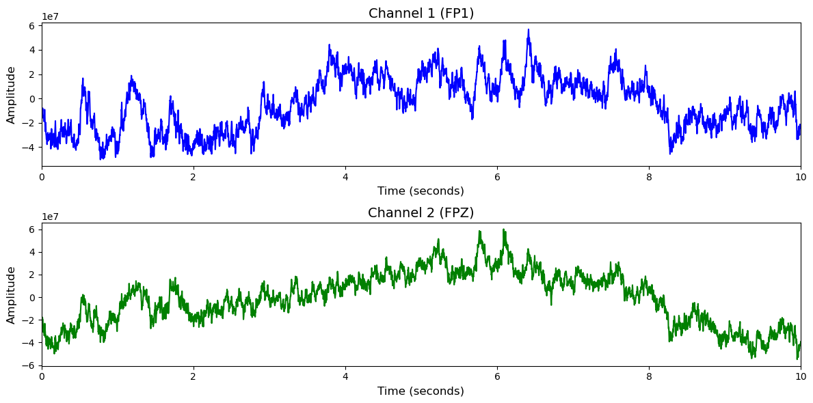

# SEED

# 1. Dataset Information

SEED 데이터셋[^1] 은 12명의 피험자에 대한 EEG(뇌파) 및 안구 운동 데이터와, 추가로 3명의 피험자에 대한 EEG 데이터만을 포함하고 있습니다. 데이터는 피험자들이 영화 클립을 시청하는 동안 수집되었습니다. 이 영화 클립들은 긍정, 부정, 중립의 세 가지 감정을 유도할 수 있도록 선정되었습니다. 총 3번의 실험으로, 각 실험은 총 15개의 트라이얼로 구성되어 있습니다

# 2. Dataset Basic Information

## 2.1 Data Information

| # of Subjects | # of Leads | Sampling Frequency (Hz) | Recording Duration (min) | File Fomat |
| --- | --- | --- | --- | --- |
| 15 |  62 |   1000 |   75 |   (EEG).cnt/(eye).xls |

## 2.2 Data Statistics

*EEG 전극에 해당하는 데이터만을 사용해 통계 분석을 수행하였습니다.

| Label Type | #of recordings | EEG Mean | EEG Std | EEG Max | EEG Median | EEG Min |
| --- | --- | --- | --- | --- | --- | --- |
|
 Negative (0)
   | 
225
(33.3%)
 | 
  -69883
   | 
  161103696
   | 
  1.999e+09
   | 
  194277
   | 
  -2.025e+09
   |
|
  Neutral (1)
   | 
225
(33.3%)
   | 
  194508
   | 
  156046752
   | 
  1.972e+09
   | 
  -14855
   | 
  -2.010e+09
   |
|
  Positive (2)
   | 
225
(33.3%)
   | 
  -3779
   | 
  160617360
   | 
  2.054e+09
   | 
  150673
   | 
  -2.070e+09
   |
| **Total** | 675 | 40282 | 159255936 | 2008333333 | 110031.7 | -2035000000 |

## 2.3 Raw Dataset


!!! note ""
    ```
    SEED/
    ├── SEED/
    │   ├── SEED_EEG/
    │   │   ├── ExtractedFeatures_1s/
    │   │   │   ├── 10_20131130.mat
    │   │   │   ├── 10_20131204.mat
    │   │   │   └── 10_20131211.mat
    │   │   │   ... (44 more files)
    │   │   ├── ExtractedFeatures_4s/
    │   │   │   ├── 10_20131130.mat
    │   │   │   ├── 10_20131204.mat
    │   │   │   └── 10_20131211.mat
    │   │   │   ... (44 more files)
    │   │   ├── Preprocessed_EEG/
    │   │   │   ├── 10_20131130.mat
    │   │   │   ├── 10_20131204.mat
    │   │   │   └── 10_20131211.mat
    │   │   │   ... (44 more files)
    │   │   ├── SEED_RAW_EEG/
    │   │   │   ├── 10_1.cnt
    │   │   │   ├── 10_2.cnt
    │   │   │   └── 10_3.cnt
    │   │   │   ... (43 more files)
    │   │   ├── SEED_stimulation.xlsx
    │   │   ├── channel-order.xlsx
    │   │   └── subject-id-gender-seed.txt
    │   ├── SEED_Multimodal/
    │   │   ├── Chinese/
    │   │   │   ├── 01-EEG-raw/
    │   │   │   │   ├── 10_1.cnt
    │   │   │   │   ├── 10_2.cnt
    │   │   │   │   └── 10_3.cnt
    │   │   │   │   ... (34 more files)
    │   │   │   ├── 02-EEG-DE-feature/
    │   │   │   │   ├── eeg_used_1s/
    │   │   │   │   │   ├── 10_1.npz
    │   │   │   │   │   ├── 10_2.npz
    │   │   │   │   │   └── 10_3.npz
    │   │   │   │   │   ... (33 more files)
    │   │   │   │   ├── eeg_used_4s/
    │   │   │   │   │   ├── 10_1.npz
    │   │   │   │   │   ├── 10_2.npz
    │   │   │   │   │   └── 10_3.npz
    │   │   │   │   │   ... (33 more files)
    │   │   │   │   └── reading_eeg_feature.py
    │   │   │   ├── 03-Eye-tracking-excel/
    │   │   │   │   ├── 10_1.xls
    │   │   │   │   ├── 10_2.xls
    │   │   │   │   └── 10_3.xls
    │   │   │   │   ... (33 more files)
    │   │   │   └── 04-Eye-tracking-feature/
    │   │   │       ├── eye_tracking_feature/
    │   │   │       │   ├── 10_1
    │   │   │       │   ├── 10_2
    │   │   │       │   └── 10_3
    │   │   │       │   ... (33 more files)
    │   │   │       └── reading_eye_feature.py
    │   │   ├── code/
    │   │   │   ├── CrossCultureCode-main/
    │   │   │   │   ├── BDAE/
    │   │   │   │   │   ├── bdae_chinese.py
    │   │   │   │   │   └── [utils.py](http://utils.py/)
    │   │   │   │   ├── DCCA-AM/
    │   │   │   │   │   ├── chinese_dcca_attention.py
    │   │   │   │   │   ├── dcca_utils.py
    │   │   │   │   │   └── [utils.py](http://utils.py/)
    │   │   │   │   ├── TraditionalFusion/
    │   │   │   │   │   ├── 01_svm_concat.py
    │   │   │   │   │   ├── MCalFuzzyMeasure.m
    │   │   │   │   │   └── max_sum_fusion.py
    │   │   │   │   │   ... (2 more files)
    │   │   │   │   ├── dnn_eeg_chinese_baseline.py
    │   │   │   │   └── svm_knn_lr_classifiers.py
    │   │   │   └── CrossCultureCode-main.zip
    │   │   ├── paper/
    │   │   │   ├── Chinese_and_French.pdf
    │   │   │   ├── Chinese_and_German.pdf
    │   │   │   └── jne_19_2_026012.pdf
    │   │   ├── China_information.xlsx
    │   │   └── README.pdf
    │   └── channel_62_pos.locs
    ├── SEED_EEG/
    │   ├── ExtractedFeatures_1s/
    │   │   ├── 10_20131130.mat
    │   │   ├── 10_20131204.mat
    │   │   └── 10_20131211.mat
    │   │   ... (15 more files)
    │   ├── SEED_stimulation.xlsx
    │   ├── channel-order.xlsx
    │   └── subject-id-gender-seed.txt
    └── channel_62_pos.locs
    
    23 directories, 414 files
    
    9 directories, 165 files
    ```


Raw EEG data는 .cnt 형식으로 제공되며, preprocessed data는 .mat 형식으로 제공됩니다. SEED_stimulation.xlsx에서 자극 순서 및 시간, 라벨링 정보를 알 수 있습니다.  SEED_RAW_EEG 폴더 내의 time.txt를 통해 한 cnt파일 별 자극단위 timepoint를 알 수 있습니다.

## 2.4 Raw Dataset Example



## 2.5 Preprocessed Dataset


!!! note ""
    ```
    SEED/
    ├── npy_files/
    │   ├── sess01_sub01_trial01.npy
    │   ├── sess01_sub01_trial02.npy
    │   └── sess01_sub01_trial03.npy
    │   ... (672 more files)
    ├── SEED.h5
    ├── channels.csv
    └── labels.csv
    ```


한 trial(자극)별로 split하고 .npy로 변환하였으며 이 파일명은 labels.csv의 1열과 대응되고, 2열엔 정수형 레이블이 있습니다.

# 3. Applications and Use Cases

| 인용 논문 | 연구 과제 | 모델 구조 | 방법론 |
| --- | --- | --- | --- |
|
  Song et al. (2023) [^2]
   | 
  EEG의 Local, global 정보를 동시에 학습하는 경량 모델
  개발
   | 
  CNN, Self-attention 기반 모델
   | 
  CNN으로 로컬특징, self-attention으로 global 특징 포착,  
   |
|
  Yi et al. (2023) [^3]
   | 
  다양한 EEG 채널 구성을 통합할 수 있는 topology-agnostic EEG
  representation 학습 프레임워크 개발
   | 
  Multi-dimensional position encoding, Multi-level channel
  hierarchy, Multi-stage pre-training 전략
   | 
  EEG 채널들을 통합된 두피 위상(topology)으로 매핑한 뒤, 계층적·공간적 정보를 반영한 다단계 사전학습을 수행해 범용 EEG 표현 학습
   |

# 4. References

[^1]: Wei-Long Zheng, and Bao-Liang Lu, Investigating Critical Frequency Bands and Channels for EEG-based Emotion Recognition with Deep Neural Networks, accepted by IEEE Transactions on Autonomous Mental Development (IEEE TAMD) 7(3): 162-175, 2015

[^2]: Song, Y., Zheng, Q., Liu, B., & Gao, X. (2023). EEG Conformer: Convolutional Transformer for EEG Decoding and Visualization. *IEEE Transactions on Neural Systems and Rehabilitation Engineering, 31*, 710–719.

[^3]: Yi, K., Wang, Y., Ren, K., & Li, D. (2023). Learning topology-agnostic EEG representations with geometry-aware modeling. In *Advances in Neural Information Processing Systems*, 36. NeurIPS.