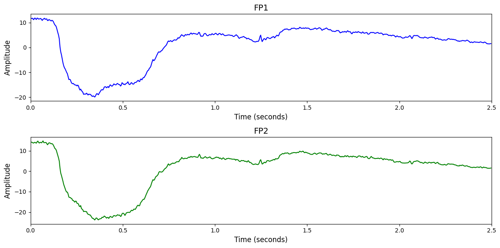

# 1. Dataset Information

이 데이터셋은 25명의 피험자가 5일에 걸쳐 수행한 좌/우손 운동 심상(Motor Imagery, MI) 과제 중 수집된 EEG 신호로 구성되어 있으며, 세션 간 변동성(Cross-session variability)을 다루기 위한 목적으로 제작되었습니다 [1].  이 데이터셋은 세션 내 분류(within-session), 세션 간 분류(cross-session), 세션 간 적응 학습(cross-session adaptation) 실험이 가능하도록 설계되었으며, CSP, FBCSP, EEGNet, FBCNet 등 다양한 고전적/딥러닝 알고리즘을 위한 벤치마크 실험 결과도 함께 제공됩니다. 특히, 세션 간 적응 학습(CSA)을 통해 훈련 데이터를 줄이면서도 높은 분류 정확도를 달성할 수 있어, 해당 분야 연구에 유용하게 활용될 수 있습니다.

# 2. Dataset Basic Information

## 2.1 Data Information

| # of Subjects | # of Leads | Sampling Frequency (Hz) | Recording Duration (min) | File Fomat |
| --- | --- | --- | --- | --- |
| 25 | 32 | 250 | 0.0667 | (EEG).edf, (annotation).tsv |

## 2.2 Data Statistics

*EEG 전극에 해당하는 데이터만을 사용해 통계 분석을 수행하였습니다.

| Label Type | #of recordings | EEG Mean | EEG Std | EEG Max | EEG Median | EEG Min |
| --- | --- | --- | --- | --- | --- | --- |
| Left Hand | 5983 | -6.266834e-08 | 351.810699 | 281775.03125 | 0.012015 | -283019.59375 |
| Right Hand | 6005 | -5.130733e-07 | 214.657806 | 281045.03125 | 0.011376 | -279057.03125 |
| Total | 11988 | -2.907332e-07 | 291.2897 | 281775.03125 | 0.011695217 | -283019.59375 |

## 2.3 Raw Dataset

!!! note ""
     19228725/
     ├── 36729000_README.txt
     ├── 36729006_README.txt
     └── code_files.zip
     ... (136 more files)
    0 directories, 139 files

이 데이터셋은 EEG-BIDS 포맷을 따르며, 전처리된 EEG 신호는 edf_files/ 폴더에 .edf 형식으로 저장되어 있고, 각 세션별 이벤트 정보는 events/ 폴더의 .tsv 파일로 제공됩니다. 또한 mat_files/ 폴더에는 각 세션별로 trial 단위 EEG 데이터와 라벨이 포함된 .mat 파일이 있어 바로 분류 실험에 활용할 수 있습니다. 데이터는 피험자 ID와 세션 번호에 따라 체계적으로 구성되어 있습니다.

## 2.4 Raw Dataset Example

## 2.5 Preprocessed Dataset

!!! note ""
     SHU-MI/
     ├── npy_files/
     │   ├── sess01_sub01_trial001.npy
     │   ├── sess01_sub01_trial002.npy
     │   └── sess01_sub01_trial003.npy
     │   ... (11985 more files)
     ├── channels.csv
     └── labels.csv
    1 directories, 12129 files

# 3. Applications and Use Cases

| 인용 논문 | 연구 과제 | 모델 구조 | 방법론 |
| --- | --- | --- | --- |
| Guerrero-Mendez (2023) [2] | MI-BCI 초보 사용자에서의 EEG 분류 성능 향상 및 BCI illiteracy 극복 | CNN+LSTM 혼합 구조 | 25명의 naive 사용자 EEG 데이터를 이용해 CNN, LSTM, BiLSTM 기반 딥러닝 모델을 학습. 초보자 대상 BCI 시스템의 실용성과 제어성, 신뢰성을 높이는 데 효과적. |
| Pham (2023) [3] | 대규모 MI-EEG 데이터셋 기반 웨이블릿 특징 융합 분류 성능 향상 | Wavelet Scattering Features + SVM + Fuzzy Rule-based Classifier Fusion | 웨이블릿-시간 특성과 반복성 플롯을 기반으로 두 개 분류기(SVM 등)를 훈련시킨 후 fuzzy rule 기반 융합 시스템으로 최종 분류. |

# 4. References

[1] Ma, Jun; Yang, Banghua; Qiu, Wenzheng; Li, Yunzhe; Gao, Shouwei; Xia, XinXing (2022). SHU Multi-session Dataset. figshare. Software. [https://doi.org/10.6084/m9.figshare.19228725.v3](https://doi.org/10.6084/m9.figshare.19228725.v3)
[2] Guerrero-Mendez, Cristian D., et al. "EEG motor imagery classification using deep learning approaches in naïve BCI users." *Biomedical Physics & Engineering Express* 9.4 (2023): 045029.
[3] Pham, Tuan D. "Classification of motor-imagery tasks using a large EEG dataset by fusing classifiers learning on wavelet-scattering features." *IEEE Transactions on Neural Systems and Rehabilitation Engineering* 31 (2023): 1097-1107.
