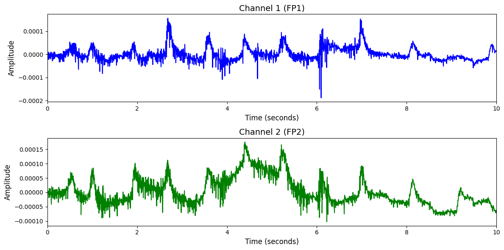

# 1. Dataset Information

Siena Scalp EEG Database[1]는 발작 탐지를 위해 설계된 EEG(뇌파) 데이터입니다. 간질 환자 14명을 대상으로 수집 되었으며, 각 피험자에 대해 1~5개의 기록 세션이 존재합니다. 일부 피험자의 경우 동일한 실험 환경에서 최대 5회까지 EEG가 반복적으로 측정되었습니다. 국제 10–20 전극 배치 기준에 따라 전극이 부착되었으며, 대부분의 세션에서 EKG 신호도 함께 기록되었습니다. 모든 데이터는 전문 임상의의 검토를 거쳐 발작 구간이 주석 처리 되었으며, 환자는 깨어 있거나 수면 중인 상태에서 침대에 누워 있는 조건 하에 측정을 받았습니다.

# 2. Dataset Basic Information

## 2.1 Data Information

| # of Subjects | # of Leads | Sampling Frequency (Hz) | Recording Duration (min) | File Fomat |
| --- | --- | --- | --- | --- |
| 14 | 28 | 512 | Max   1408min | (EEG).edf/(피실험자 정보).csv |

## 2.2 Data Statistics

*EEG 전극에 해당하는 데이터만을 사용해 통계 분석을 수행하였습니다.

| Label Type | #of recordings | EEG Mean | EEG Std | EEG Max | EEG Median | EEG Min |
| --- | --- | --- | --- | --- | --- | --- |
| Non-seizure (0) | 83 (65.87%) | 0.000003 | 0.000104 | 0.003436 | 0.000004 | -0.003020 |
| Seizure (1) | 43 (34.13%) | -0.000002 | 0.000132 | 0.001582 | 0.000004 | -0.001507 |
| **Total** | 126 | 0.000002 | 0.000113 | 0.002786 | 0.000004 | -0.002486 |

| Label Type | #of recordings | EEG Mean | EEG Std | EEG Max | EEG Median | EEG Min |
| --- | --- | --- | --- | --- | --- | --- |
| Non-seizure (0) | 83 (65.87%) | 0.00000341 | 0.000104 | 0.003436 | 0.00000375 | -0.003020 |
| IAS(1) | 30 (23.81%) | 0.00000032 | 0.000097 | 0.001679 | 0.00000405 | -0.001547 |
| WIAS (2) | 9 (7.14%) | 0.00000260 | 0.000235 | 0.001418 | 0.00000428 | -0.001498 |
| FBTC(3) | 4 (3.17%) | -0.00002515 | 0.000158 | 0.001222 | 0.00000009 | -0.001226 |
| **Total** | 126 | 0.000002 | 0.000113 | 0.002786 | 0.000004 | -0.002486 |

## 2.3 Raw Dataset

!!! note ""
    ```
    Siena/
    ├── PN00/
    │   ├── PN00-1.edf
    │   ├── PN00-2.edf
    │   └── PN00-3.edf
    │   ... (3 more files)
    ├── PN01/
    │   ├── PN01-1.edf
    │   └── Seizures-list-PN01.txt
    ├── PN03/
    │   ├── PN03-1.edf
    │   ├── PN03-2.edf
    │   └── Seizures-list-PN03.txt
    ├── PN05/
    │   ├── PN05-2.edf
    │   ├── PN05-3.edf
    │   └── PN05-4.edf
    │   ... (1 more files)
    ├── PN06/
    │   ├── PN06-1.edf
    │   ├── PN06-2.edf
    │   └── PN06-3.edf
    │   ... (3 more files)
    ├── PN07/
    │   ├── PN07-1.edf
    │   └── Seizures-list-PN07.txt
    ├── PN09/
    │   ├── PN09-1.edf
    │   ├── PN09-2.edf
    │   └── PN09-3.edf
    │   ... (1 more files)
    ├── PN10/
    │   ├── PN10-1.edf
    │   ├── PN10-10.edf
    │   └── PN10-2.edf
    │   ... (4 more files)
    ├── PN11/
    │   ├── PN11-1.edf
    │   └── Seizures-list-PN11.txt
    ├── PN12/
    │   ├── PN12-1.2.edf
    │   ├── PN12-3.edf
    │   └── PN12-4.edf
    │   ... (1 more files)
    ├── PN13/
    │   ├── PN13-1.edf
    │   ├── PN13-2.edf
    │   └── PN13-3.edf
    │   ... (1 more files)
    ├── PN14/
    │   ├── PN14-1.edf
    │   ├── PN14-2.edf
    │   └── PN14-3.edf
    │   ... (2 more files)
    ├── PN16/
    │   ├── PN16-1.edf
    │   ├── PN16-2.edf
    │   └── Seizures-list-PN16.txt
    ├── PN17/
    │   ├── PN17-1.edf
    │   ├── PN17-2.edf
    │   └── Seizures-list-PN17.txt
    ├── subjec_info.csv
    ├── LICENSE.txt
    ├── RECORDS
    └── SHA256SUMS.txt
    14 directories, 59 files
    ```

Siena raw EEG 데이터셋은 총 14명의 간질 환자의 뇌파 데이터를 개별 폴더로 구분하여 구성하고 있으며, 각 폴더는 피험자 식별자(ID)에 따라 PN00, PN01과 같은 이름으로 정리되어 있습니다. 전체 데이터셋에는 LICENSE.txt, RECORDS, subject_info.csv 등의 공통 정보 파일이 존재하며, 각 환자 폴더에는 여러 세션별 EEG 기록 파일과 발작 발생 여부 주석 정보가 담긴 txt파일이 포함됩니다.

## 2.4 Raw Dataset Example



## 2.5 Preprocessed Dataset

!!! note ""
    ```
    Siena/
    ├── npy_files/
    │   ├── sess1.2_sub12_trial1.npy
    │   ├── sess1.2_sub12_trial2.npy
    │   └── sess1.2_sub12_trial3.npy
    │   ... (123 more files)
    ├── seizure_labels.csv
    ├── seizuretype_labels.csv
    ├── Siena.h5
    ├── Siena.npz
    └── channels.csv
    1 directiories, 131 files.
    ```

# 3. Applications and Use Cases

| 인용 논문 | 연구 과제 | 모델 구조 | 방법론 |
| --- | --- | --- | --- |
| Wang et al. (2023) [2] | 발작 감지 및 예측 | 랜덤 포레스트 분류기 | 주파수 도메인 분석 및 위상-진폭 결합(PAC) 분석을 통한 특징 추출 |
| Li et al. (2024) [3] | EEG 기반 범용 사전학습 모델 개발 | LaBraM(Transformer 기반 Masked Modeling) | 벡터 양자화 기반 EEG tokenizer 사전학습, downstream task 적용 (Siena 포함 다수 데이터셋 사용) |

# 4. References

[1] Detti, P., Vatti, G., & Zabalo Manrique de Lara, G. (2020).*EEG Synchronization Analysis for Seizure Prediction: A Study on Data of Noninvasive Recordings*. Processes, 8(7), 846.

[2] Wang, Y., Zhang, Y., et al., 2023. Epileptic seizures detection and the analysis of optimal seizure prediction horizon based on phase–amplitude coupling. Frontiers in Neuroscience, 17, 1191683.

[3] Li, Y., Yang, Y., Du, Y., Wu, P., Wang, Y., 2024. LaBraM: A Large Brain Model for Universal Representation of EEG Signals. arXiv preprint, arXiv:2405.18765.
