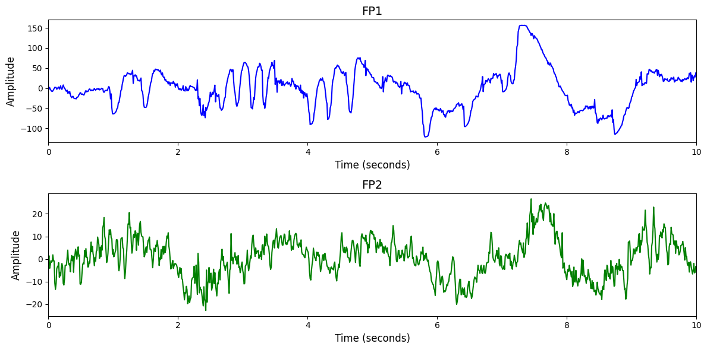

# 1. Dataset Information

Sleep-EDF는 197명의 피험자에 대한 수면 다원검사(PSG) 기록을 포함한 데이터셋으로, EEG, EOG, EMG 등 다양한 생리 신호와 수면 단계 주석이 30초 간격으로 포함되어 있다. 데이터는 수면 단계 분류 연구에 널리 활용되며, EEG Fpz-Cz와 Pz-Oz 채널이 주요 신호로 사용된다 [1].

# 2. Dataset Basic Information

## 2.1 Data Information

| # of Subjects | # of Leads | Sampling Frequency (Hz) | Recording Duration (min) | File Fomat |
| --- | --- | --- | --- | --- |
| 82 | 7 | 100 | 1300 | (EEG).edf, (annotation).edf |

## 2.2 Data Statistics

*EEG 전극에 해당하는 데이터만을 사용해 통계 분석을 수행하였습니다.

| Label Type | #of recordings | EEG Mean | EEG Std | EEG Max | EEG Median | EEG Min |
| --- | --- | --- | --- | --- | --- | --- |
| Awake | 183 | 0.443607 | 103.473258 | 2148.141366 | 0.541880 | -2785.021058 |
| REM | 7093 | -0.097265 | 45.050307 | 3540.194104 | 0.049817 | -3730.635415 |
| Stage 1 | 7910 | 0.029287 | 37.065112 | 4526.460355 | 0.148638 | -4507.049991 |
| Stage 2 | 4645 | -0.095869 | 29.799350 | 2967.405237 | 0.010989 | -3395.531954 |
| Stage 3 | 1401 | 0.184078 | 36.218958 | 2977.659769 | 0.134799 | -2972.898736 |
| Stage 4 | 35 | 0.191816 | 28.778672 | 416.956601 | 0.468132 | -329.426845 |
| Monitoring | 1897 | -0.240358 | 52.548293 | 4526.460355 | 0.044689 | -4507.049991 |
| Undefined | 4329 | -0.138913 | 33.291596 | 3468.046145 | -0.019780 | -3963.559788 |
| Total | 27493 | -0.005638 | 31.651181 | 4526.460355 | 0.0791209 | 4507.049991 |

## 2.3 Raw Dataset

!!! note ""
    ```
    sleep-edf-database-expanded-1.0.0/
    └── sleep-edf-database-expanded-1.0.0/
    ├── sleep-cassette/
    │   ├── SC4001E0-PSG.edf
    │   ├── SC4001EC-Hypnogram.edf
    │   └── SC4002E0-PSG.edf
    │   ... (303 more files)
    ├── sleep-telemetry/
    │   ├── ST7011J0-PSG.edf
    │   ├── ST7011JP-Hypnogram.edf
    │   └── ST7012J0-PSG.edf
    │   ... (85 more files)
    ├── RECORDS
    ├── RECORDS-v1
    └── SC-subjects.xls
    ... (2 more files)
    3 directories, 399 files
    ```

Sleep-EDF Expanded 데이터셋은 sleep-cassette와 sleep-telemetry 두 하위 폴더로 구성되어 있으며, 각각의 폴더에는 PSG 신호 파일(*.edf)과 수면 단계 주석 파일(*-Hypnogram.edf)이 짝을 이루어 존재한다. sleep-cassette는 주간 수면 기록을, sleep-telemetry는 야간 수면 기록을 포함하며, RECORDS와 SC-subjects.xls 파일에는 전체 데이터의 메타 정보가 정리되어 있다. 수면 단계는 30초 간격으로 주석 처리되어 있다.

## 2.4 Raw Dataset Example



## 2.5 Preprocessed Dataset

!!! note ""
    ```
    Sleep_EDF/
    ├── npy_files/
    │   ├── sess1_sub100_trial1.npy
    │   ├── sess1_sub100_trial10.npy
    │   └── sess1_sub100_trial100.npy
    │   ... (23129 more files)
    ├── channels.csv
    └── labels.csv
    1 directories, 23134 files
    ```

# 3. Applications and Use Cases

| 인용 논문 | 연구 과제 | 모델 구조 | 방법론 |
| --- | --- | --- | --- |
| Kostas (2021) [2] | 대규모 EEG 데이터를 활용한 범용 feature 학습 및 다운스트림 BCI/EEG 분류로의 적응 | Transformer + Contrastive Self-Supervised Learning (BENDR) | raw EEG에 대해 transformer 기반 encoder를 사용하고, contrastive self-supervised objective로 시계열 representation을 학습. 사전학습된 BENDR는 다양한 장비, 과제, 피험자 간에도 일반화 가능하며, 다운스트림 EEG 분류/수면 단계 분류에서 fine-tuning 시 높은 전이 학습 성능을 보임. |
| Alickovic (2018) [3] | 단일 채널 EEG 기반 수면 단계 자동 분류 | DWT + MSPCA + Rotational SVM (RotSVM) 앙상블 | Pz-Oz 단일 채널 EEG 신호에 대해 MSPCA로 노이즈 제거, DWT로 서브밴드 분해 및 통계량 추출 후, 해당 feature들을 RotSVM 기반 앙상블 분류기로 입력. PCA 기반 차원 축소와 비선형 SVM을 조합하여 고성능 수면 분류 모델을 구성함. |

# 4. References

[1] Kemp, Bob, et al. "Sleep-edf database expanded." *Physionet org* (2018).

[2] Kostas, Demetres, Stephane Aroca-Ouellette, and Frank Rudzicz. "BENDR: Using transformers and a contrastive self-supervised learning task to learn from massive amounts of EEG data." *Frontiers in Human Neuroscience* 15 (2021): 653659.

[3] Alickovic, Emina, and Abdulhamit Subasi. "Ensemble SVM method for automatic sleep stage classification." *IEEE Transactions on Instrumentation and Measurement* 67.6 (2018): 1258-1265.
