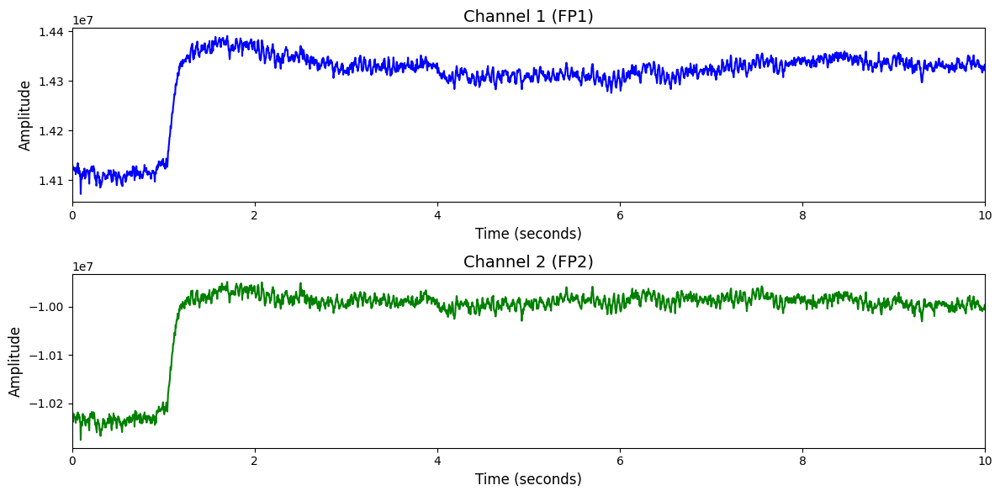

# 1. Dataset Information

SPIS 데이터셋[1]은 총 10명의 건강한 성인을 대상으로 수집된 EEG 데이터로, 지속적인 주의력을 요구하는 단순 반복 자극-반응 과제(SART)를 수행하는 동안의 뇌파를 기록하였습니다. 실험은 약 100분 이상 동안 진행되며, 각 세션은 12개의 블록으로 구성되어 총 2700개 이상의 자극이 제시됩니다. 실험 시작 전에는 정신 곱셈 과제를 통해 피험자의 주의 상태를 초기화하고, 눈을 뜬 상태와 감은 상태의 휴식 EEG도 각각 2.5분간 수집하였습니다. EEG는 Biosemi 64채널 시스템을 사용하여 기록되었고, CVS(Cumulative Vigilance Score), HRT(Hit Response Time) 평균 및 분산 등을 통해 각 피험자의 지속적 주의력을 수치화하여 정답값으로 활용합니다.

# 2. Dataset Basic Information

## 2.1 Data Information

| # of Subjects | # of Leads | Sampling Frequency (Hz) | Recording Duration (min) | File Fomat |
| --- | --- | --- | --- | --- |
| 10 | 64 | 256 | 100 | EEG(.set), CVS/HRT(.csv) |

## 2.2 Data Statistics

*EEG 전극에 해당하는 데이터만을 사용해 통계 분석을 수행하였습니다.

| Label Type | #of recordings | EEG Mean | EEG Std | EEG Max | EEG Median | EEG Min |
| --- | --- | --- | --- | --- | --- | --- |
| (0) | 10 (50.0%) | -4782682.5 | 14427179.0 | 67977736.0 | -4756455.0 | -48971676.0 |
| (1) | 10 (50.0%) | -4491953.5 | 16247430.0 | 87742320.0 | -4905937.0 | -46807268.0 |
| **Total** | 20 | -4491606.5 | 20008236.0 | 265610000.0 | -4807721.0 | -70026080.0 |

## 2.3 Raw Dataset

!!! note ""
     SPIS-Resting-State-Dataset/
     ├── Pre-SART EEG/
     │ ├── Dataset Description
     │ ├── S02_restingPre_EC.mat
     │ └── S02_restingPre_EO.mat
     │ ... (19 more files)
     ├── LICENSE
     └── [README.md](http://readme.md/)
     1 directories, 24 files

## 2.4 Raw Dataset Example

## 2.5 Preprocessed Dataset

!!! note ""
     SPIS_Resting_State_Dataset/
     ├── SPIS_Resting_State_Dataset_npy/
     │   ├── S02_EC.npy
     │   ├── S02_EO.npy
     │   └── S03_EC.npy
     │   ... (17 more files)
     ├── npy_files/
     │   ├── sess1_sub10_trial1.npy
     │   ├── sess1_sub11_trial1.npy
     │   └── sess1_sub2_trial1.npy
     │   ... (17 more files)
     ├── preprocessed/
     ├── SPIS_Resting_State_Dataset.h5
     ├── SPIS_Resting_State_Dataset.npz
    ├── SPIS_Resting_State_Dataset.npz
    ├── labels.csv
    ├── labels(raw_encoded).csv
    └── channels.csv
    3 directories, 46 files

# 3. Applications and Use Cases

| 인용 논문 | 연구 과제 | 모델 구조 | 방법론 |
| --- | --- | --- | --- |
| Jiang et al. (2024) [2] | EEG 기반 범용 표현 학습 및 다양한 과제 전이 | Transformer 기반 EEG 인코더 모델 (LaBraM) | 마스킹 기반 자기지도 학습 방식을 통해 2,500시간 이상의 EEG 데이터를 사전학습하며, 복원 기반 학습을 통해 일반화 가능한 표현을 확보함. 이후 감정 인식, 보행 예측 등 다양한 다운스트림 과제에 전이하여 기존 최고 성능을 초과함. |
| Feng et al. (2023) [3] | M/EEG 기반 뇌 source activity 추정 향상 | Microstate 기반 segmentation과 Bayesian source imaging 모델 | EEG 데이터를 microstate 단위로 나누고, 각 구간에서 spatio-temporal priors를 적용하여 source를 추정함. SPIS 데이터로 성능 검증. |

# 4. References

[1] Torkamani-Azar, M., Kanik, S. D., Aydin, S., & Cetin, M. (2020). Prediction of Reaction Time and Vigilance Variability From Spatio-Spectral Features of Resting-State EEG in a Long Sustained Attention Task. *IEEE Journal of Biomedical and Health Informatics*, 24(9), 2550–2558.
[2] Jiang, W., Zhao, L.-M., & Lu, B.-L. (2024). LaBraM: Large Brain Model for Learning Generic Representations with Tremendous EEG Data in BCI. *International Conference on Learning Representations (ICLR)*.
[3] Feng, Z., Wang, S., Qian, L., Xu, M., Wu, K., Kakkos, I., Guan, C., & Sun, Y. (2023). *μ-STAR: A novel framework for spatio-temporal M/EEG source imaging optimized by microstates*. NeuroImage, 282, 120372.
