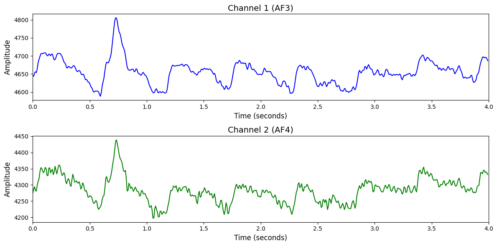

# 1. Dataset Information

STEW 데이터셋[1]은 총 48명의 건강한 성인 남성 피험자를 대상으로 수집된 EEG 데이터로, 멀티태스킹 기반의 정신적 작업 부하 과제(SIMKAP)를 수행하는 동안 기록되었습니다. 실험은 휴식 상태(3분)와 멀티태스킹 상태(18분)로 구성되며, 분석에는 각 조건당 2.5분간의 EEG가 사용됩니다. EEG는 Emotiv EPOC 14채널 무선 헤드셋을 통해 128Hz의 샘플링 주파수로 측정되었으며, 각 피험자는 실험 종료 후 1~9점 척도의 주관적 작업 부하 점수를 보고합니다. 해당 점수를 기반으로 작업 부하 수준은 낮음, 중간, 높음의 세 가지 클래스로 라벨링됩니다. 본 데이터셋은 정신적 부하 예측, 뇌파 기반 상태 분류, 경량 BCI 시스템 검증에 활용됩니다.

# 2. Dataset Basic Information

## 2.1 Data Information

| # of Subjects | # of Leads | Sampling Frequency (Hz) | Recording Duration (min) | File Fomat |
| --- | --- | --- | --- | --- |
| 48 | 14 | 128 | 5 | EEG(.txt), ratings(.txt), summarty(.csv) |

## 2.2 Data Statistics

*EEG 전극에 해당하는 데이터만을 사용해 통계 분석을 수행하였습니다.

| Label Type | #of recordings | EEG Mean | EEG Std | EEG Max | EEG Median | EEG Min |
| --- | --- | --- | --- | --- | --- | --- |
| Low (0) | 42개 (43.75%) | 4332.286621 | 292.768616 | 6348.852051 | 4311.403809 | 2760.170898 |
| Moderate (1) | 23개 (23.96%) | 4311.902832 | 317.490967 | 6837.167969 | 4288.517090 | 2503.590332 |
| High (2) | 25개 (26.04%) | 4352.272949 | 298.168335 | 7074.145020 | 4341.517578 | 2389.894043 |
| Total | 96 | 4332.984863 | 297.026001 | 6655.549316 | 4315.908203 | 2642.479004 |

## 2.3 Raw Dataset

!!! note ""
    ```
    Stew/
    ├── STEW_data_summary.csv
    ├── ratings.txt
    ├── sub01_hi.txt
    ├── sub01_lo.txt
    ├── sub02_hi.txt
    └── sub02_lo.txt
    ... (92 more files)
    0 directories, 98 files
    ```

각 참가자별로 휴식 상태(_lo.txt)와 높은 정신부하 상태(_hi.txt)의 EEG 데이터를 텍스트 형식으로 제공합니다. ratings.txt에는 참가자들이 1~9점 척도로 평가한 주관적 정신부하 점수가 포함되어 있으며, STEW_data_summary.csv는 각 파일 당 데이터 포인트 수의 정보를 담고 있습니다. 

## 2.4 Raw Dataset Example



## 2.5 Preprocessed Dataset

!!! note ""
    ```
    Stew/
    ├── npy_files/
    │   ├── sess1_sub01.npy
    │   ├── sess1_sub02.npy
    │   └── sess1_sub03.npy
    │   ... (93 more files)
    ├── Stew.h5
    ├── Stew.npz
    ├── labels.csv
    └── channels.csv
    1 directories, 100 files
    ```

# 3. Applications and Use Cases

| 인용 논문 | 연구 과제 | 모델 구조 | 방법론 |
| --- | --- | --- | --- |
| Foumani et al. (2024) [2] | EEG 기반 자가 지도 표현 학습 및 다양한 EEG 과제 분류 | Informative Masking 기반 Self-supervised 모델 (EEG2Rep) | Informative Masked Input 방식을 적용한 자가 지도 학습 모델. 다양한 EEG 과제(감정 인식, 주의 산만 탐지, 눈 깜빡임 감지 등)에 대해 사전 학습 후 분류 성능을 향상 시킴. |
| Jammisetty et al. (2025) [3] | EEG 기반 인지 부하 탐지. 과제 수행 중 뇌파 변화를 분석하여 인지적 부하 수준을 추정함. | Robust Local Mean Decomposition 기반 다중 도메인 특징 추출, Binary Arithmetic Optimization 기반 특징 선택, 최적화된 앙상블 분류기 구조 | EEG 신호를 R-LMD로 분해한 후 시계열, 주파수, 엔트로피 기반 특징을 추출함. BAO 알고리즘으로 최적 특징을 선택하고, 앙상블 분류기를 통해 전체 및 리드별 인지 부하를 분류함. |

# 4. References

[1] Lim, W. L., Sourina, O., & Wang, L. P. (2018). STEW: Simultaneous Task EEG Workload Data Set. *IEEE Transactions on Neural Systems and Rehabilitation Engineering, 26*(11), 2106–2114.

[2] Foumani, N. M., Mackellar, G., Ghane, S., Irtza, S., Nguyen, N., and Salehi, M. (2024). EEG2Rep: Enhancing Self-supervised EEG Representation Through Informative Masked Inputs. *Proceedings of the 30th ACM SIGKDD Conference on Knowledge Discovery and Data Mining (KDD '24)*.
[3] Jammisetty, Y., Sunkara, K., Vankayalapati, R., Kondaveeti, S., Anumothu, M., & Krishna, Y. M. (2025). Cognitive load detection through EEG lead wise feature optimization and ensemble classification. *Scientific Reports*, **15**, Article 842.
