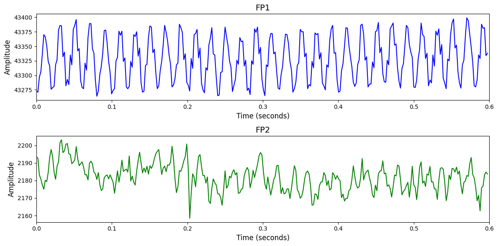

# Target Versus Non Target

# 1. Dataset Information

이 데이터셋은 2015년 프랑스 GIPSA-lab에서 수집된 것으로, 50명의 피험자가 P300 기반 BCI 게임 *Brain Invaders*를 플레이하며 기록된 EEG 데이터를 포함한다. 자극은 36개의 기호(1개 타겟, 35개 논타겟)로 구성되며, 플래시 지속 시간은 50ms, 80ms, 110ms의 세 가지 조건이 사용되었다 [^1].

# 2. Dataset Basic Information

## 2.1 Data Information

| # of Subjects | # of Leads | Sampling Frequency (Hz) | Recording Duration (min) | File Fomat |
| --- | --- | --- | --- | --- |
| 43 | 32 | 512 | 0.0667 | (EEG).csv, (header).csv |

## 2.2 Data Statistics

*EEG 전극에 해당하는 데이터만을 사용해 통계 분석을 수행하였습니다.

| Label Type | #of recordings | EEG Mean | EEG Std | EEG Max | EEG Median | EEG Min |
| --- | --- | --- | --- | --- | --- | --- |
| Non-target | 59463 | 3254.129815 | 20946.185247 | 237410.000000 | 1362.100000 | -443830.000000 |
| Target | 11892 | 3256.813149 | 19800.667271 | 90976.000000 | 1253.200000 | -443790.000000 |
| Total | 71355 | 3255.102904 | 208567.523519 | 237410.000000 | 1289.325193 | -443830.000000 |

## 2.3 Raw Dataset


!!! note ""
    ```
    Target_Versus_NonTarget/
    
    ├── s_01/
    │   ├── subject_01_eyesclosed_after.csv
    │   ├── subject_01_eyesclosed_before.csv
    │   └── subject_01_fixing_after.csv
    │   ... (4 more files)
    ├── s_02/
    │   ├── subject_02_eyesclosed_after.csv
    │   ├── subject_02_eyesclosed_before.csv
    │   └── subject_02_fixing_after.csv
    │   ... (4 more files)
    
    …
    
    └── s_43/
    ├── subject_43_eyesclosed_after.csv
    ├── subject_43_eyesclosed_before.csv
    └── subject_43_fixing_after.csv
    ... (4 more files)
    
    43 directories, 301 files
    ```


이 데이터셋은 50명의 피험자로부터 수집된 EEG 기록을 담고 있으며, 세션은 세 가지 조건(기본 상태, 안구 감은 상태 등)으로 구성되어 있고 .mat 및 .csv 형식으로 제공된다. 각 파일은 시간 샘플 기준으로 행(row)을 구성하며, 첫 번째 열은 타임스탬프, 2~33열은 32개의 EEG 채널 데이터, 34열은 자극 발생 시점에 1로 설정되는 Trigger, 35열은 타겟 자극 시점에 1로 설정되는 Target 정보를 담고 있다. 채널 이름은 Header.mat 또는 Header.csv 파일에 저장되어 있다.

## 2.4 Raw Dataset Example



## 2.5 Preprocessed Dataset


!!! note ""
    ```
    Target_Versus_Non_Target/
    ├── npy_files/
    │   ├── sess1_sub10_trial1.npy
    │   ├── sess1_sub10_trial10.npy
    │   └── sess1_sub10_trial100.npy
    │   ... (71481 more files)
    ├── channels.csv
    └── labels.csv
    
    1 directories, 71486 files
    ```


# 3. Applications and Use Cases

| 인용 논문 | 연구 과제 | 모델 구조 | 방법론 |
| --- | --- | --- | --- |
| Ahmadi (2024) [^2] | Brain-to-BrainCommunication 시스템의 보안 및 견고성 향상 | Adversarial Neural Network + ERP 기반 B2B 통신 시스템 | 8개 EEG 데이터셋 기반 이벤트 연관 전위(ERP) 신호를 이용해 적대적 공격에 강건한 신경망 훈련 수행. trial duration 및 sampling rate 최적화를 통해 보안 성능 향상. |
|
Fallahi (2023) [^3]         
   | EEG 기반 바이오메트릭 인증 및 사용자 식별 정확도 향상 | Siamese Network | EG 입력 쌍 간의 유사도를 측정하도록 시암 네트워크를 학습시켜 신원 확인 및 식별 수행. 연속적 활동 대신 시간 고정형 자극 반응 기반 EEG 사용으로 정확도 및 실용성 향상. |

# 4. References

[^1]: Korczowski, Louis, et al. *Brain Invaders calibration-less P300-based BCI with modulation of flash duration Dataset (bi2015a)*. Diss. GIPSA-lab, 2019.

[^2]: Ahmadi, Hossein, Ali Kuhestani, and Luca Mesin. "Adversarial neural network training for secure and robust brain-to-brain communication." *IEEE Access* (2024).

[^3]: Fallahi, Matin, Thorsten Strufe, and Patricia Arias-Cabarcos. "Brainnet: Improving brainwave-based biometric recognition with siamese networks." *2023 IEEE International Conference on Pervasive Computing and Communications (PerCom)*. IEEE, 2023.