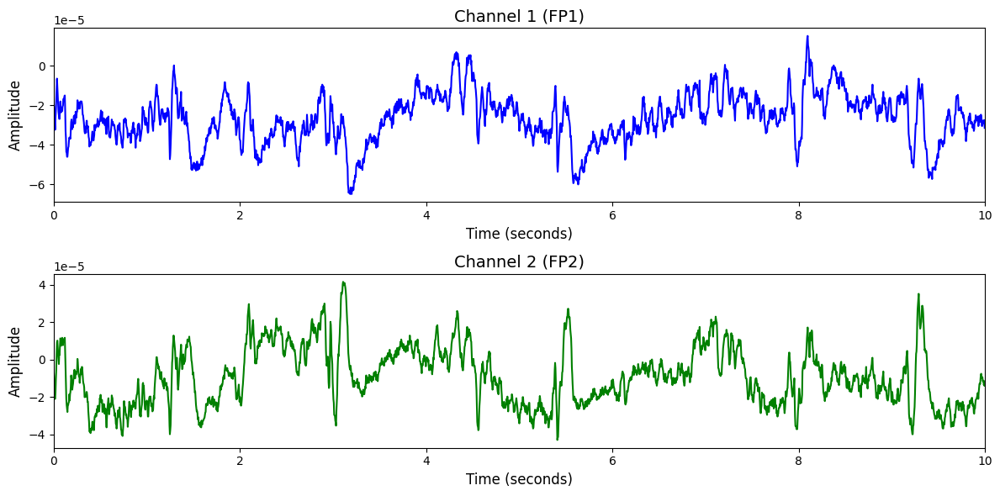

# TUEG

# 1. Dataset Information

TUEG 데이터셋[^1]은 실제 임상 환경에서 총 10,874명의 피실험자를 대상으로 수집되었습니다. 총 16,986 세션이 진행되었으며 각 참가자들은 평균적으로 1.56 세션을 통해 EEG가 수집되었고 일부 환자에게는 동일한 검사가 최대 37번 반복되었습니다. 대부분의 EDF 파일은 31개의 채널로 측정되었으며, 적은 경우 20개의 채널로 측정된 경우도 존재합니다. 각 EEG 데이터는 250Hz(87%), 256Hz(3.8%), 512Hz(1%)로 샘플링 되었습니다. 

# 2. Dataset Basic Information

## 2.1 Data Information

| # of Subjects | # of Leads | Sampling Frequency (Hz) | Recording Duration (min) | File Fomat |
| --- | --- | --- | --- | --- |
| 10,874 | 31 | 250Hz(87%), 256Hz(3.8%), 512Hz(1%) | Ave 901 | (EEG).edf |

## 2.2 Raw Dataset


!!! note ""
    ```
    TUEG/
    ├── DOCS/
    │   └── headers.tar.gz
    ├── edf/
    │   ├── 000/
    │   │   ├── aaaaaaaa/
    │   │   │   └── s001_2015/
    │   │   │       └── 01_tcp_ar/
    │   │   │           └── aaaaaaaa_s001_t000.edf
    │   │   ├── aaaaaaab/
    │   │   │   ├── s001_2002/
    │   │   │   │   └── 02_tcp_le/
    │   │   │   │       ├── aaaaaaab_s001_t000.edf
    │   │   │   │       ├── aaaaaaab_s001_t001.edf
    │   │   │   │       └── aaaaaaab_s001_t003.edf
    │   │   │   │       ... (2 more files)
    │   │   │   ├── s002_2002/
    │   │   │   │   └── 02_tcp_le/
    │   │   │   │       ├── aaaaaaab_s002_t000.edf
    │   │   │   │       └── aaaaaaab_s002_t001.edf
    │   │   │   └── s003_2002/
    │   │   │       └── 02_tcp_le/
    │   │   │           ├── aaaaaaab_s003_t000.edf
    │   │   │           ├── aaaaaaab_s003_t001.edf
    │   │   │           └── aaaaaaab_s003_t002.edf
    │   │   ├── aaaaaaac/
    │   │   │   ├── s001_2002/
    │   │   │   │   └── 02_tcp_le/
    │   │   │   │       ├── aaaaaaac_s001_t000.edf
    │   │   │   │       └── aaaaaaac_s001_t001.edf
    │   │   │   ├── s002_2002/
    │   │   │   │   └── 02_tcp_le/
    │   │   │   │       └── aaaaaaac_s002_t000.edf
    │   │   │   ├── s003_2002/
    │   │   │   │   └── 02_tcp_le/
    │   │   │   │       └── aaaaaaac_s003_t000.edf
    │   │   │   ├── s004_2002/
    │   │   │   │   └── 02_tcp_le/
    │   │   │   │       ├── aaaaaaac_s004_t000.edf
    │   │   │   │       └── aaaaaaac_s004_t002.edf
    │   │   │   ├── s005_2002/
    │   │   │   │   └── 02_tcp_le/
    │   │   │   │       ├── aaaaaaac_s005_t000.edf
    │   │   │   │       ├── aaaaaaac_s005_t001.edf
    │   │   │   │       └── aaaaaaac_s005_t002.edf
    │   │   │   │       ... (1 more files)
    │   │   │   ├── s006_2003/
    │   │   │   │   └── 02_tcp_le/
    │   │   │   │       └── aaaaaaac_s006_t001.edf
    │   │   │   ├── s007_2003/
    │   │   │   │   └── 02_tcp_le/
    │   │   │   │       └── aaaaaaac_s007_t000.edf
    │   │   │   ├── s008_2003/
    │   │   │   │   └── 02_tcp_le/
    │   │   │   │       ├── aaaaaaac_s008_t000.edf
    │   │   │   │       └── aaaaaaac_s008_t001.edf
    │   │   │   └── s009_2006/
    │   │   │       └── 02_tcp_le/
    │   │   │           └── aaaaaaac_s009_t000.edf
    │   │   ├── aaaaaaad/
    │   │   │   └── s001_2002/
    │   │   │       └── 02_tcp_le/
    │   │   │           └── aaaaaaad_s001_t000.edf
    │   │   ├── aaaaaaae/
    │   │   │   └── s001_2002/
    │   │   │       └── 02_tcp_le/
    │   │   │           ├── aaaaaaae_s001_t000.edf
    │   │   │           └── aaaaaaae_s001_t001.edf
    │   │
    
    132573 directories, 131528 files
    ```


각 EDF 파일 안에는 EEG 신호 데이터가 포함되어 있으며, 채널 구성과 샘플링 주파수는 파일마다 다를 수 있습니다. 파일 경로 중 edf/000/aaaaaaab/s001_2002_12_30/02_tcp_le/aaaaaaab_s001_t000.edf의 예로 000은 100명 단위 그룹, aaaaaaab는 무작위 환자 ID, s001_2002_12_30는 세션 번호 및 날짜, 마지막으로 02_tcp_le 몽타주 구성 정보를 나타냅니다.

## 2.3 Raw Dataset Example



## 2.4 Preprocessed Dataset


!!! note ""
    ```
    TUEG/
    ├── npy_files/
    │   ├── sess10_sub10081_trial000_REF.npy
    │   ├── sess10_sub10081_trial001_REF.npy
    │   └── sess10_sub10081_trial002_REF.npy
    │   ... (69665 more files)
    ├── channels.csv
    
    1 directories, 69669 files
    ```


# 3. Applications and Use Cases

| 인용 논문 | 연구 과제 | 모델 구조 | 방법론 |
| --- | --- | --- | --- |
| Chen et al. (2024) [^2] | 대규모 EEG 사전학습 및 전이 학습 | Vector-Quantized Transformer (EEG-Former) | TUH EEG Corpus의 1.7TB 데이터를 기반으로 EEG를 조각내어 Transformer로 인코딩 후, 벡터 양자화를 통해 보편적이고 해석 가능한 표현 학습 수행. 다양한 TUH 하위 데이터셋 및 Neonate dataset에서 전이 성능 평가.
 |
| Kostas et al. (2021) [^3] | EEG 기반 BCI 및 수면 단계 분류 | Contrastive self-supervised Transformer (BENDR) | wav2vec 2.0 구조를 EEG에 적용하여 자기지도 표현 학습 수행. TUH EEG 데이터에서 사전학습 후 여러 BCI 및 수면 분류 데이터셋에 전이. 다양한 미세조정 전략 실험 포함.
 |
| Cui et al. (2024) [^4] | 소량의 motor imagery EEG에 대한 일반화 학습 | EEG 전용 인코더와 생성 사전학습 변환기 구조 (Neuro-GPT) | TUH EEG 데이터를 활용하여 self-supervised 예측 과제로 사전학습 후, motor imagery 과제(BCI Competition IV 2a)에 전이 학습 수행. Encoder-only fine-tuning 전략이 가장 높은 정확도 달성. |
| Wang et al. (2025) [^5] | 다양한 BCI 과제에 대응 가능한 범용 EEG 모델 학습 | 시공간 주의 메커니즘을 분리한 Criss-Cross Transformer 구조 (CBraMod) | 마스킹된 EEG 복원을 통한 자기지도학습 방식으로 사전 학습을 수행하고, 시공간 의존성을 병렬로 학습하여 다양한 과제에 일반화 가능한 성능을 확보함. |

# 4. References

[^1]: Obeid, I., & Picone, J. (2016). The Temple University Hospital EEG Data Corpus. Frontiers in Neuroscience, Section Neural Technology,10, 196.

[^2]: Yuqi Chen, Kan Ren, Kaitao Song, Yansen Wang, Yifan Wang, Dongsheng Li, and Lili Qiu.EEG-Former: Towards Transferable and Interpretable Large-Scale EEG Foundation Model.*arXiv preprint arXiv:2401.10278*, 2024.

[^3]: Demetres Kostas, Stéphane Aroca-Ouellette, and Frank Rudzicz. BENDR: Using Transformers and a Contrastive Self-supervised Learning Task to Learn from Massive Amounts of EEG Data.*arXiv preprint arXiv:2101.12037*, 2021.

[^4]: Wenhui Cui, Woojae Jeong, Philipp Thölke, Takfarinas Medani, Karim Jerbi, Anand A. Joshi, and Richard M. Leahy. Neuro-GPT: Towards a Foundation Model for EEG. *arXiv preprint arXiv:2311.03764*, 2024.

[^5]: Jiquan Wang, Sha Zhao, Zhiling Luo, Yangxuan Zhou, Haiteng Jiang, Shijian Li, Tao Li, and Gang Pan. CBraMod: A Criss-Cross Brain Foundation Model for EEG Decoding. *Proceedings of the International Conference on Learning Representations (ICLR)*, 2025.