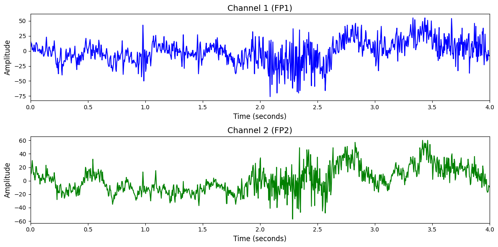

# TUEV

# 1. Dataset Information

TUEV 데이터셋[^1]은 TUH EEG Corpus의 하위 집합으로, 발작 관련 뇌파 외에도 주기적 이상 파형(periodic epileptiform discharges), 스파이크 및 샤프파(spike and sharp wave), 눈 움직임(eye movement), 아티팩트(artifact) 등 다양한 이벤트가 포함된 EEG 세션으로 구성되어 있습니다. 각 EDF 파일은 10–20 시스템 기반 TCP 몽타주를 따르며, 평균 22채널로 구성되고, 주요 이벤트가 발생한 세그먼트만을 남기고 나머지는 제거된 프루닝(pruning)된 형태로 제공됩니다. 주석은 .lab 파일(10μs 단위)과 .rec 파일(초 단위) 두 가지 형식으로 제공되며, 각 채널에 대한 이벤트 라벨과 시간 정보를 포함합니다. 이 데이터셋은 이벤트 기반 뇌파 분류, 노이즈 탐지, 임상 신호 분석 등 다양한 머신러닝 기반 EEG 분석 과제에 활용됩니다.

# 2. Dataset Basic Information

## 2.1 Data Information

| # of Subjects | # of Leads | Sampling Frequency (Hz) | Recording Duration (min) | File Fomat |
| --- | --- | --- | --- | --- |
| unknown | 22 bipolar channel pairs (TCP montage) | 128 | 1440 | (ECG).dat/(ECG).hea/(ECG).atr/(ECG).xws (Metadata) |

## 2.2 Data Statistics

*EEG 전극에 해당하는 데이터만을 사용해 통계 분석을 수행하였습니다.

| Label Type | #of recordings | EEG Mean | EEG Std | EEG Max | EEG Median | EEG Min |
| --- | --- | --- | --- | --- | --- | --- |
| spsw (1) | 1212 (1.15%) |  1.114985 | 51.870625 | 283.734314   | -0.140264 | -300.783813 |
| gped (2) | 13317 (12.58%) | -2.328926 | 35.962997   | 197.487427    | -3.832845 | -185.955017 |
| pled (3) | 6528 (6.17%) | -1.447306    | 39.757015   | 209.150116   | -2.748238  | -190.474258 |
| eyem(4) | 1281 (1.21%) | -2.728554 | 35.503918   | 270.481659    | -3.562061   | -187.862610 |
| artf(5) | 11842 (11.19%) | -28.832817 | 155.752151   | 632.563232  | -35.110031 | -701.440491 |
| bckg(6) | 71666 (67.71%) | -2.742052  | 24.649084   | 119.895943   | -2.475525  | -130.853409 |
| Total | 105846 | -5.328107 | 213.489639 | 7491.000000 | -1.000000 | -7469.000000 |

## 2.3 Raw Dataset


!!! note ""
    ```
    TUEV/
    └── v2.0.1/
    ├── edf/
    │   ├── test/
    │   │   ├── 000/
    │   │   │   ├── bckg_000_a_.edf
    │   │   │   ├── bckg_000_a_.rec
    │   │   │   └── bckg_000_a__ch000.htk
    │   │   │   ... (43 more files)
    │   │   ├── 001/
    │   │   │   ├── bckg_001_a_.edf
    │   │   │   ├── bckg_001_a_.rec
    │   │   │   └── bckg_001_a__ch000.htk
    │   │   │   ... (227 more files)
    │   │   ├── 002/
    │   │   │   ├── bckg_002_a_.edf
    │   │   │   ├── bckg_002_a_.rec
    │   │   │   └── bckg_002_a__ch000.htk
    │   │   │   ... (89 more files)
    │   │   ├── 003/
    │   │   │   ├── bckg_003_a_.edf
    │   │   │   ├── bckg_003_a_.rec
    │   │   │   └── bckg_003_a__ch000.htk
    │   │   │   ... (43 more files)
    │   │   ├── 004/
    │   │   │   ├── bckg_004_a_.edf
    │   │   │   ├── bckg_004_a_.rec
    │   │   │   └── bckg_004_a__ch000.htk
    │   │   │   ... (135 more files)
    │   │       
    │   └── train/
    │       ├── aaaaaaar/
    │       │   ├── aaaaaaar_00000001.edf
    │       │   ├── aaaaaaar_00000001.rec
    │       │   └── aaaaaaar_00000001_ch000.htk
    │       │   ... (43 more files)
    │       ├── aaaaaabs/
    │       │   ├── aaaaaabs_00000001.edf
    │       │   ├── aaaaaabs_00000001.rec
    │       │   └── aaaaaabs_00000001_ch000.htk
    │       │   ... (43 more files)
    │       ├── aaaaaaci/
    │       │   ├── aaaaaaci_00000001.edf
    │       │   ├── aaaaaaci_00000001.rec
    │       │   └── aaaaaaci_00000001_ch000.htk
    │       │   ... (43 more files)
    │       ├── aaaaaadd/
    │       │   ├── aaaaaadd_00000005.edf
    │       │   ├── aaaaaadd_00000005.rec
    │       │   └── aaaaaadd_00000005_ch000.htk
    │       │   ... (43 more files)
    │       ├── aaaaaadg/
    │       │   ├── aaaaaadg_00000002.edf
    │       │   ├── aaaaaadg_00000002.rec
    │       │   └── aaaaaadg_00000002_ch000.htk
    │       │   ... (89 more files)
    
    │       │
    ├── AAREADME.txt
    ├── AAREADME.txt,v
    └── needs_fixin.list
    ... (2 more files)
    
    374 directories, 23833 files
    ```


각 세트는 EEG 신호가 저장된 EDF 파일(.edf)과 함께, 이벤트 주석이 포함된 .lab 및 .rec 파일, 그리고 전처리된 특징(feature) 추출용 .htk 파일로 구성되어 있습니다. .lab 파일은 10μs 단위로 시작 시간과 종료 시간, 이벤트 라벨(spsw, gped, pled, eyem, artf, bckg)을 포함하고, .rec 파일은 채널 번호, 시간(초), 그리고 수치형 라벨을 담고 있어 보다 간단한 형식으로 제공됩니다.

## 2.4 Raw Dataset Example



## 2.5 Preprocessed Dataset


!!! note ""
    ```
    TUEV/
    ├── test_npy_files/
    │   ├── sess360_trialf1.npy
    │   ├── sess360_trialf10.npy
    │   └── sess360_trialf100.npy
    │   ... (29418 more files)
    ├── train_npy_files/
    │   ├── subaaaaaaar_trial1.npy
    │   ├── subaaaaaaar_trial10.npy
    │   └── subaaaaaaar_trial100.npy
    │   ... (76422 more files)
    
    ├── channels.csv
    ├── test_labels.csv
    ├── train_labels.csv
    ├── TUEV_test.h5
    ├── TUEV_train.h5
    └── TUEV_train.npz
    
    1 directories, 105846 files
    ```


# 3. Applications and Use Cases

| 인용 논문 | 연구 과제 | 모델 구조 | 방법론 |
| --- | --- | --- | --- |
| Jiang et al. (2024) [^2] | EEG 기반 범용 표현 학습 및 다양한 과제 전이 | Transformer 기반 EEG 인코더 모델 (LaBraM) | 마스킹 기반 자기지도 학습 방식을 통해 2,500시간 이상의 EEG 데이터를 사전학습하며, 복원 기반 학습을 통해 일반화 가능한 표현을 확보함. 이후 감정 인식, 보행 예측 등 다양한 다운스트림 과제에 전이하여 기존 최고 성능을 초과함. |
| Wang et al. (2025) [^5] | 다양한 BCI 과제에 대응 가능한 범용 EEG 모델 학습 | 시공간 주의 메커니즘을 분리한 Criss-Cross Transformer 구조 (CBraMod) | 마스킹된 EEG 복원을 통한 자기지도학습 방식으로 사전 학습을 수행하고, 시공간 의존성을 병렬로 학습하여 다양한 과제에 일반화 가능한 성능을 확보함. |

# 4. References

[^1]: Harati, A., Golmohammadi, M., Lopez, S., Obeid, I., & Picone, J. (2015). *Improved EEG Event Classification Using Differential Energy*. Proceedings of the IEEE Signal Processing in Medicine and Biology Symposium, 1–4. Philadelphia, Pennsylvania, USA.

[^2]: Jiang, W., Zhao, L.-M., & Lu, B.-L. (2024). LaBraM: Large Brain Model for Learning Generic Representations with Tremendous EEG Data in BCI. *International Conference on Learning Representations (ICLR)*.

[^3]: Jiquan Wang, Sha Zhao, Zhiling Luo, Yangxuan Zhou, Haiteng Jiang, Shijian Li, Tao Li, and Gang Pan. CBraMod: A Criss-Cross Brain Foundation Model for EEG Decoding. *Proceedings of the International Conference on Learning Representations (ICLR)*, 2025.