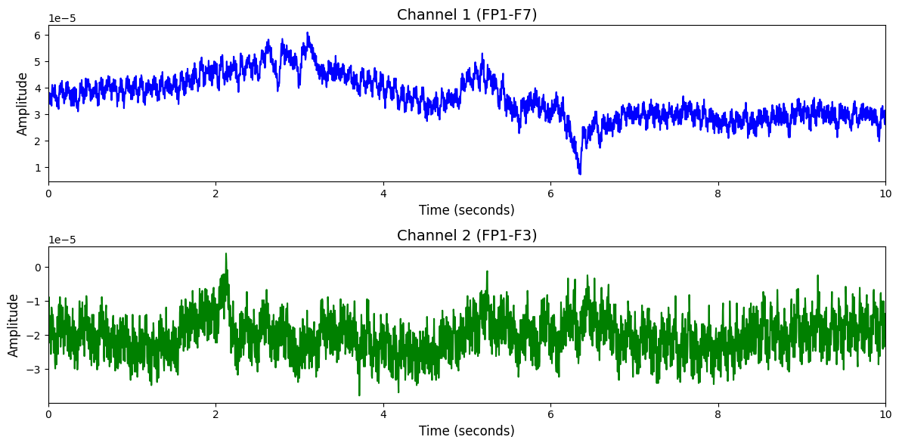

# 1. Dataset Information

TUSL 데이터셋[1]은 발작 탐지 시스템에서 슬로잉으로 인한 오탐지를 줄이기 위한 학습 및 평가용으로 설계된 데이터셋으로 총 38명의 환자로부터 총 75개의 세션이 수집 되었습니다. 주석 파일은 발작, 슬로잉(slowing), 복잡한 배경(Complex Background) 이벤트가 포함된 10초 길이의 세그먼트 기반으로 구성되어 있습니다. 모든 EEG는 표준 10–20 시스템에 따라 수집되었으며, 대부분 250Hz 샘플링 주파수와 31채널 구성을 따릅니다. 

# 2. Dataset Basic Information

## 2.1 Data Information

| # of Subjects | # of Leads | Sampling Frequency (Hz) | Recording Duration (min) | File Fomat |
| --- | --- | --- | --- | --- |
| 38 | 22 bipolar channel pairs (TCP montage) | 250 (most common), 256, 512 | 16.7 | (EEG).edf / (event-based annotations).lbl / (term-based annotations).tse or .tse_agg / (aggregated event-based annotations).lbl_agg |

## 2.2 Data Statistics

*EEG 전극에 해당하는 데이터만을 사용해 통계 분석을 수행하였습니다.

| Label Type | #of recordings | EEG Mean | EEG Std | EEG Max | EEG Median | EEG Min |
| --- | --- | --- | --- | --- | --- | --- |
| bckg (1) | 100(33.3%) | 0.000002 | 0.000072 | 0.000477 | 0.000000 | -0.000405 |
| seiz (2) | 100(33.3%) | -0.000001 | 0.000092 | 0.000406 | -0.000001 | -0.000421 |
| slow (3) | 100(33.3%) | 0.000000 | 0.000025 | 0.000137 | 0.000000 | -0.000138 |
| **Total** | 300 | 0.000000 | 0.000062 | 0.000339 | 0.000000 | -0.000321 |

## 2.3 Raw Dataset

!!! note ""
    ```
    TUSL/
    └── v2.0.1/
    ├── edf/
    │   ├── aaaaaaju/
    │   │   ├── s005_2010/
    │   │   │   └── 01_tcp_ar/
    │   │   │       ├── aaaaaaju_s005_t000.csv
    │   │   │       ├── aaaaaaju_s005_t000.edf
    │   │   │       └── aaaaaaju_s005_t000.lbl_agg
    │   │   │       ... (17 more files)
    │   │   ├── s005_2010_11_15/
    │   │   │   └── 01_tcp_ar/
    │   │   └── s007_2013/
    │   │       └── 01_tcp_ar/
    │   │           ├── aaaaaaju_s007_t000.csv
    │   │           ├── aaaaaaju_s007_t000.edf
    │   │           └── aaaaaaju_s007_t000.lbl_agg
    │   │           ... (13 more files)
    │   ├── aaaaaalq/
    │   │   └── s001_2003/
    │   │       └── 02_tcp_le/
    │   │           ├── aaaaaalq_s001_t000.csv
    │   │           ├── aaaaaalq_s001_t000.edf
    │   │           └── aaaaaalq_s001_t000.lbl_agg
    │   │           ... (9 more files)
    │   ├── aaaaaasy/
    │   │   ├── s002_2003/
    │   │   │   └── 02_tcp_le/
    │   │   │       ├── aaaaaasy_s002_t000.csv
    │   │   │       ├── aaaaaasy_s002_t000.edf
    │   │   │       └── aaaaaasy_s002_t000.lbl_agg
    │   │   │       ... (9 more files)
    │   │   └── s003_2003/
    │   │       └── 01_tcp_ar/
    │   │           ├── aaaaaasy_s003_t000.csv
    │   │           ├── aaaaaasy_s003_t000.edf
    │   │           └── aaaaaasy_s003_t000.lbl_agg
    │   │           ... (13 more files)
    │   ├── aaaaabiw/
    │   │   ├── s005_2003/
    │   │   │   └── 01_tcp_ar/
    │   │   │       ├── aaaaabiw_s005_t000.csv
    │   │   │       ├── aaaaabiw_s005_t000.edf
    │   │   │       └── aaaaabiw_s005_t000.lbl_agg
    │   │   │       ... (9 more files)
    │   │   ├── s016_2012/
    │   │   │   └── 01_tcp_ar/
    │   │   │       ├── aaaaabiw_s016_t000.csv
    │   │   │       ├── aaaaabiw_s016_t000.edf
    │   │   │       └── aaaaabiw_s016_t000.lbl_agg
    │   │   │       ... (17 more files)
    │   │   ├── s017_2012/
    │   │   │   └── 01_tcp_ar/
    │   │   │       ├── aaaaabiw_s017_t000.csv
    │   │   │       ├── aaaaabiw_s017_t000.edf
    │   │   │       └── aaaaabiw_s017_t000.lbl_agg
    │   │   │       ... (21 more files)
    │   │   └── s018_2013/
    │   │       └── 01_tcp_ar/
    │   │           ├── aaaaabiw_s018_t000.csv
    │   │           ├── aaaaabiw_s018_t000.edf
    │   │           └── aaaaabiw_s018_t000.lbl_agg
    │   │           ... (33 more files)
    │   ├── …(168 more directories)
    │   │   │      ... (1482 more files)
    ├── AAREADME.txt
    └── AAREADME.txt,v
    194 directories, 1650 files
    ```

각 세트는 EDF 형식의 EEG 데이터(.edf)와 함께, 이벤트 주석이 포함된 term-based 파일(.tse, .tse_agg) 및 event-based 구조의 .lbl, .lbl_agg 파일로 구성되어 있습니다. .tse 파일은 각 세그먼트의 시작 시점, 종료 시점, 이벤트 라벨, 그리고 확률값(기본 1.0)을 포함하며, 모든 주석은 10초 단위로 설정되어 있습니다. .lbl 파일은 채널 번호와 계층 인덱스를 포함한 보다 복잡한 그래프 기반 구조로 되어 있지만, 해당 버전에서는 term-based 라벨만 사용됩니다.

## 2.4 Raw Dataset Example



## 2.5 Preprocessed Dataset

!!! note ""
    ```
    TUSL/
    ├── npy_files/
    │   ├── sess01_sub02_trial001_LE.npy
    │   ├── sess01_sub02_trial002_LE.npy
    │   └── sess01_sub05_trial003_LE.npy
    │   ... (297 more files)
    ├── labels.csv
    ├── TUSL.h5
    ├── TUSL.npz
    └── channels.csv
    1 directories, 304 files
    ```

# 3. Applications and Use Cases

| 인용 논문 | 연구 과제 | 모델 구조 | 방법론 |
| --- | --- | --- | --- |
| Jiang et al. (2024) [2] | EEG 기반 범용 표현 학습 및 다양한 과제 전이 | Transformer 기반 EEG 인코더 모델 (LaBraM) | 마스킹 기반 자기지도 학습 방식을 통해 2,500시간 이상의 EEG 데이터를 사전학습하며, 복원 기반 학습을 통해 일반화 가능한 표현을 확보함. 이후 감정 인식, 보행 예측 등 다양한 다운스트림 과제에 전이하여 기존 최고 성능을 초과함. |
| Chen et al. (2024) [3] | 대규모 EEG 사전학습 및 전이 학습 | 벡터 양자화 기반 트랜스포머 모델 (EEG-Former) | EEG 신호를 시계열 조각 단위로 분할한 뒤 트랜스포머로 인코딩하고, 벡터 양자화를 통해 정보 손실 없이 일반화 가능한 표현을 학습함. 다양한 TUH 하위 데이터셋 및 Neonate dataset에서 전이 성능 평가. |

# 4. References

[1] von Weltin, E., Ahsan, T., Shah, V., Jamshed, D., Golmohammadi, M., Obeid, I., & Picone, J. (2017). Electroencephalographic Slowing: A Source of Error in Automatic Seizure Detection. In J. Picone &I. Obeid (Eds.), Proceedings of the IEEE Signal Processing in Medicine and Biology Symposium (pp. 1–5). Philadelphia, Pennsylvania, USA: IEEE.

[2] Jiang, W., Zhao, L.-M., & Lu, B.-L. (2024). LaBraM: Large Brain Model for Learning Generic Representations with Tremendous EEG Data in BCI. *International Conference on Learning Representations (ICLR)*

[3] Chen, Y., Ren, K., Song, K., Wang, Y., Wang, Y., Li, D., & Qiu, L. (2024). EEG-Former: Towards Transferable and Interpretable Large-Scale EEG Foundation Model. *arXiv:2401.10278*.
