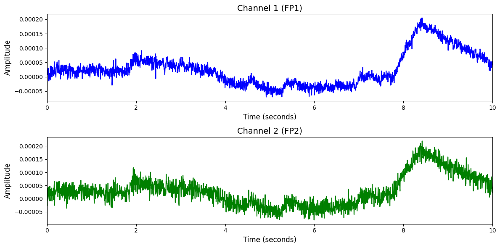

# TUSZ

# 1. Dataset Information

TUSZ 데이터셋[^1]은 총 675명의 환자로부터 수집된 1,643개의 EEG 세션으로 구성된 대규모 발작 탐지용 데이터셋입니다. 이 중 528개 세션에는 실제 발작 이벤트가 포함되어 있으며, 나머지 세션은 정상 배경만 포함되어 있어 이진 분류 및 오탐지 방지를 위한 학습에 모두 활용할 수 있습니다. EEG는 표준 10–20 시스템 기반 TCP 몽타주를 따르며, 대부분 250Hz로 샘플링된 다채널(약 21채널 이상) 데이터를 포함합니다.TUSZ는 임상 수준의 EEG를 기반으로 한 고성능 발작 탐지 알고리즘 학습 및 평가를 위한 대표적인 공개 데이터셋입니다.

# 2. Dataset Basic Information

## 2.1 Data Information

| # of Subjects | # of Leads | Sampling Frequency (Hz) | Recording Duration (min) | File Fomat |
| --- | --- | --- | --- | --- |
| 675 | 22 bipolar channel pairs (TCP montage) | 250 (most common), 256, 512 | Typically 30–60 per session | (EEG).edf/(event-based annotations).csv/(ECG).atr/(term-based annotations).csv_bi |

## 2.2 Data Statistics

*EEG 전극에 해당하는 데이터만을 사용해 통계 분석을 수행하였습니다.

| Label Type | #of recordings | EEG Mean | EEG Std | EEG Max | EEG Median | EEG Min |
| --- | --- | --- | --- | --- | --- | --- |
| Non-Seizure (0) | 5969 (60.09%) | -0.000014 | 0.000051 | 0.000204 | -0.000016 | -0.000213 |
| Seizure (1) | 3965 (39.91%) | -0.000014 | 0.000051 | 0.000204 | -0.000016 | -0.000213 |
| **Total** | 9934 | -0.000008 | 0.000121 | 0.001042 | -0.000010 | -0.000930 |

## 2.3 Raw Dataset


!!! note ""
    ```
    TUSZ/
    └── v2.0.3/
    ├── DOCS/
    │   ├── 01_tcp_ar_montage.txt
    │   ├── 02_tcp_le_montage.txt
    │   └── 03_tcp_ar_a_montage.txt
    │   ... (3 more files)
    ├── edf/
    │   ├── dev/
    │   │   ├── aaaaaajy/
    │   │   │   ├── s001_2003/
    │   │   │   │   └── 02_tcp_le/
    │   │   │   │       ├── aaaaaajy_s001_t000.csv
    │   │   │   │       ├── aaaaaajy_s001_t000.csv_bi
    │   │   │   │       └── aaaaaajy_s001_t000.edf
    │   │   │   ├── s002_2003/
    │   │   │   │   └── 01_tcp_ar/
    │   │   │   │       ├── aaaaaajy_s002_t000.csv
    │   │   │   │       ├── aaaaaajy_s002_t000.csv_bi
    │   │   │   │       └── aaaaaajy_s002_t000.edf
    │   │   │   │       ... (6 more files)
    │   │   │   ├── s003_2003/
    │   │   │   │   └── 01_tcp_ar/
    │   │   │   │       ├── aaaaaajy_s003_t000.csv
    │   │   │   │       ├── aaaaaajy_s003_t000.csv_bi
    │   │   │   │       └── aaaaaajy_s003_t000.edf
    │   │   │   │       ... (15 more files)
    │   │   │   └── s004_2003/
    │   │   │       └── 02_tcp_le/
    │   │   │           ├── aaaaaajy_s004_t000.csv
    │   │   │           ├── aaaaaajy_s004_t000.csv_bi
    │   │   │           └── aaaaaajy_s004_t000.edf
    │   │   ├── aaaaaayf/
    │   │   │   ├── s001_2003/
    │   │   │   │   └── 02_tcp_le/
    │   │   │   │       ├── aaaaaayf_s001_t000.csv
    │   │   │   │       ├── aaaaaayf_s001_t000.csv_bi
    │   │   │   │       └── aaaaaayf_s001_t000.edf
    │   │   │   │       ... (3 more files)
    │   │   │   ├── s002_2003/
    │   │   │   │   └── 02_tcp_le/
    │   │   │   │       ├── aaaaaayf_s002_t000.csv
    │   │   │   │       ├── aaaaaayf_s002_t000.csv_bi
    │   │   │   │       └── aaaaaayf_s002_t000.edf
    │   │   │   │       ... (3 more files)
    │   │   │   ├── s003_2003/
    │   │   │   │   └── 01_tcp_ar/
    │   │   │   │       ├── aaaaaayf_s003_t000.csv
    │   │   │   │       ├── aaaaaayf_s003_t000.csv_bi
    │   │   │   │       └── aaaaaayf_s003_t000.edf
    │   │   │   └── s004_2003/
    │   │   │       └── 01_tcp_ar/
    │   │   │           ├── aaaaaayf_s004_t000.csv
    │   │   │           ├── aaaaaayf_s004_t000.csv_bi
    │   │   │           └── aaaaaayf_s004_t000.edf
    │   │   │           ... (9 more files)
    │   │ 
    
    3967 directories, 22091 files
    ```


각 세트는 EDF 형식의 EEG 신호 파일(.edf)과 함께, 발작 주석 정보를 담은 다채널 이벤트 기반 파일(.csv) 및 이진(term-based) 주석 파일(.csv_bi)로 구성되어 있습니다. .csv 파일은 채널별로 발작 시작 시점과 종료 시점, 해당 채널 번호, 그리고 발작 유형을 포함하며, .csv_bi 파일은 각 세그먼트에 대해 발작(seiz) 또는 배경(bckg) 여부를 일괄적으로 표시합니다.

## 2.4 Raw Dataset Example



## 2.5 Preprocessed Dataset


!!! note ""
    ```
    TUSZ/
    ├── test_npy_files/
    │   ├── sess10_sub638_trial10_REF.npy
    │   ├── sess10_sub638_trial11_REF.npy
    │   └── sess10_sub638_trial12_REF.npy
    │   ... (1136 more files)
    ├── train_npy_files/
    │   ├── sess10_sub219_trial1_REF.npy
    │   ├── sess10_sub255_trial1_REF.npy
    │   └── sess10_sub255_trial2_REF.npy
    │   ... (6210 more files)
    ├── validation_npy_files/
    │   ├── sess10_sub588_trial1_REF.npy
    │   ├── sess10_sub588_trial2_REF.npy
    │   └── sess10_sub593_trial1_REF.npy
    │   ... (2579 more files)
    
    ├── channels.csv
    
    ├── test_labels.csv
    
    ├── train_labels.csv
    
    ├── validation_labels.csv 
    ├── TUSZ_test.h5
    ├── TUSZ_train.h5
    
    ├── TUSZ_validation.h5
    └── TUSZ_train.npz
    
    1 directories, 9942 files
    ```


# 3. Applications and Use Cases

| 인용 논문 | 연구 과제 | 모델 구조 | 방법론 |
| --- | --- | --- | --- |
| Afzal et al. (2024) [^2] | EEG 기반 실시간 발작 탐지 | Residual State Update 기반 GNN 모델 (REST) | 잔차 상태 갱신(residual state update)을 적용한 GNN 모델로, 10–20 시스템 기반의 고정 EEG distance graph를 사용하여 빠르고 경량화된 실시간 발작 탐지 수행. REST는 8.4K 파라미터로 TUSZ 및 CHB-MIT 데이터셋에서 높은 성능과 초고속 추론 속도를 달성함. |
| Ho and Armanfard (2023) [^3] | 비지도 기반 EEG 이상 채널 탐지 및 발작 분석 | 대조 학습 및 생성 학습 기반 자가 지도 그래프 신경망 모델 (EEG-CGS) | 발작 라벨 없이 EEG의 이상 채널을 탐지하고 발작 발생 여부를 분류하기 위한 자가 지도 학습 기반 그래프 신경망 구조를 제안함. 대조 학습과 생성 학습을 함께 적용하였으며, 다양한 그래프 구성(거리 기반, 상관관계 기반 등)을 실험하여 TUH 데이터셋에서 기존 지도 학습보다 뛰어남을 확인함.
 |

# 4. References

[^1]: Shah, V., von Weltin, E., Lopez. S., McHugh, J., Veloso, L., Golmohammadi, M., Obeid, I., and Picone, J. (2018). The Temple University Hospital Seizure Detection Corpus. Frontiers in Neuroinformatics. 12:83. doi: 10.3389/fninf.2018.00083

[^2]: Afzal, A., Chrysos, G., Cevher, V., & Shoaran, M. (2024). REST: Efficient and Accelerated EEG Seizure Analysis through Residual State Updates. *Proceedings of the 41st International Conference on Machine Learning (ICML 2024)*. PMLR 235.

[^3]: Ho, T. K. K., & Armanfard, N. (2023). Self-Supervised Learning for Anomalous Channel Detection in EEG Graphs: Application to Seizure Analysis. *Proceedings of the AAAI Conference on Artificial Intelligence*, AAAI-23.