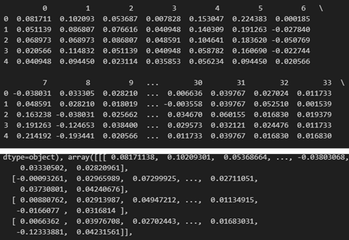
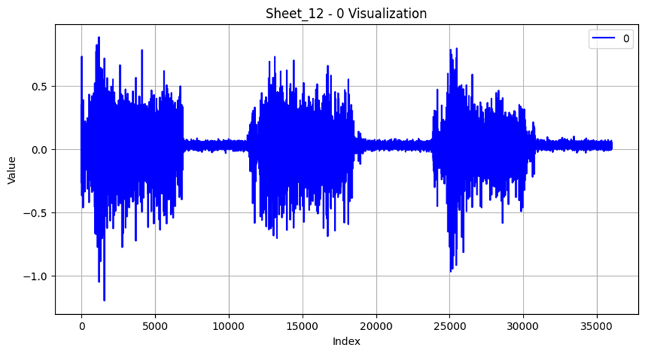

# BioPatRec

# 1. Dataset Information

BioPatRec 데이터셋은 의수(보철 손) 제어 연구를 위해 Chalmers University of Technology (스웨덴)에서 수집되었다. 본 데이터셋은 근전도(EMG) 신호의 패턴 인식을 활용한 보철 제어 알고리즘 개발 및 평가를 목적으로 하며, 다양한 신호 처리 및 머신러닝 모델을 검증하는 플랫폼으로 활용된다. 또한 해당 데이터를 사용하기 위한 코드를 제공한다.

# 2. Dataset Basic Information

## 2.1 Data information

해당 데이터셋은 17명의 건강한 성인이 10가지 손 및 손목 동작을 3회 반복 수행하여 수집되었다. National Instruments USB-6009 및 USB-6212 데이터 수집카드를 사용해 신호를 기록하였고 실험 환경은 2000Hz 샘플링 속도를 갖춘 맞춤형 MyoAmpF2F4-VGI8 바이오 포텐셜 증폭기를 사용하여 설정하였다. 또한 해당 데이터는 forearm EMG data뿐만 아니라, 실험적인 Lower-Limb EMG데이터셋 또한 포함하고 있다.

| **Channel** | **Sampling frequency** | **Recording duration** | **File format** |
| --- | --- | --- | --- |
| 8 | 200Hz | 6~9 seconds | .csv (EMG) |

## 2.2 Data Statistics

| **Label** | **Description** | **# of recording** |
| --- | --- | --- |
| OH (Open Hand) | 손을 편 상태 | 10% |
| CH (Close Hand) | 손을 쥔 상태 | 10% |
| FH (Flex Hand) | 손을 안쪽으로 당기는 상태 | 10% |
| EH (Extend Hand) | 손을 바깥쪽으로 당기는 상태 | 10% |
| PR (Pronation) | 손바닥을 아래로 회전 | 10% |
| SP (Supination) | 손바닥을 위로 회전 | 10% |
| SG (Side Grip) | 손가락을 측면으로 모으기 | 10% |
| FG (Fine Grip) | 작은 물체를 잡는 동작 | 10% |
| AG (Thumb up) | 엄지 손가락을 올리는 동작 | 10% |
| PT (Pointer) | 검지 손가락을 펴고 나머지는 접기 | 10% |

## 2.3 Raw Dataset

기존 (36000, 4, 10) 배열의 numpy형태로 저장되어있다. 4는 채널의 개수, 10은 손동작의 개수를 의미한다. 이 둘중 하나를 새로운 분류기준으로 삼을 수 있다. 그림은 각 동작별로 sheet를 구분하여 데이터를 정리한 모습이다.

## 2.4 Raw dataset Example

# 3. References