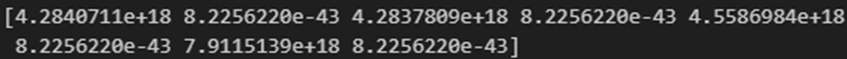
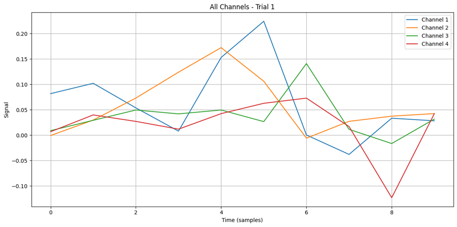
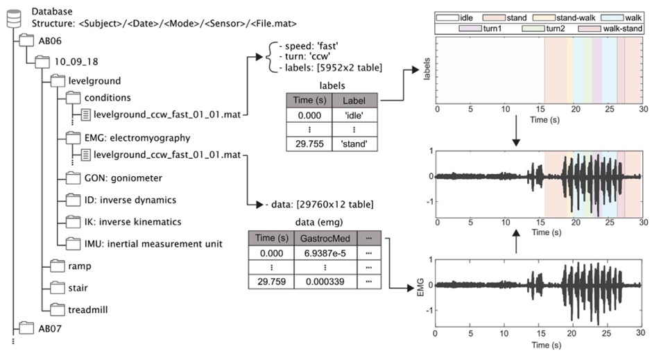

# 1. Dataset Information

이 데이터셋은 건강한 성인의 다양한 보행모드에 대한 3D 생체 역학 및 웨어러블 센서 데이터를 포함한 공개 데이터셋으로 Georgia Institute of Technology(미국)에서 수집되었다. 착용형 센서를 활용하여 보행 패턴을 정량적으로 분석하고 로봇 보조 장치 및 생체 모방 컨트롤러 개발을 지원하기 위해 수집된 데이터셋이다. 데이터는 연구 목적으로 사용할 수 있게 공개되어 있다.

# 2. Dataset Basic Information

## 2.1 Data information

이 데이터셋은 22명의 비환자 피험자가 다양한 지형과 속도 조건에서 보행하는 동안 EMG 데이터 뿐만 아니라 관절각과 관성센서 데이터까지 측정하여 기록되었다. 오른쪽 다리에만 Biometrics LTd.의 EMG센서가 부착되어 측정되었다.

| **Channel** | **Sampling Frequency** | **Recording Duration** | **File Format** |
| --- | --- | --- | --- |
| 11 | 1000 Hz | 트레드밀 보행 : 30초 기타 보행 : 5회 반복 실험 | .CSV, .MAT |

## 2.2 Data Statistics

| **Mark** | **#recording** | **Key variables** |
| --- | --- | --- |
| Treadmill walking | 7 times x 28 | 0.5~1.85m/s, 0.05m/s 간격 |
| Level-Ground Walking | 30 times | Slow, Middle, Fast |
| Ramp Ascent/Descent | 60 times | Angle : 5.2°~18° |
| Stair Ascent/Descent | 40 times | Stair height : 102~178mm |

## 2.3 Raw Dataset

AB06/10_21_2018/treadmill/conditions/treadmill_01_01.mat를 예시로 살펴보면
<subject/date/mode/sensor/file>의 구조로 저장되어 있다. 또한 파일내부를 보면 emg데이터만 시간순으로 기록된 파일이 새로 존재한다.

## 2.4 Raw dataset Example

# 3. References

J. Camargo, A. Ramanathan, W. Flanagan, and A. Young, “A comprehensive, open-source dataset of lower limb biomechanics in multiple conditions of stairs, ramps, and level-ground ambulation and Transitions,” Journal of Biomechanics, vol. 119, p. 110320, Apr. 2021. doi:10.1016/j.jbiomech.2021.11032 0
