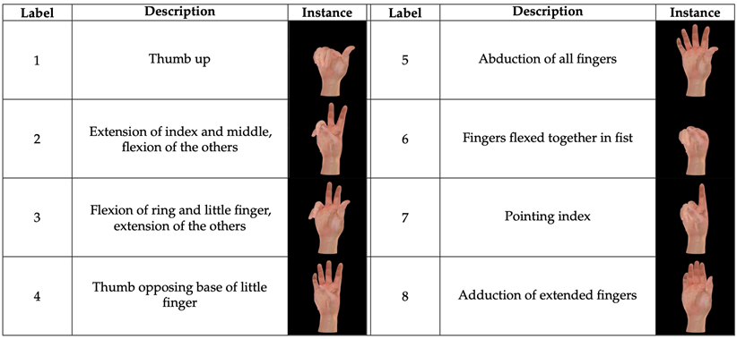
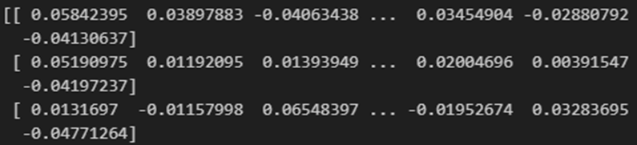
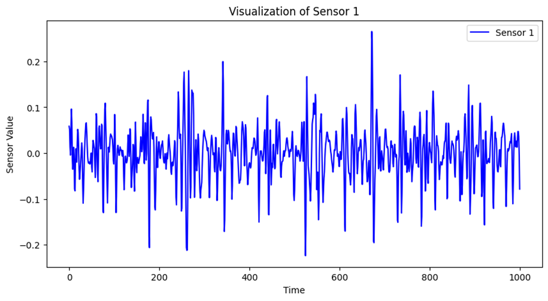

# 1. Dataset Information

Capgmyo-db 데이터셋은 고밀도 표면 근전도(HD-sEMG)기반 손 제스처 인식 데이터셋이다. 제스처 인식의 세션 간 문제를 해결하기 위해 딥러닝 기만 도메인 적응기법을 제안할 뿐만 아니라 본 데이터셋과 모델은 기존 방법 대비 높은 제스처 인식 성능을 제공하며 다양한 제스처 인식 연구 및 Muscle-Computer Interface개발에 활용 가능하다.

# 2. Dataset Basic Information

## 2.1 Data information

현재 DB-a의 경우 공개되어 있으나, DB-b와 DB-c의 경우는 데이터셋 요청이 필요하다. DB-a,b의 경우 각각 18명, 10명의 정상 피험자로부터 8가지 손 제스처를 바탕으로 측정되었고 DB-c의 경우는 12가지의 손가락 움직임을 바탕으로 근전도신호가 측정되었다

| **Channel** | **Sampling frequency** | **Recording duration** | **File format** |
| --- | --- | --- | --- |
| 128 | 1000 Hz | 3~10 seconds | .mat |

## 2.2 Data Statistics

Capgmyo- db a,b 에 사용된 손동작

## 2.3 Raw Dataset

각 데이터셋은 subject별로 분류되어있으며, 데이터셋 내에는 128채널의 emg신호가 각각 저장되어있으며 반복횟수,subject정보,제스터 종류가 라벨로 저장되어 있다. 파일명은 001-001-001.mat 형식으로 저장되어 있는데, subject 번호-제스쳐 번호-반복횟수를 나타낸다. 때문에 데이터는 (1000, 128)배열을 띄게 된다.

## 2.4 Raw dataset Example

# 3. References

Du, Y., et al., *Surface EMG-Based Inter-Session Gesture Recognition Enhanced by Deep Domain Adaptation.* Sensors (Basel), 2017. **17**(3): p. 458.
