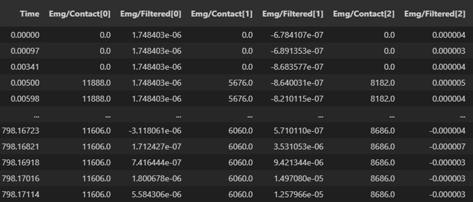
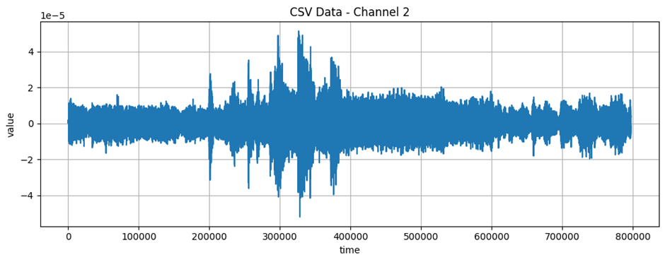

# EMG data VR

# 1. Dataset Information

본 데이터셋은 가상현실(VR) 환경에서 착용형 얼굴 근전도(sEMG) 센서를 활용한 감정 모니터링 연구를 위해 **Università della Svizzera italiana (스위스), Emteq Ltd. (영국), Ss. Cyril and Methodius University (북마케도니아)**에서 수집되었다. 연구 목적은 sEMG 기반 감정 표현 분석을 통해 긍정적/부정적 감정을 효과적으로 분류하는 것이다. 이 데이터셋은 연구 및 개발 목적으로 자유롭게 활용할 수 있다.

# 2. Dataset Basic Information

## 2.1 Data information

이 데이터셋에서는38명의 비환자가 총 25개 감정유발 영상(긍정/중립/부정)을 시청하면서 얼굴 근전도 신호를 기록하고, 객관적인 영상 분류기준(긍정, 중립, 부정)과 비교 분석되었다. 5채널 sEMG emteqPro 웨어러블 EMG센서를 사용하여 측정하였지만 이 데이터셋에서는 Frontails를 제외한 4채널만 사용되었다. 또한, 긍정적인 영상에서는 Zygomaticus major(광대근) 및 Orbicularis oculi(눈둘레근)의 활성이 증가하였고 부정적인 영상에서는 Corrugator supercilia(미간주름근)의 활성도가 증가하였다. 각 감정 표현동안 영상 시청 후 10초간 주관적 감정평가가 진행되었다.

| **Channel** | **Sampling frequency** | **Recording duration** | **File format** |
| --- | --- | --- | --- |
| 5 | 1000 Hz | 10 seconds | .csv
.mat |

## 2.2 Data Statistics

| **Label** | **Description** | **# of recording** |
| --- | --- | --- |
| Positive | 긍정적 감정상태 | 40% |
| Neutral | 중립적 감정상태 | 36% |
| Negative | 부정적 감정상태 | 24% |

## 2.3 Raw Dataset

데이터셋의 경우 각 subject별로 저장되어 있으며 시간순으로 각 채널의 EMG신호를 기록했다.

## 2.4 Raw dataset Example

# 3. References