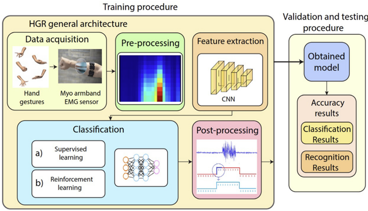
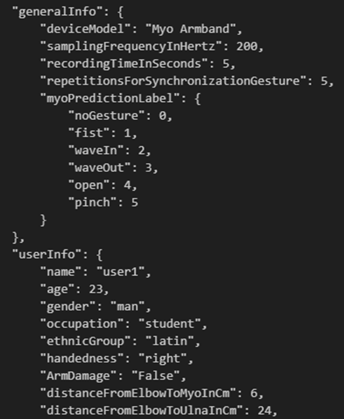
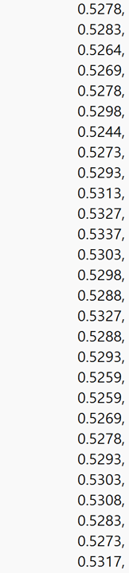
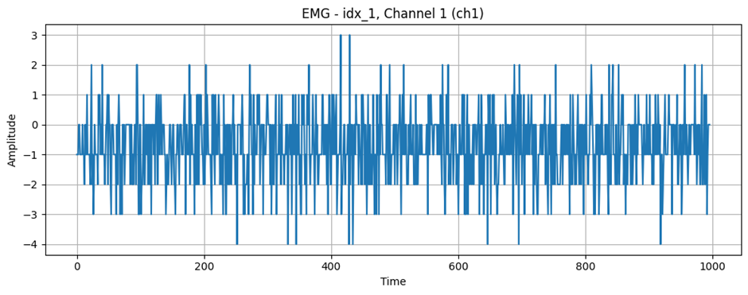

# 1. Dataset Information

이 연구는 표면 근전도 신호를 활용한 인터랙티브 시스템을 개발하여 인지 능력 향상을 목표로 한다. Myo Armband 센서를 사용하여 손동작을 인식하고 이를 Unity 3D 기반의 게임과 연동하여 사용자가 미로를 탐색하는 방식으로 설계되었다. 또한 주의력, 집중력, 문제 해결 능력, 공간 인지 능력 등의 인지 능력을 향상시키는 것을 목적으로 하며 사용자의 손 제스처를 분류모델을 이용하여 인식하는 것을 목표로 한다.

# 2. Dataset Basic Information

## 2.1 Data information

612명의 건강한 비환자 피험자를 대상으로 5가지의 손 제스처를 사용하여 데이터가 수집되었다. 피험자들은 각 제스처당 5초를 유지하고 총 300회씩 반복하였다. 또한 모든 손 동작이 동일한 실험 횟수를 가지며 데이터 균형이 유지된다. 해당 데이터는 또한 측정한 데이터를 훈련데이터와 테스트 데이터로 50:50으로 분할하여 제공한다.

| **Channel** | **Sampling frequency** | **Recording duration** | **File format** |
| --- | --- | --- | --- |
| 8 | 200Hz | 5 seconds | .MAT |

## 2.2 Data Statistics

| **Label** | **Description** | **# of recording** |
| --- | --- | --- |
| Open | 손을 편 상태 | 20% |
| Fist | 손을 쥔 상태 | 20% |
| Wave-in | 손을 안쪽으로 흔드는 동작 | 20% |
| Wave-out | 손을 바깥쪽으로 흔드는 동작 | 20% |
| Pinch | 엄지와 검지를 맞닿은 동작 | 20% |

## 2.3 Raw Dataset

## 2.4 Raw dataset Example

