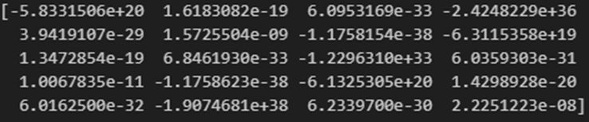
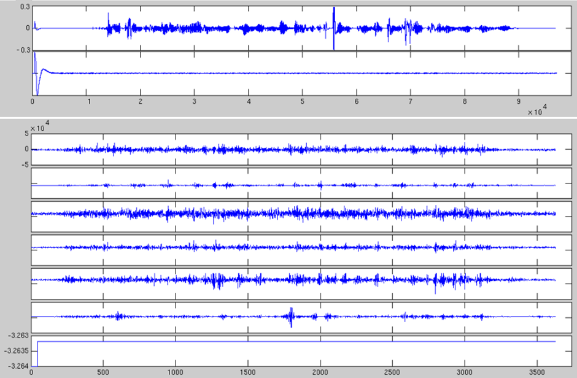

# EMG-UKA

# 1. Dataset Information

EMG-UKA 데이터셋은 표면 근전도를 활용한 무음 음성 인식(Silent Speech Interface, SSI) 연구를 위해 구축된 데이터셋이다. 영어 문장을 읽으며 수집된 EMG신호와 동기화된 음성 데이터를 포함하고 있다. 본 데이터셋은 EMG 기반 음성 인식 및 합성 기발을 개발하고, 발성 장애가 있는 사람들을 위한 대체 의사소통 시스템을 구축하는 것을 목표로 한다. 총 7시간 32분의 데이터 크기를 갖고 있으나, 현재 공개된 데이터는 1시간 52분이다.

# 2. Dataset Basic Information

## 2.1 Data information

이 데이터셋은 8명의 비환자 피험자를 대상으로 측정되었다. 6채널의 Varioport Biosignal Recorder전극이 측정에 사용되었고 각 참가자는 3가지 음성모드에서 주어진 영어문장을 읽기를 요청받았다. 데이터셋의 각 파일은 파일단위로 발화 모드 레이블을 제공한다.

| **Channel** | **Sampling frequency** | **Recording duration** | **File format** |
| --- | --- | --- | --- |
| 6 | 600Hz | 7 hours 32 minutes | .adc .txt |

## 2.2 Data Statistics

| **Label** | **Description** | **# of recording** |
| --- | --- | --- |
| 일반 발화 (Audible) | 61개의 일반 크기의 발화 | 42.26% |
| 속삭임 발화 (Whispered) | 32개의 작은 크기의 발화 | 23.67% |
| 무음 발화 (Silent) | 목소리를 내지 않는 발화 | 23.45% |

EMG-UKA의 라벨 (10.62%의 경우, 라벨이 되지 않은 Nan 영역임)

## 2.3 Raw Dataset

데이터는 subject별로 분류되어 있으며 시간순서에 따른다. 또한 서브데이터셋으로 피험자가 읽은 문장을 txt파일로 제공하고 있다.

## 2.4 Raw dataset Example

# 3. References