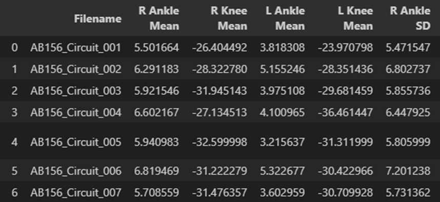
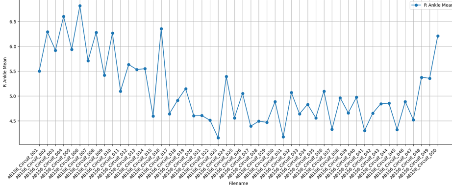

# 1. Dataset Information

이 데이터셋은 신경기계 신호 기반 보행 분석 연구를 위해 Northwestern University 및 Shirley Ryan Ability Lab(미국)에서 수집되었다. 연구 목적은 웨어러블 센서를 활용하여 건강한 성인의 다양한 보행 활동(평지 보행, 계단 오르기/내리기. 경사 오르기/내리기)를 분석하고, 이를 보행 보조 장치 및 로봇 의족 개발에 활용하는 것이다. 이를 위해 양측 하지의 근전도 데이터, 관성센서, 운동학 데이터를 포함하는 다중 모달 데이터를 기록하였다. 데이터는 연구 목적으로 공개된다.

# 2. Dataset Basic Information

## 2.1 Data information

이 데이터셋은 10명의 비환자 피험자들을 대상으로 6가지의 보행 작업 실험을 진행한 데이터셋이다. 실험 데이터는 양측 하지의 신경기계 신호 기반으로 수집되었고 Delsys DE2.1 (EMG) 센서가 실험에 사용되었다.

| **Channel** | **Sampling Frequency** | **Recording Duration** | **File Format** |
| --- | --- | --- | --- |
| 14 | 1000 Hz | 45feet | .CSV |
|  |  |  |  |

## 2.2 Data Statistics

| **Mark** | **Heel Contact** | **Toe Off** | **#recording** |
| --- | --- | --- | --- |
| Level Walking, LW | 4,523 | 4,637 | 9,160 (42.96%) |
| Ramp Ascent, RA | 1,408 | 1,416 | 2,824 (13.24%) |
| Ramp Descent, RD | 1,757 | 1,762 | 3,519 (16.50%) |
| Stair Ascent, SA | 489 | 472 | 961 (4.51%) |
| Stair Descent, SD | 475 | 478 | 953 (4.47%) |

## 2.3 Raw Dataset

데이터는 각 보행 실험이 별도의 데이터 파일로 저장된다. 각 보행 데이터 파일에는 발뒤꿈치 접촉(Heel Contact) 및 발끝 이륙(Toe off) 이벤트 타임스탬프가 포함되어 있고

보행상태 전환시 4자리 트리거코드(1201 = 평지보행시작, 1302=계단보행종료)가 포함되어 있다. 또한 EMG 데이터 외에 관성센서와 운동학 데이터 또한 제공된다.

데이터는 각 보행 실험이 별도의 데이터 파일로 저장된다. 또한 EMG 데이터 외에 관성센서와 운동학 데이터 또한 제공된다.

## 2.4 Raw dataset Example

data.csv의 파일중 하나를 일부 시각화한 예시이다. 일부 데이터는 센서 케이블 엉킴, 전극 탈착, 보행 중 불규칙한 움직임으로 인해 제외되었으며 Raw data와 preprocessed data 모두 제공한다.

# 3. References
