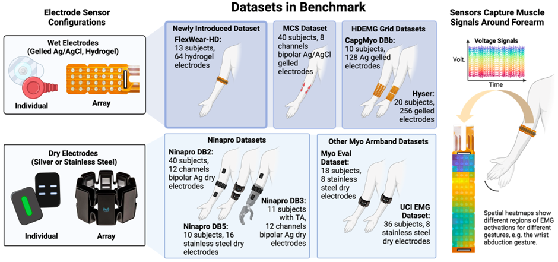
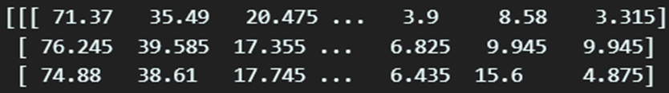
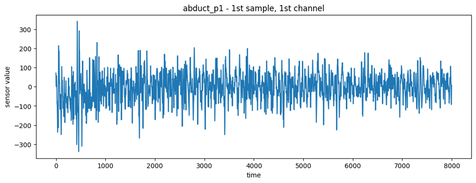

# FlexWear

# 1. Dataset Information

FlexWear 데이터셋은 웨어러블 고밀도 근전도(HD-EMG) 인터페이스를 활용한 이동형 조작 로봇 제어 연구를 위해 Carnegie Mellon University (미국)에서 수집되었다. 연구 목적은 웨어러블 HDEMG 장비를 사용하여 손과 손목의 제스처를 실시간으로 판독하고, 이를 기반으로 이동형 조작 로봇을 효과적으로 제어하는 것이다.

# 2. Dataset Basic Information

## 2.1 Data Information

이 데이터셋은 13명의 비환자 피험자가 10가지 손 제스처를 수행하면서 신호를 기록한 것이다. 각 피험자는 각 제스처를 10회 반복 수행하였다. 각 제스처는 3초동안 유지되었으며 1초 간격을 두고 다음 제스처가 수행되었다. EMG 신호는 Intan RHD Recording Controller와 flexPCB 기반 64채널 전극 배열을 통해 측정되었다.

| **Channel** | **Sampling frequency** | **Recording duration** | **File format** |
| --- | --- | --- | --- |
| 64 | 4000Hz | 3 seconds | .h5 |

## 2.2 Data Statistics

| **Label** | **Keys** |
| --- | --- |
| Finger closed | Abduct_p1 |
| Fingers open | Abduct_01 |
| Pinch fingers | Extend_p1 |
| Palm up | Grip_p1 |
| Palm down | Pronate_p1 |
| Wrist left | Rest_p1 |
| Wrist right | Supinate_p1 |
| Wrist up | Tripod_p1 |
| Wrist down | Wextend_p1 |
| Rest | Wflex_p1 |

## 2.3 Raw Dataset

데이터셋은 각 subject별로 저장되어 있으며, 폴더 내에서 제스쳐별 파일로 나뉘어진다. 제스처별로 센서가 측정한 EMG신호를 시간순서대로 제공하고 있다.

## 2.4 Raw dataset Example

# 3. References

[^1]: Yang, J., et al., *EMGBench: Benchmarking Out-of-Distribution Generalization and Adaptation for Electromyography.* Advances in Neural Information Processing Systems, 2024. **37**: p. 50313-50342.