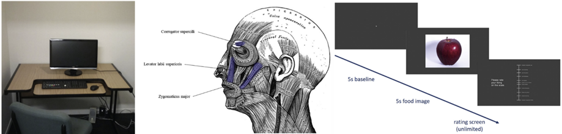
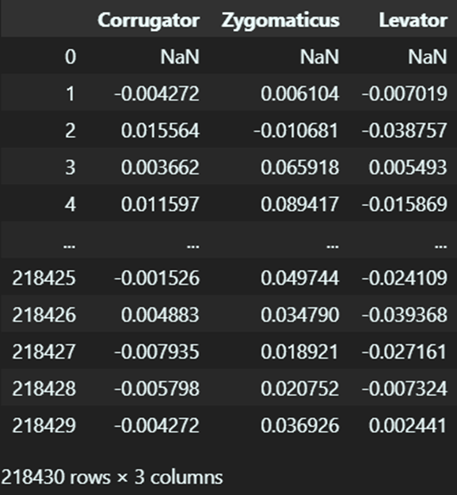
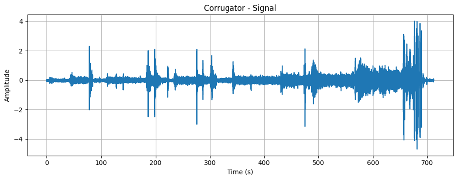

# FSC

# 1. Dataset Information

본 데이터셋은 음식 이미지 및 초콜릿 샘플에 대한 얼굴 근전도(EMG) 및 주관적 선호도 데이터를 연구하기 위해 Massey University (뉴질랜드)에서 수집되었다. 연구 목적은 사회적 맥락이 음식 자극에 대한 얼굴 근전도 반응 및 주관적 선호도에 미치는 영향을 분석하는 것이다.

# 2. Dataset Basic Information

## 2.1 Data information

이 데이터셋은 Zygomaticus major(광대근), Corrugator supercilia(미간주름근), Levator Labii superioris(윗입술올림근) 들을 이용해서 70명의 피험자가 30가지 음식 이미지를 평가하고, 2종류의 초콜릿을 섭취하면서 기록된 EMG 신호 데이터셋이다. 각 음식 이미지는 5초 동안 제시되었고 초콜릿 섭취 중에는 10초간 신호가 기록되었다. 또한 실험은 참가자가 혼자 수행하는 조건과 연구원이 함꼐 있는 조건으로 나뉘어 진행되었으며, 이에 따른 사회적 맥락이 감정에 미치는 영향을 분석할 수 있도록 설계되었다.

| **Channel** | **Sampling frequency** | **Recording duration** | **File format** |
| --- | --- | --- | --- |
| 8 | 200Hz | 5 seconds | .MAT |

## 2.2 Data Statistics

## 2.3 Raw Dataset

각 근육별로 EMG신호들이 정렬되어있다. 기존 mat파일에서는 digital input 행을 이용하여 데이터셋을 구분하고 있다.

## 2.4 Raw dataset Example

# 3. References