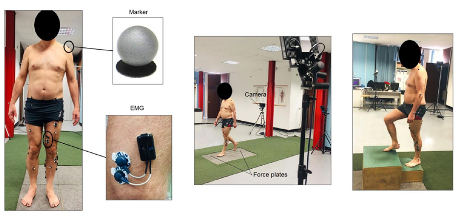
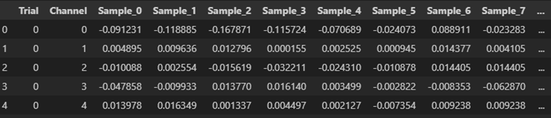
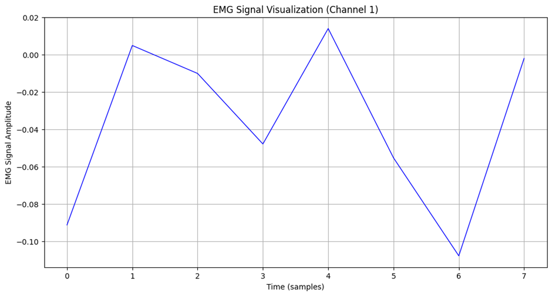

# 1. Dataset Information

이 데이터셋은 다양한 보행 및 계단 오르기내리기 동작에서 인간의 운동학, 운동역학, 근전도 데이터를 포함하는 공개 데이터셋이다. IRCCS Fondazione Don Carlo Gnocchi (이탈리아)에서 수집되었으며 건강한 성인의 보행 및 계단 동작을 정량적으로 분석하고 신경근육 질환 평가, 보행 보조기기 개발, 이족 보행 로봇 제어 연구 등에 활용하기 위해 연구되었다. 데이터는 공개 데이터이다.

# 2. Dataset Basic Information

## 2.1 Data information

이 데이터는 50명의 건강한 피험자가 5가지 보행 동작을 수행하는 동안 9채널 동작 캡쳐 시스템, 2개의 지면반력 시스템, 8채널 무선 EMG장비를 사용하여 데이터가 기록되었다. 신경근육 질환 및 보행 장애가 없는 대상자들만 피험자로 선정되었으며 데이터셋에는 피험자의 나이, 성별, 키, 체중 정보가 포함된다.

| **Channel** | **Sampling Frequency** | **Recording Duration** | **File Format** |
| --- | --- | --- | --- |
| 8 | 800~1000 Hz | 5 times repetition | .MAT |

## 2.2 Data Statistics

| **Mark** | **#recording** |
| --- | --- |
| Walking, W | 250 |
| Toe Walking, T | 250 |
| Heal Walking, H | 250 |
| Stair Ascending, SA | 250 |
| Stair Descending, SD | 250 |

## 2.3 Raw Dataset

데이터셋의 파일들은 각 subject 별로 나뉘어져 있다. 각 파일별로 실험 대상자의 나이,성별,신장,체중이 기록되어 있으며 EMG에 관련된 여러가지 key가 포함되어있다.
- EMGfreq : EMG 데이터의 샘플링 주파수 라벨
- EmgVarName : EMG 신호 변수명(센서가 부착된 근육명)
- Data : 운동 실험의 데이터
- StandingData : 서 있는 상태의 데이터

## 2.4 Raw dataset Example

# 3. References

Lencioni, Tiziana; CARPINELLA, ILARIA; Rabuffetti, Marco; Marzegan, Alberto; Ferrarin, Maurizio (2019). Human kinematic, kinetic and EMG data during level walking, toe/heel-walking, stairs ascending/descending. figshare. Collection. https://doi.org/10.6084/m9.figshare. c.4494755.v1
