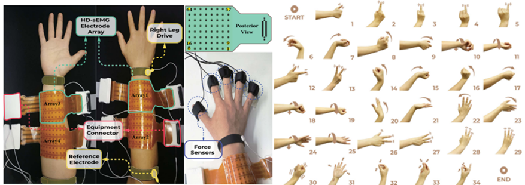
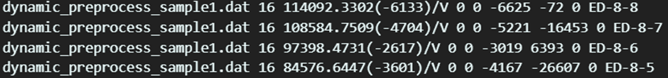
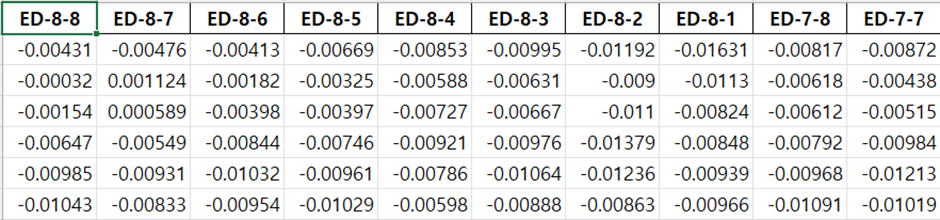
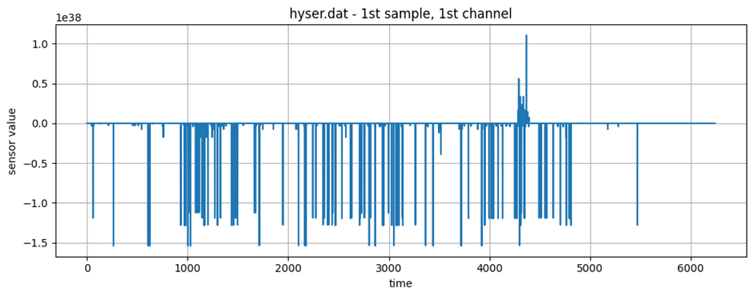

# Hyser

# 1. Dataset Information

Hyser 데이터셋은 고밀도 표면 근전도(HD-sEMG)를 활용한 손 제스쳐 인식 및 신경 인터페이스 연구를 위해 Fudan University (중국)에서 수집되었다. 연구 목적은 256채널 HD-sEMG를 활용하여 손가락 개별 움직임 및 복합 움직임을 인식하고, 정밀한 신경 인터페이스 및 의수 제어 시스템을 개발하는 것이다. 해당 데이터는 연구 및 개발 목적으로 자유롭게 활용할 수 있다.

Hyser dataset의 계측 기기 및 수집한 손동작

# 2. Dataset Basic Information

## 2.1 Data information

이 데이터셋에는 총 20명의 피험자가 참여하여 34가지 손 제스처를 수행하면서 HD-sEMG 신호를 기록했다. 각 피험자는 각 제스처를 2회 반복하여 측정되었다. 각 제스처는 4초동안 유지되며 피험자는 2초 간격을 두고 다음 제스처를 수행했다. 또한, 해당 데이터의 제스처는 여러 그룹으로 나뉘어 묶여서 실험이 진행되었다.

- **PR 데이터셋**: 34가지 손 동작 수행, 1초(동적) + 4초(유지)
- **MVC 데이터셋**: 각 손가락 최대 근수축(MVC) 수행 (10초 측정)
- **One-DoF/N-DoF 데이터셋**: 각 손가락 25초 동안 등척성 수축 수행

EMG신호를 담고있는 .DAT파일과 메타데이터가 담긴 .hea파일이 같이 제공된다.

| **Channel** | **Sampling frequency** | **Recording duration** | **File format** |
| --- | --- | --- | --- |
| 256 | 2048Hz | 4 seconds | .dat
.hea |

## 2.2 Data Statistics

Label

| Hand close | Hand open | Wrist supination | Wrist supination combined with hand open | Extension of index, middle, ring and little fingers |
| --- | --- | --- | --- | --- |
| Thumb
extension | Index finger
extension | Middle finger
extension | Ring finger
extension | Little finger
extension |
| Wrist flexion | Wrist extension | Wrist radial | Wrist ulnar | Wrist pronation |
| Wrist flexion combined with hand close | Wrist extension combined with hand close | Wrist radial combined with hand close | Wrist ulnar combined with hand close | Wrist pronation combined with hand close |
| Wrist flexion combined with hand open | Wrist extension combined with hand open | Wrist radial combined with hand open | Wrist ulnar combined with hand open | Wrist pronation combined with hand open |
| Extension of thumb and 
index fingers | Extension of thumb, index and middle fingers | Extension of index, middle and ring fingers | Extension of middle, ring and little fingers |  |
| Thumb and index fingers pinch | Thumb, index and middle fingers pinch | Thumb and middle fingers pinch | Wrist supination combined with hand close |  |

## 2.3 Raw Dataset

아래 그림은 PR 데이터셋의1번째 subject의 첫번째 session내용인dynamic_preprocess_sample1.dat파일과 .hea파일을 열었을때의 내용이다. hea파일에는 채널, 총 샘플 개수, 샘플링 주파수, 레코드명의 데이터가 담겨져 있다.

## 2.4 Raw dataset Example

# 3. References