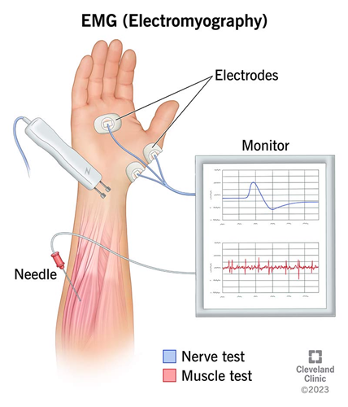

# EMG dataset

# 1. 서론

헬스케어시스템의 발전으로 다양한 생체전기신호 분석에 대한 관심이 증가하면서, 생체전기신호 분석에도 다양한 연구들이 수행되고 있다. 그 중 사람의 근육 움직임을 반영하는 생체전기신호인 Electromyogram (EMG)는 질병진단 [^1][^2][^3], 감정분석 [^4][^5][^6], 재활 [^7][^8][^9], 최근에는 사람과 기계 혹은 컴퓨터간 소통(Human Machine Interface; HMI, Human Computer Interface; HCI)과 관련된 분야에 활용되고 있다 [^10][^11][^12]. 또한, AI (Artificial Intelligence) 기술의 적극적인 도입으로, 이전에는 EMG에서 분석할 수 없었던 정보들을 얻게 되면서 각 분야의 큰 발전을 이끌어내고 있다. 이러한 AI 모델들은 데이터셋을 기반으로 개발되는데, 이는 좋은 데이터셋의 확보가 좋은 AI 모델로 이어지는 것을 나타낸다. 특히, 최근에는 의료 파운데이션 모델에 대한 연구들이 주목받으면서, 생체전기신호 데이터셋의 확보 중요도는 더욱이 높아지고 있다.
하지만, AI 기술이 발전되면서 데이터셋의 중요도가 강조되고 있음에도, 다양한 EMG 데이터셋의 확보가 어려운 한계점이 있다. Ninapro의 경우 [^13][^14][^15], 손동작 및 손가락 움직임과 관련된 데이터셋을 홈페이지를 통해 공개 및 각 정보들을 자세하게 소개해두고 있지만, 대부분의 연구에서는 데이터셋을 공개하고 있지 않고 있다. 이는 하나의 AI 기반 모델을 개발한 후 다양한 케이스에 대해 교차검증하기 어려운 한계점과, 다양한 케이스를 학습시켜보지 못한다는 한계점을 또한 같이 보여준다.
본 백서에서는 이전 연구들에서 지적하고 있는 한계점들을 해결하기 위해, 여러 오픈 소스 데이터셋을 한 곳에 모으고, 각각의 정보와 전처리 방법 그리고 각 데이터셋을 활용할 수 있는 방안들을 같이 제안하고자 한다. 본 백서가 EMG를 활용한 연구를 수행하고자 하는 연구자들에게 하나의 가이드라인로써 기여할 것으로 기대한다.

# 2. Electromyogram (EMG) 개요

## 2.1. EMG 정의

Electromyogram (EMG)는 인간의 몸에서 발생하는 전기신호 중 하나로, 근육이 수축시에 발생하는 전기신호이다. EMG는 보통 0~10mV 진폭과, 0~500Hz 에너지로 제한되어 계측된다 [^16][^17]. EMG는 크게 그 계측 방법에 따라 iEMG (Intramuscular Electromyogram; nEMG, Niddle Electromyogram)와 sEMG (Surface Electromyogram)으로 나누어진다. iEMG의 경우 계측하고자 하는 근육에 직접적으로 바늘형 전극을 삽입해, 데이터를 수집한다. 근육에 직접적으로 계측하기 때문에, 노이즈에 노출이 덜 되지만, 고통을 동반한 침습형 방법이라는 데에 그 한계점이 있다. sEMG의 경우 피부 표면에서 계측하는 방식을 가지기 때문에, 다양한 노이즈들에 노출되지만, 침습적이지 않는 방법을 사용하기 때문에 대부분의 연구에서 이 방법을 채택해 사용한다. 하지만, 연구에 따르면 두 계측방법으로 수집한 데이터를 통해 EMG를 분석할 때 큰 차이를 보이지 않아 [^18], 계측상의 위험성이 없고, 계측하기 쉬운 sEMG를 주로 계측해 분석 및 연구를 수행하고 있다.

## 2.2. EMG 신호적 특징

EMG를 원활히 분석하기 위해서는, EMG의 신호적 특징을 이해하고, 이를 위한 적절한 전처리가 필요하다. EMG는 근섬유의 운동단위(Motor unit)가 아닌 여러 근섬유 다발에서 발생하는 복잡한 전기신호로, 하나의 동작을 할 때에도 여러 근섬유가 생체전기신호들을 동시다발적으로 발생시키기 때문에, 분석에 어려움이 있다. 이는 피부표면에서 EMG 데이터셋을 계측할 때, 어떤 근육들이 활성화되었는지 분석하는 어려움을 나타낸다.

이외에도 EMG 계측시에 영향을 주는 노이즈들은 다음 **표 1**과 같다. PLI (Power Line Interference) 는 전력선에서 발생하는 전자기적 간섭에 의해 발생하는 노이즈로, 50Hz 또는 60Hz의 주파수단에서 나타난다. 또한, 고조파(Harmonics)의 형태로도 나타나, PLH (Power Line Harmonics) 각 기본주파수의 자연수배의 영역(100Hz, 150Hz, 200Hz)에서도 노이즈가 나타난다. HFN (High Frequency Noise)는 주변 장치에서 발생하는 고주파 전자기파에서 발생되는 노이즈이다. 이외에도, MA (Motion Artifacts)가 존재하며, 이는 사람의 움직임에 따라 발생하는 노이즈이다. 여기서 언급한 노이즈들은 대부분의 환경에서 공통적으로 발견되는 노이즈로, 각 실험환경에 따라 다른 노이즈들이 관찰되기도 한다.

이러한 노이즈들을 제거하기 위해, 다양한 필터들이 사용된다. 이는 하드웨어적인 필터로써도 적용시킬 수 있고, 소프트웨어를 통해 후처리를 진행할 수도 있다. 수집된 데이터들의 경우, 소프트웨어적인 전처리만 적용시킬 수 있기 때문에, 본 백서에서는 소프트웨어적인 전처리 방법을 소개한다.
PLI의 경우, Notch (Band stop) filter를 적용시켜 해당 주파수 영역대의 노이즈들을 제거할 수 있다. PLH의 경우, Nyquist frequency 안에서, 제거하려는 주파수 영역의 자연수배까지 Notch (band stop) filter를 적용시켜 노이즈를 제거한다. HFN과 MA의 경우, Low pass filter 혹은 band pass filter를 적용시켜 각 노이즈들을 제거한다. 본 필터를 적용시킬 때, Butterworth를 주로 사용한다.

# 3. 연구동향

최근 EMG를 활용한 연구들은 크게, hand gesture recognition, human activity recognition, human gait recognition 등이 주로 연구되고 있다. 또한, sleep stage classification, driver drowsiness, emotion recognition 관련 연구에서도 EMG가 활용된다. 본 절에서는 각 연구분야의 연구동향에 대해 소개한다.

## 3.1. Hand gesture recognition

우리는 손을 통해 일을 하고, 사람들과 소통을 하고, 밥을 먹는 등 다양한 기능을 한다. 이처럼 손은 우리 몸에서 많은 역할을 수행하고 있고, 이를 반영하듯 손동작들을 인식하고 활용하고자 하는 연구들이 수행되고 있다. 그 중, 근육에서 발생되는 생체전기신호인 EMG를 기반으로 하는 손동작 인식 분야가 적극적으로 연구되고 있다. EMG를 기반으로 손동작을 수행할 경우, 적은 전력으로도 데이터를 계측할 수 있고, 더 나아가 손동작의 세기(Force)를 유추할 수 있는 장점이 있다. 하지만, EMG는 단일 근섬유의 운동단위(Motor unit)에서만 발생하지 않아 분석 복잡도가 높고, 피부표면에서 EMG를 계측하기 때문에, 다양한 노이즈에 노출되어 있다. 이런 한계점을 해결하고자 많은 연구에서 다양한 머신러닝, 딥러닝 알고리즘을 적용시키고 있고, 손동작 인식에 있어 높은 성능과, EMG에 대한 풍부한 분석을 내놓고 있다. 다음은 머신딥러닝을 통해 EMG 기반 손동작 인식에 관한 연구들을 소개한다.
(그림 2, a) Kadavath, M. R. K. 및 연구진들은 각 손동작에 대한 EMG 신호 분석과 학습을 위한 피쳐 추출 그리고 머신러닝을 활용한 손동작 인식에 관한 연구를 수행하였다 [^30].
EMG는 각 손동작에 따른 신호의 차이 외에도, 피험자(Subject)간 서로 다른 특징을 보인다. 높은 성능을 얻기 위해서는 이러한 변동성(Variability)에 대한 분석 또한 수행되어야 한다. (그림 2, b) Fan, J. 및 연구진들은 대조 학습(Contrastive learning)을 통해, EMG의 패턴별, 피험자별 EMG의 신호특징들을 학습해 분류하는 연구를 수행하였다 [^31]. 이는 같은 동작이여도 피험자간 달라지는 변동성에 관한 분석을 딥러닝 관점에서 잘 분석하고 있다.
손동작 인식은 의수 개발 및 최적화에도 활용된다. (그림 2, c) Gozzi, N.와 연구진들은 의수의 최적화를 위해, 손동작별 어떤 계측 지점이 가장 큰 영향을 주는지에 대한 연구를 수행했다 [^29]. XAI (eXplainable Artificial Intelligence) 기법을 활용해 각 채널별로 중요도를 분석해, 손동작 인식에 있어 중요한 계측 지점을 제시하고 있다.
또한, 손동작 인식을 통해 HMI, HCI에 적용하고자 하는 연구들도 활발히 수행되고 있다. Hodam, Kim 과 그 연구진들은 EMG 기반 손동작 인식 모델을 구현하고 이를 활용해, AR 시스템을 조작하고, 더 나아가 드론의 움직임까지 제어하는 연구를 수행하였다.

![**그림 2.** (a) 머신러닝 모델을 활용한 손동작 인식 [^30], (b) Contrastive learning을 통한 subject-specific 손동작 인식 모델 [^31], (c) XAI를 활용한 EMG 기반 의수 최적화 [^29], (d) EMG 기반 손동작 인식을 활용한 AR 제어 및 드론 제어 [^32].](images/image-3.png)

## 3.2. Human activity recognition

EMG를 활용해, 사람의 움직임을 인식 하는 연구도 활발히 진행되고 있다. 특히, 사람의 움직임을 분석해, 재활분야, 의수(또는 의족) 최적화, 움직임 모니터링과 관련된 연구들이 더욱 활발히 수행되고 있다. 각 분야에 적용시키기 위해 다양한 동작인식 연구들이 수행되고 있다.
(그림 3. a) Ren Y. 와 그 연구진들은 EMG와 IMU (Inertial Measurement Unit)를 통해 얻어진 데이터를 computer vision 기반 CNN (Convolution Nueral Network) 알고리즘을 활용해 사람의 동작을 인식하는 연구를 수행했다 [^33]. 이때 EMG 신호를 spectrogram으로 바꾸어, 그 자체를 이미지로 인식을 해 동작을 구분하는 피처로 사용했다.
(그림 3. b) Bangaru S. S. 와 연구진들은 전완근에 EMG 계측장치를 부착해 데이터를 수집하고, 다양한 feature들을 EMG 신호로부터 추출해, ANN을 통해 작업자의 동작을 인식하는 연구를 수행하였다 [^34]. 제한된 동작이지만, 전완근에서 수집된 EMG 데이터셋만으로도 동작 인식을 높은 성능을 통해 해내는 것을 확인할 수 있다.

![**그림 3.** (a) Computer vision 지식기반 동작 인식 CNN 모델 [^33], (b) ANN을 활용한 EMG 기반 작업자의 움직임 인식 [^34]](images/image-4.png)

## 3.3. Others

(**그림 4, a**) 목소리 장애를 가지고 있는 사람들을 위해 목 주위의 근육에서 EMG를 계측해 이를 인식하는 Silent speech와 관련된 연구도 활발히 수행되고 있다 [^35]. 이러한 연구는 큰 목소리를 낼 수 없는 환경에서도 EMG를 통해 음성을 인식해 이를 상대방에게 전달할 수 있는 장점 또한 가지고 있다.

(**그림 4, b**) 단순한 손 동작 인식에서 더 나아가, 수화를 인식하는 연구에도 EMG가 활용된다 [^36]. 이때, EMG 뿐만 아니라 IMU (Inertial Measurement Unit) 함께 사용되어 더욱 격하고 빠른 움직임을 가지는 수화 인식과 관련된 연구도 활발히 수행되고 있다.

(**그림 4, c**) 다른 생체신호와 함께 질병진단에도 EMG는 많이 활용되고 있다. Jha, P. K. 와 그 연구진들은 EMG와 EEG를 통해 쥐의 수면 상태를 분류하는 연구를 수행하였다 [^37]. 이때, ResNet을 직접 적용시켜, 높은 정확도를 이끌어낸 성과를 보이고 있다.

![**그림 4.** (a) Transformer 기반 silent speech recognition 모델 [^35], (b) ResNET의 Inception block을 활용한 수화 인식 모델 [^36], (c) EEG, EMG를 활용한 ResNET 기반 수면 상태 분류 모델 [^37].   ](images/image-5.png)

# 4. 데이터셋의 정제 및 활용 방안

## 4.1 Preprocessing 방법

EMG는 다양한 데이터셋에서 수집되며, 샘플링 주파수, 기록 장치의 종류, 채널수, 측정부위 등에서 차이가 존재합니다. 이러한 차이를 효과적으로 처리하기 위한 전처리(Preprocessing)기법이 필요하며, 주요 방법은 다음과 같습니다.

### 4.1.1 Sampling Frequency 통일

EMG 데이터셋마다 샘플링 주파수(ex: 200Hz, 1000Hz, 2000Hz, 4000Hz)와 기록길이가 다릅니다. 이를 일관된 형태로 맞추기 위해 다음과 같은 방법이 사용되었습니다.

- Resampling: 학습 시 일관된 샘플링 레이트를 기준으로 상향 또는 하향 샘플링을 수행하여 신호를 변환
- Uniform Segmenting: 다양한 길이의 기록을 짧은 시간 단위(예: 0.5초)로 분할하여 일정한 크기의 입력 데이터로 변환
- Zero Padding: 짧은 신호의 길이를 긴 신호와 일치시키기 위해 신호의 끝부분에 0을 추가하는 방식

이러한 전처리 과정을 거치면 서로 다른 데이터셋을 통합하여 일관된 입력 형태로 모델을 학습할 수 있습니다.

### 4.1.2 채널 수 차이에 따른 처리

EMG 데이터는 데이터별로 다양한 채널 수가 분포하고 있습니다. 이를 고려하여 데이터셋을 정리하는 방식은 다음과 같습니다.

- 채널 수 패딩: 모든 데이터셋을 통합하여 학습할 때,  일관되게 16채널로 패딩 , 채널 수가 16개 미만인 데이터의 경우, 부족한 채널을 0으로 패딩하여 전체 데이터의 구조 통일

### 4.1.3 Noise Filtering

EMG 신호에는 전극 접촉 불량, 근육 피로, 기기 노이즈, 모션 아티팩츠 등 다양한 노이즈가 포함될 수 있으며, 이를 제거하기 위한 필터링이 필요합니다.

- Bandpass Filter: EMG 신호가 포함된 특정 주파수 대역(예:20Hz~400Hz)를 유지하고, 나머지 노이즈 성분을 제거하는 필터 적용
- Notch Filter:  특정 주파수(예: 50/60Hz 전원 노이즈)를 선택적으로 제거하는 협대역 제거 필터 적용

### 4.1.4 Normalization & Imputation

- Normalization: 데이터셋 간 신호의 진폭 차이를 보정하여 학습 안정성을 높이는 기법 (예: Z-score Normalization)
- Imputation: 일부 결측치가 존재하는 경우, Linear interpolation과 같은 방법을 활용하여 보안

## 4.2 통합 활용 방안

### 4.2.1 단일 모델 학습

전처리 과정을 거친 다양한 EMG 데이터셋을 통합하여 분류 및 예측작업을 수행하는 하나의 단일 모델을 학습할 수 있습니다. 이를 통해 일반화 성능을 향상할 수 있으나, 원본 데이터 간의 차이가 클 경우 성능 저하 가능성이 있어 신중한 조정이 필요합니다.

### 4.2.2 Transfer Learning

사전 학습된 EMG 분석 모델을 활용하여 새로운 데이터셋에서 추가 학습하는 방법입니다. 소규모 데이터셋에서도 높은 성능을 낼 수 있으며, 행동 분류, 특정 질환 감지 및 모니터링 등 다양한 작업을 위한 추가적인 미세조정(fine-tuning)이 가능합니다.

### 4.2.3 Foundation Model

Foundation Model은 대규모 EMG 및 생체 근전도신호 데이터를 Self-supervised Learning 방식으로 학습한 후, 다양한 의료 및 헬스케어와 HMI(Human-computer interaction) 관련 downstream task에 활용할 수 있는 초거대 모델입니다. 다양한 EMG 데이터셋을 활용하여 구축된 모델은 근육 활성의 패턴 이상을 민감하게 포착하여 다양한 근기능 이상 및 질병을 탐지할 수 있습니다. 또한 이러한 EMG 기반 Foundation Model은 다른 생체신호와의 멀티모달 분석에도 손쉽게 확장될 수 있어 의료 및 헬스케어 분야에서 활용도가 더욱 커질것으로 기대됩니다.

## 4.3 Downstream Task

# 5. 데이터셋별 상세소개

[NinaproDB](ninaprodb/)

[CapgMyo-db](capgmyo-db/)

[UCI-sEMG for basic hand movements](uci-semg-for-basic-hand-movements/)

[FlexWear](flexwear/)

[Hyser](hyser/)

[MCS](mcs/)

[SeNic](senic/)

[BioPatRec](biopatrec/)

[EMG-EPN-12](emg-epn-12/)

[FSC](fsc/)

[EMG data VR](emg-data-vr/)

[Silent speech](silent-speech/)

[EMG-UKA](emg-uka/)

[PME4](pme4/)

[ENABL3S](enabl3s/)

[Camargo, et al.](camargo-et-al/)

[Human kinematic-kinetic EMG](human-kinematic-kinetic-emg/)

[R. V. Schulte. et al](r-v-schulte-et-al/)

[UCI EMG dataset in lower limb](uci-emg-dataset-in-lower-limb/)

[SIAT-LLMD](siat-llmd/)

[UCI EMG Data for Gestures](uci-emg-data-for-gestures/)

# 6. 결론

 EMG는 우리 몸의 근육의 움직임에 대한 중요한 정보를 담고 있는 생체전기신호이다. EMG는 신호의 복잡성과 다양한 노이즈들로 인해, 분석의 어려움을 가지고 있지만, AI의 적용을 통해 질병진단, 재활, 운동 모니터링, HMI 등 다양한 분야에서 활용되고 있다. 연구가 활성화됨에 따라, 데이터셋의 중요도가 강조되고 있지만, 다양한 데이터셋의 확보에 어려움이 존재한다. 본 백서에서는 이런 어려움을 해결하기 위해, 오픈 소스 EMG 데이터셋을 확보해 그에 대한 정보, 전처리 방법, 활용 방안에 관한 정보들을 정리하였다. 또한, EMG에 대한 정의 및 특징, 전통적인 분석방법, 최신의 연구동향 등을 포함시켜, EMG 관련 연구자들 및 그 연구에 기여할 것으로 기대한다.

# 7. 참고문헌

[^1]: Rissanen, S.M., et al., *Surface EMG and acceleration signals in Parkinson's disease: feature extraction and cluster analysis.* Med Biol Eng Comput, 2008. **46**(9): p. 849-58.
[^2]: Tannemaat, M.R., et al., *Distinguishing normal, neuropathic and myopathic EMG with an automated machine learning approach.* Clin Neurophysiol, 2023. **146**: p. 49-54.
[^3]: Wang, Y.-C., et al., *The use of surface electromyography in dysphagia evaluation.* Technology and Health Care, 2017. **25**(5): p. 1025-1028.
[^4]: Phinyomark, A. and E. Scheme, *EMG pattern recognition in the era of big data and deep learning.* Big Data and Cognitive Computing, 2018. **2**(3): p. 21.
[^5]: Kose, M.R., M.K. Ahirwal, and A. Kumar, *A new approach for emotions recognition through EOG and EMG signals.* Signal, Image and Video Processing, 2021. **15**(8): p. 1863-1871.
[^6]: Chen, J., T. Ro, and Z. Zhu, *Emotion recognition with audio, video, EEG, and EMG: a dataset and baseline approaches.* IEEE Access, 2022. **10**: p. 13229-13242.
[^7]: Kotov-Smolenskiy, A., et al., *Surface EMG: applicability in the motion analysis and opportunities for practical rehabilitation.* Human Physiology, 2021. **47**(2): p. 237-247.
[^8]: Ghassemi, M., et al., *Development of an EMG-controlled serious game for rehabilitation.* IEEE Transactions on Neural Systems and Rehabilitation Engineering, 2019. **27**(2): p. 283-292.
[^9]: Cesqui, B., et al., *EMG-based pattern recognition approach in post stroke robot-aided rehabilitation: a feasibility study.* Journal of neuroengineering and rehabilitation, 2013. **10**: p. 1-15.
[^10]: Gordleeva, S.Y., et al., *Real-time EEG–EMG human–machine interface-based control system for a lower-limb exoskeleton.* Ieee Access, 2020. **8**: p. 84070-84081.
[^11]: Gomez-Gil, J., et al., *Steering a tractor by means of an EMG-based human-machine interface.* Sensors, 2011. **11**(7): p. 7110-7126.
[^12]: Zhang, S., et al., *A wearable human–machine-interface (HMI) system based on colocated EMG-pFMG sensing for hand gesture recognition.* IEEE/ASME Transactions on Mechatronics, 2024.
[^13]: Atzori, M., et al., *Characterization of a benchmark database for myoelectric movement classification.* IEEE Trans Neural Syst Rehabil Eng, 2015. **23**(1): p. 73-83.
[^14]: Atzori, M., et al., *Electromyography data for non-invasive naturally-controlled robotic hand prostheses.* Sci Data, 2014. **1**: p. 140053.
[^15]: Atzori, M., et al. *Building the Ninapro database: A resource for the biorobotics community*. in *2012 4th IEEE RAS & EMBS International Conference on Biomedical Robotics and Biomechatronics (BioRob)*. 2012. IEEE.
[^16]: Reaz, M.B.I., M.S. Hussain, and F. Mohd-Yasin, *Techniques of EMG signal analysis: detection, processing, classification and applications.* Biological procedures online, 2006. **8**: p. 11-35.
[^17]: Ni, S., et al., *A survey on hand gesture recognition based on surface electromyography: Fundamentals, methods, applications, challenges and future trends.* Applied Soft Computing, 2024: p. 112235.
[^18]: Farrell, T.R., *A comparison of the effects of electrode implantation and targeting on pattern classification accuracy for prosthesis control.* IEEE Transactions on Biomedical Engineering, 2008. **55**(9): p. 2198-2211.
[^19]: Córdova, J.C., C. Flores, and J. Andreu-Perez. *Emgtfnet: Fuzzy vision transformer to decode upperlimb semg signals for hand gestures recognition*. in *2023 IEEE International Conference on Fuzzy Systems (FUZZ)*. 2023. IEEE.
[^20]: Rahimian, E., et al., *Temgnet: Deep transformer-based decoding of upperlimb semg for hand gestures recognition.* arXiv preprint arXiv:2109.12379, 2021.
[^21]: Zabihi, S., et al., *Trahgr: Transformer for hand gesture recognition via electromyography.* IEEE Transactions on Neural Systems and Rehabilitation Engineering, 2023. **31**: p. 4211-4224.
[^22]: Kareemulla, A.A., et al., *EMGTTL: Transformers-Based Transfer Learning for Classification of ADL using Raw Surface EMG Signals.* arXiv preprint arXiv:2410.00586, 2024.
[^23]: Josephs, D., et al. *sEMG gesture recognition with a simple model of attention*. in *Machine Learning for Health*. 2020. PMLR.
[^24]: Geng, W., et al., *Gesture recognition by instantaneous surface EMG images.* Scientific reports, 2016. **6**(1): p. 36571.
[^25]: Ortiz-Catalan, M., R. Branemark, and B. Hakansson, *BioPatRec: A modular research platform for the control of artificial limbs based on pattern recognition algorithms.* Source Code Biol Med, 2013. **8**(1): p. 11.
[^26]: Ozdemir, M.A., et al., *Dataset for multi-channel surface electromyography (sEMG) signals of hand gestures.* Data in brief, 2022. **41**: p. 107921.
[^27]: Yang, J., et al., *EMGBench: Benchmarking Out-of-Distribution Generalization and Adaptation for Electromyography.* Advances in Neural Information Processing Systems, 2024. **37**: p. 50313-50342.
[^28]: Jiang, X., et al., *Open access dataset, toolbox and benchmark processing results of high-density surface electromyogram recordings.* IEEE Transactions on Neural Systems and Rehabilitation Engineering, 2021. **29**: p. 1035-1046.
[^29]: Gozzi, N., et al., *XAI for myo-controlled prosthesis: Explaining EMG data for hand gesture classification.* Knowledge-Based Systems, 2022. **240**: p. 108053.
[^30]: Kadavath, M.R.K., M. Nasor, and A. Imran, *Enhanced hand gesture recognition with surface electromyogram and machine learning.* Sensors, 2024. **24**(16): p. 5231.
[^31]: Fan, J., et al., *Surface EMG feature disentanglement for robust pattern recognition.* Expert Systems with Applications, 2024. **237**: p. 121224.
[^32]: Kim, H., et al., *AR‐Enabled Persistent Human–Machine Interfaces via a Scalable Soft Electrode Array.* Advanced Science, 2024. **11**(7): p. 2305871.
[^33]: Ren, Y., et al., *PDCHAR: Human activity recognition via multi-sensor wearable networks using two-channel convolutional neural networks.* Pervasive and Mobile Computing, 2024. **97**: p. 101868.
[^34]: Bangaru, S.S., et al., *ANN-based automated scaffold builder activity recognition through wearable EMG and IMU sensors.* Automation in Construction, 2021. **126**: p. 103653.
[^35]: Song, R., et al., *Decoding silent speech from high-density surface electromyographic data using transformer.* Biomedical Signal Processing and Control, 2023. **80**: p. 104298.
[^36]: Wang, X., et al., *IRDC-Net: An inception network with a residual module and dilated convolution for sign language recognition based on surface electromyography.* Sensors, 2023. **23**(13): p. 5775.
[^37]: Jha, P.K., U.K. Valekunja, and A.B. Reddy, *SlumberNet: Deep learning classification of sleep stages using residual neural networks.* Scientific Reports, 2024. **14**(1): p. 4797.
[^38]: Pizzolato, S., et al., *Comparison of six electromyography acquisition setups on hand movement classification tasks.* PLoS One, 2017. **12**(10): p. e0186132.
[^39]: Palermo, F., et al. *Repeatability of grasp recognition for robotic hand prosthesis control based on sEMG data*. in *2017 International Conference on Rehabilitation Robotics (ICORR)*. 2017. IEEE.
[^40]: Krasoulis, A., et al., *Improved prosthetic hand control with concurrent use of myoelectric and inertial measurements.* J Neuroeng Rehabil, 2017. **14**(1): p. 71.
[^41]: Krasoulis, A., S. Vijayakumar, and K. Nazarpour, *Effect of User Practice on Prosthetic Finger Control With an Intuitive Myoelectric Decoder.* Front Neurosci, 2019. **13**: p. 891.
[^42]: Du, Y., et al., *Surface EMG-Based Inter-Session Gesture Recognition Enhanced by Deep Domain Adaptation.* Sensors (Basel), 2017. **17**(3): p. 458.
[^43]: Sapsanis, C., A. Tzes, and G. Georgoulas, *sEMG for basic hand movements data set.* UCI Machine Learning Repository, 2014.
[^44]: Jiang, X., et al., *Open Access Dataset, Toolbox and Benchmark Processing Results of High-Density Surface Electromyogram Recordings.* IEEE Trans Neural Syst Rehabil Eng, 2021. **29**: p. 1035-1046.
[^45]: Ozdemir, M.A., et al., *Dataset for multi-channel surface electromyography (sEMG) signals of hand gestures.* Data Brief, 2022. **41**: p. 107921.
[^46]: Zhu, B., et al., *SeNic: An Open Source Dataset for sEMG-Based Gesture Recognition in Non-Ideal Conditions.* IEEE Trans Neural Syst Rehabil Eng, 2022. **30**: p. 1252-1260.
[^47]: Vásconez, J.P., et al., *A comparison of EMG-based hand gesture recognition systems based on supervised and reinforcement learning.* Engineering Applications of Artificial Intelligence, 2023. **123**: p. 106327.
[^48]: Nath, E.C., P.R. Cannon, and M.C. Philipp, *Facial electromyography and subjective liking data from 70 New Zealand participants in response to food images and chocolate samples.* Data Brief, 2020. **29**: p. 105124.