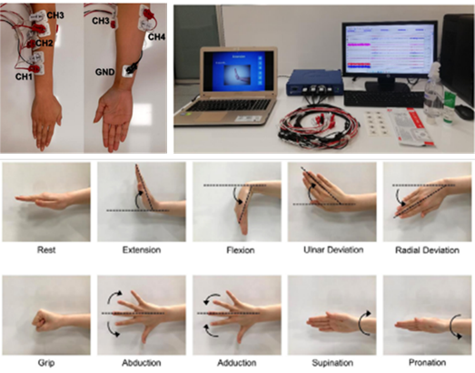
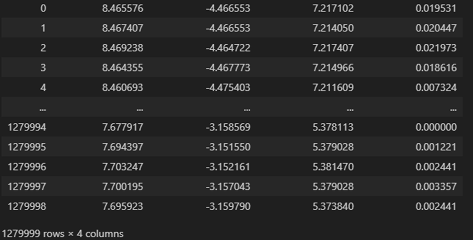
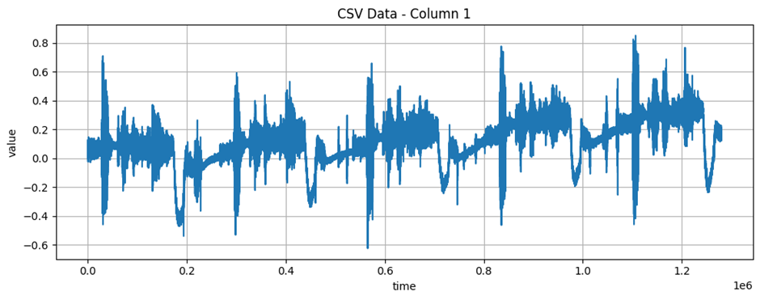

# MCS

# 1. Dataset Information

MCS(Multi-Channel Surface Electromyography) 데이터셋은 Izmir Katip Celebi University 및 Izmir University of Economics에서 수집한 다채널 표면 근전도(sEMG) 신호 데이터셋이다. 본 데이터셋은 손 동작 인식 및 근전도 기반 인간-컴퓨터 인터페이스(HCI) 연구를 목적으로 실험실 환경에서 수집되었으며, BIOPAC MP36 시스템을 사용하여 40명의 참가자로부터 데이터를 측정하였다. 데이터는 자유롭게 활용 가능하다.

# 2. Dataset Basic Information

## 2.1 Data information

이 데이터셋은 40명의 참가자가 총 10가지의 손동작을 5회씩 반복 측정한 데이터이다. 각 동작의 신호는 6초 지속되며 각 반복간 4초 휴식시간이 포함된다. (2000Hz의 sampling frequency를 가지고 있음)

![**그림 21.** 데이터셋 수집 프로토콜 [^45]](mcs/image-1.png)

| **Channel** | **Sampling frequency** | **Recording duration** | **File format** |
| --- | --- | --- | --- |
| 4 | 2000Hz | 640second | .csv .mat |

## 2.2 Data Statistics

| Mark | Label distribution |
| --- | --- |
| Neutral | 10% |
| Wrist Extension | 10% |
| Wrist Flexion | 10% |
| Ulnar Deviation | 10% |
| Radial Deviation | 10% |
| Grip | 10% |
| Finger Abduction | 10% |
| Finger Adduction | 10% |
| Supination | 10% |
| Pronation | 10% |

## 2.3 Raw Dataset

각 subject별로 4개 channels의 emg신호를 시간순서로 제공하고 있다. 모든 손동작별 분포가 같기 때문에 전체 데이터수를 알면 해당 신호가 어느 손동작의 신호인지 쉽게 알 수 있다.

## 2.4 Raw dataset Example

# 3. References