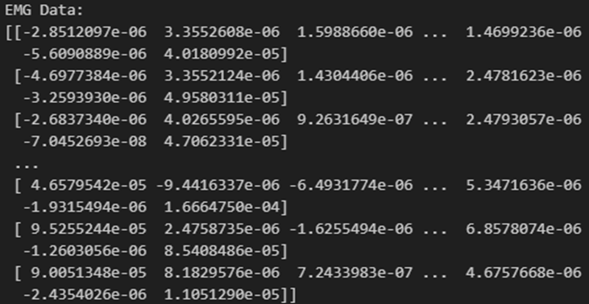
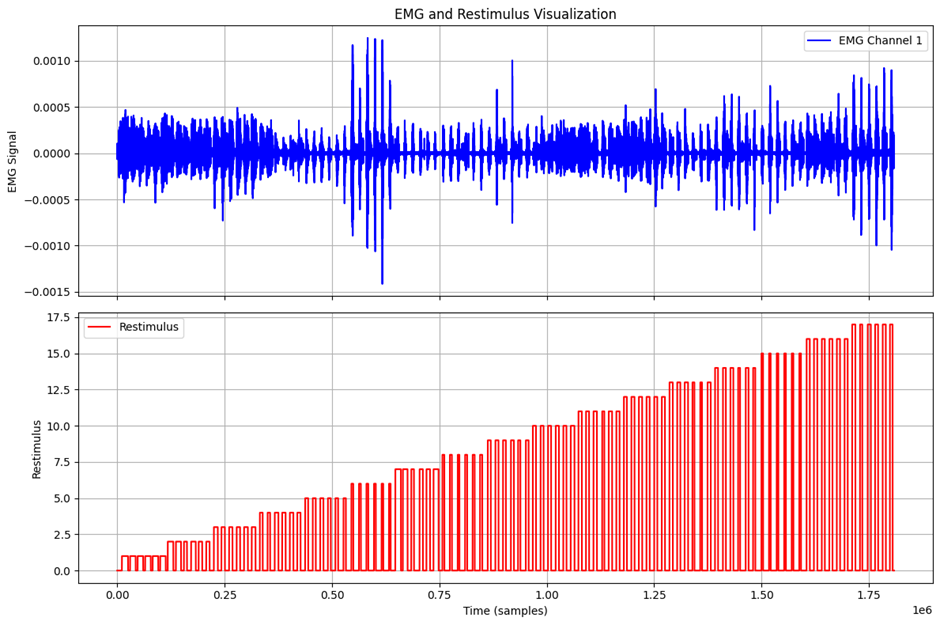

# 1. Dataset Information

Ninapro (Non-Invasive Adaptive Prosthetics) 데이터셋은 근전도신호를 활용한 의수 제어 및 제스처 인식 연구를 위해 수집된 대규모 공개 데이터셋이다. Ninapro 데이터셋은 현재 DB1 부터 DB10까지 여러 버전으로 확장되었으며, 각 데이터셋은 서로 다른 실험 프로토콜과 참가자 그룹을 기반으로 구성되어 있다. 이 데이터셋은 로봇 의수, 인간-컴퓨터 인터페이스, 생체신호 처리 및 머신러닝 연구에 널리 활용되고 있다.

# 2. Dataset Basic Information

## 2.1 Data Information

Ninapro DB (DB 6,8 제외)는 기본적으로 모두 같은 운동 제스쳐들을 바탕으로 기록되었다. 각 DB들은 크게 EMG측정센서종류, 운동 제스처들의 그룹, 피험자 들의 차이를 가지고 있다.

| **List** | **Channel** | **Sampling frequency** | **Subjects** | **Number of classes** | **EMG Sensor** |
| --- | --- | --- | --- | --- | --- |
| DB1 | 10 | 100Hz | 27 intact person | 53 | 10 Otto Bock MyoBock 13E200 electrode |
| DB2 | 12 | 2000Hz | 40 intact person | 50 | 12 Delsys Trigno electrodes |
| DB3 | 12 | 2000Hz | 11 transradial amputees | 50 | 12 Delsys Trigno electrodes |
| DB4 | 12 | 2000Hz | 10 intact Person | 53 | 12 Cometa electrodes |
| DB5 | 16 | 200Hz | 10 intact person | 53 | Two Thalmic Myo Armbands |
| DB6 | 16 | 2000Hz | 10 intact person | 7 | 4 Delsys Trigno double differential sEmg Wireless electrodes |
| DB7 | 12 | 2000Hz | 20 intact person,  2 amputees | 41 | Delsys Trigno IM Wireless EMG system |
| DB8 | 16 | 2000Hz | 10 intact person,  2 amputees | 40 | Delsys Trigno IM Wireless EMG system |

## 2.2 Data Statistics

Ninapro 데이터에서 참가자들은 정해진 움직임을 수행하며 각각의 동작이 5~10초 동안 유지된다. 참가자의 손, 손가락, 팔움직임들은 영상으로 기록되어 데이터 검증에 활용된다. Ninapro 데이터셋은 머신러닝 및 로보틱스 연구에서 광범위하게 활용된다.

| **Label** | **Explanation** |
| --- | --- |
| Subject | Subject number |
| Exercise | Exercise number |
| Emg | sEMG signal. |
| Acc | Three-axes accelerometers |
| Glove | Uncalibrated signal from the 22 sensors of the cyberglove |
| Stimulus | The movement repeated by the subject |
| Restimulus | Again the movement repeated by the subject,  but with the duration of the movement label refined a-posteriori in order to better correspond to the real movement. |
| Repetition | Repetition of the stimulus |
| Rerepetition | Repetition of restimulus (Manual label by professional clinic) |
| Force | force recorded during the third exercise |
| Forcecal | the force sensors calibration values, corresponding to the minimal and the maximal force. |

## 2.3 Raw Dataset

대부분의 Ninapro DB를 활용한 머신러닝 논문들은 Ninapro DB2를 가장 많이 채택하였고 주로 EMG와 Restimulus 두가지 key들을 활용하였다. 보여지는 데이터는 Ninapro DB2에서 Subject01의 데이터에서 EMG와 Restimulus를 채택하여 시각화하여 나타낸 것이다.

## 2.4 Raw dataset Example

# 3. References

[1] Zhang, W., Zhao, T., Zhang, J., & Wang, Y. (2023). LST-EMG-Net: Long short-term transformer feature fusion network for sEMG gesture recognition. Frontiers in Neurorobotics, 17, 1127338.
[2] Zabihi, S., Rahimian, E., Asif, A., & Mohammadi, A. TraHGR: Transformer for Hand Gesture Recognition via ElectroMyography. arXiv 2022. arXiv preprint arXiv:2203.16336.
[3] Godoy, R. V., Lahr, G. J., Dwivedi, A., Reis, T. J., Polegato, P. H., Becker, M., ... & Liarokapis, M. (2022). Electromyography-based, robust hand motion classification employing temporal multi-channel vision transformers. IEEE Robotics and Automation Letters, 7(4), 10200-10207.
[4] Rahimian, E., Zabihi, S., Asif, A., Farina, D., Atashzar, S. F., & Mohammadi, A. (2021). Temgnet: Deep transformer-based decoding of upperlimb semg for hand gestures recognition. arXiv preprint arXiv:2109.12379.
separation. IEEE Journal of Biomedical and Health Informatics, 28(1), 181-192.
[5] Wang, K. C., Liu, K. C., Yeh, P. C., Peng, S. Y., & Tsao, Y. (2024). TrustEMG-Net: Using Representation-Masking Transformer with U-Net for Surface Electromyography Enhancement. IEEE Journal of Biomedical and Health Informatics.
[6] Wang, Z., Yao, J., Xu, M., Jiang, M., & Su, J. (2024). Transformer-based network with temporal depthwise convolutions for sEMG recognition. Pattern Recognition, 145, 109967.
[7] Liu, Y., Li, X., Yang, L., & Yu, H. (2024). A transformer-based gesture prediction model via sEMG sensor for human-robot interaction. IEEE Transactions on Instrumentation and Measurement.
[8] Moslhi, A., Aly, H. H., & ElMessiery, M. (2023). Constructing an image vision transformer for recognizing hand gestures using surface electromyography signals.
