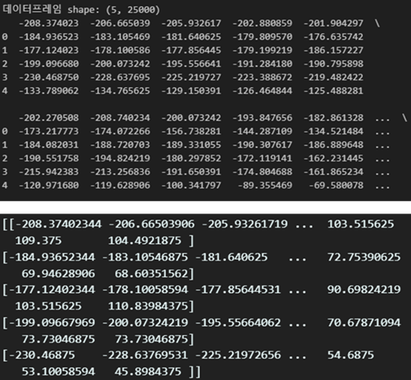
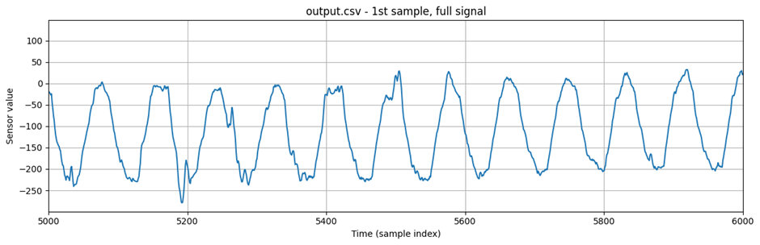

# PME4

# 1. Dataset Information

ME4 데이터셋은 오디오(Audio), 비디오(Video), 뇌파(EEG), 근전도(EMG) 신호를 포함한 다중 모달 감정 인식 연구를 위해 City College of New York (CUNY)에서 수집되었다. 연구 목적은 다양한 생리학적 및 비생리학적 신호를 활용한 감정 인식 성능 비교 및 최적화이다.

# 2. Dataset Basic Information

## 2.1 Data information

이 데이터셋은 11명의 연기자가 7가지 감정을 연기하면서 생리 신호를 기록한 데이터이다. 실험은 각 피험자가 5초동안 특정 문장을 발화하면서 감정을 표현할 때 EMG신호를 금도금 전극을 사용하여 측정함으로써 진행되었다. 각 감정표현은 5초 동안 지속했고 감정 간 1초의 간격을 포함하여 데이터 샘플 간 간섭을 최소화했다.

| **Channel** | **Sampling frequency** | **Recording duration** | **File format** |
| --- | --- | --- | --- |
| 6 | 600Hz | 7 hours 32 minutes | .adc .txt |

## 2.2 Data Statistics

| **Label** | **Description (main target muscle)** | **# of recording** |
| --- | --- | --- |
| Happiness | 행복, (Zygomaticus) | 14.3% |
| Sadness | 슬픔, (Corrugator supercilia) | 14.3% |
| Anger | 분노, (Depressor anguli oris) | 14.1% |
| Fear | 공포, (Orbicularis oculi) | 14.3% |
| Surprise | 놀람, (Frontalis) | 14.2% |
| Disgust | 역겨움 (Leavator labii superioris) | 14.4% |
| Neutral | 중립 (Weak EMG) | 14.4% |

## 2.3 Raw Dataset

## 2.4 Raw dataset Example

# 3. References