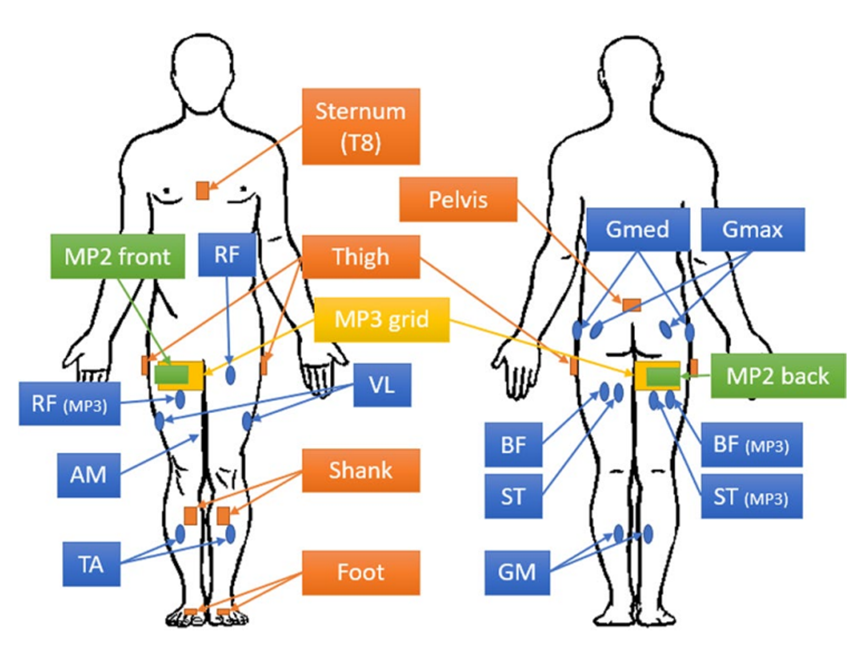
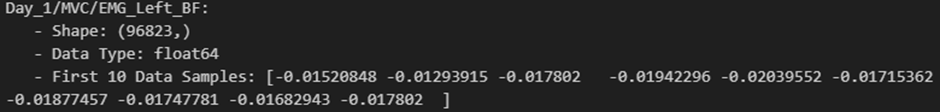
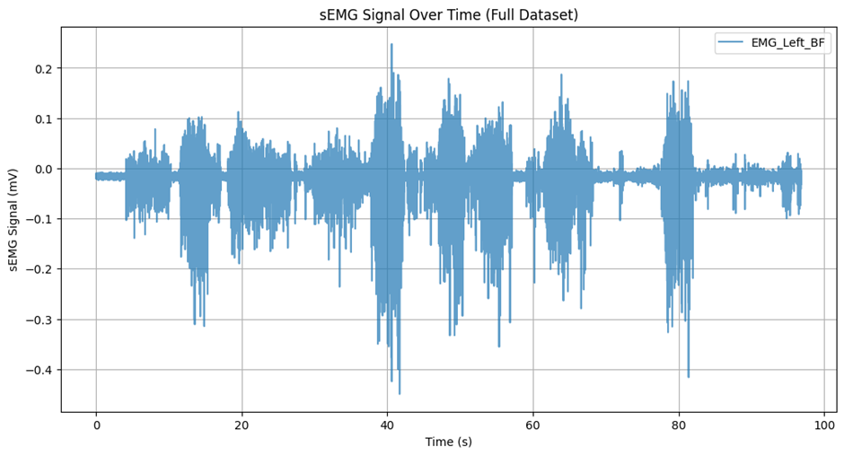

# R. V. Schulte. et al

# 1. Dataset Information

이 데이터셋은 보행 관련 활동 데이터셋으로 Roessingh Research & Development 및 University of Twente(네덜란드)에서 수집되었다. 이 데이터셋의 목적은 전기근육신호를 이용한 하위 사지의 데이터 기반 intent recognition 전략 및 활동 예측 전략에 대한 연구를 촉진하는 것이며 또한 하위 사지에서의 다중 배열 표면 근전도 연구 및 개발을 장려하는 것이다. 해당 데이터는 공개된 데이터이다.

# 2. Dataset Basic Information

## 2.1 Data information

이 데이터는 55명의 건강한 피험자가 85개의 실험세션에서 다양한 보행 및 이동활동을 수행하는 동안 데이터가 기록되었다. 실험에서는 8개의 Delsys Trigno, Cometa Wave의 Bipolar sEMG 전극과 2채널의 Sessantaquattro 시스템 다중 배열 sEMG가 사용되었다. 각 실험은 또한 MyPredict1,2,3 총 3가지의 실험조건으로 나뉘어서 진행되었다.

MyPredict 1 = 10명 대상, 8채널의 Bipolar sEMG 전극 사용

MyPredict 2 = 35명 대상, 2 채널의 다중 배열 sEMG 전극 사용(4x8, 간격 10mm)

MyPredict3 = 10aud 대상, 8채널의 Bipolar sEMG전극, 다중 배열 전극 모두 사용(4x16, 간격 20mm)

| **Channel** | **Sampling Frequency** | **Recording Duration** | **File Format** |
| --- | --- | --- | --- |
| 8+2 | 1000 / 2000 Hz
 | 1.5 minutes, 85trials | .MAT |

## 2.2 Data Statistics

| **Mark** | **#recording** | **Key features** |
| --- | --- | --- |
| Sitting | 85 | 착석 동작 포함 |
| Standing | 85 | 정지 상태 |
| Level Walking | 85 | 실내, 실외 모두 포함 |
| Ramp Ascent | 85 | 10°~15° 경사 |
| Ramp Descent | 85 | 10°~15° 경사 |
| Stair Ascent | 85 | 계단 높이 17~20cm |
| Stair Descent | 85 | 계단 높이 17~20cm |
| Uneven space walking | 85 | 자갈, 잔디, 요철 |
| Confined space walking | 85 | 작은 공간에서 다양한 방향 |

## 2.3 Raw Dataset

각 데이터는 보행 활동 종류 별로 분류되어 있으며, 반복 횟수, 각 전극이 부착된 근육별로 EMG 신호가 나뉘어져 있다. Subject01_Walking.h5의 경우 1번째 subject의 Walking EMG Data를 담고 있다.

## 2.4 Raw dataset Example

Subject01_Walking.h5의 데이터에서 Day_1_MVC_EMG_LEFT_BF의 데이터를 시각화한 예시이다.

# 3. References

R. V. Schulte et al., “Database of lower limb kinematics and electromyography during gait related activities in able-bodied subjects,” Scientific Data, vol. 10, no. 1, Jul. 2023. doi:10.1038/s41597-023-02341-6