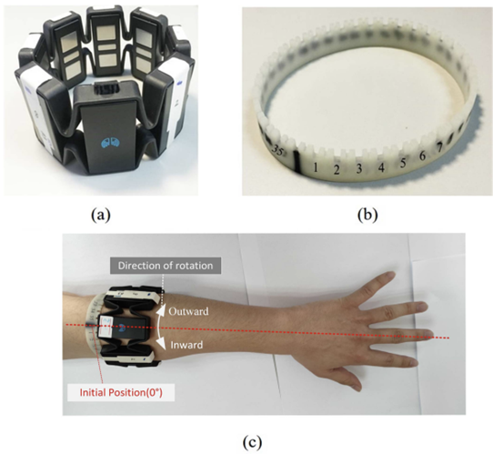
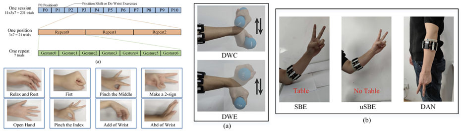
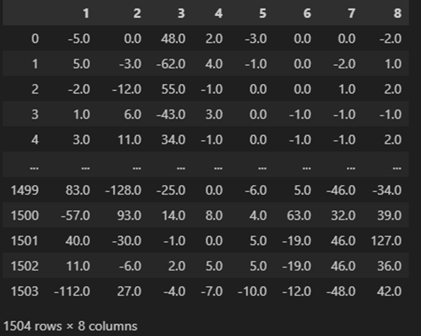
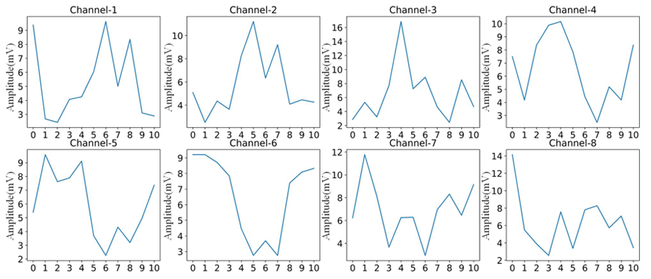

# 1. Dataset Information

SeNic 데이터셋은 sEMG(표면 근전도)를 기반으로 한 제스처 인식 연구를 위한 공개 벤치마크 데이터셋이다. 중국 선양 자동화 연구소(Shenyang Institute of Automation)에서 수집되었으며, 비이상적인 환경에서의 인간-기계 상호작용(HMI) 개선을 목표로 한다. 데이터는 다양한 환경 요인을 고려하여 실험이 설계되었다. 또한 연구 및 개발 목적으로 자유롭게 활용할 수 있다.

# 2. Dataset Basic Information

## 2.1 Data information

36명의 피험자를 대상으로 팔뚝의 11개의 서로 다른 전극 위치, 개별 차이, 근육 피로, 날짜 간 차이, 팔 자세 변화 등 다양한 조건을 반영하여 진행되었다. 모든 제스처는 6~9초 동안 각 제스처별로 3회씩 측정되었다. 각 세션 사이에는, 근육의 피로도를 가중시키기 위해, 1kg 덤벨을 쥐고 손목운동을 10회 수행 후 다음 세션의 손동작 데이터 수집을 수행하였음.

| **Channel** | **Sampling frequency** | **Recording duration** | **File format** |
| --- | --- | --- | --- |
| 8 | 200Hz | 6~9 seconds | .csv (EMG) |

## 2.2 Data Statistics

| **Label** | **Description** | **# of recording** |
| --- | --- | --- |
| Rest | 팔 근육 활동 없음 | 12.5% |
| Fist | 손가락 및 손목 근육의 강한 활성화 | 12.5% |
| Pinch the middle | 중지와 엄지를 사용하여 집기 | 12.5% |
| Make a 2-sign | 검지와 중지를 V모양으로 펼치고 나머지 손가락 접기 | 12.5% |
| Open hand | 손가락을 모두 펼치고 이완 | 12.5% |
| Pinch the index | 검지와 엄지를 사용하는 손가락 제스처 | 12.5% |
| Wrist adduction | 손목을 안쪽으로 움직이기 | 12.5% |
| Wrist abduction | 손목을 바깥쪽으로 움직이기 | 12.5% |

## 2.3 Raw Dataset

36명의 피험자를 대상으로 팔뚝의 11개의 서로 다른 전극 위치, 개별 차이, 근육 피로, 날짜 간 차이, 팔 자세 변화 등 다양한 조건을 반영하여 진행되었다. 모든 제스처는 6~9초 동안 각 제스처별로 3회씩 측정되었다. 각 subject/class명/각도 별로 정리되어 있으며, 각 channel별 EMG신호만을 데이터에 담고 있다.

## 2.4 Raw dataset Example

# 3. References
