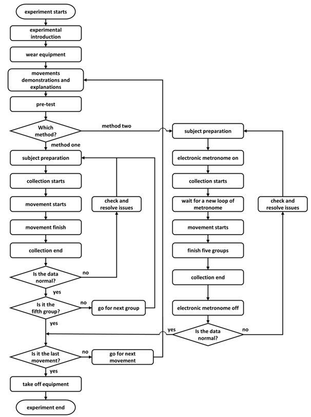
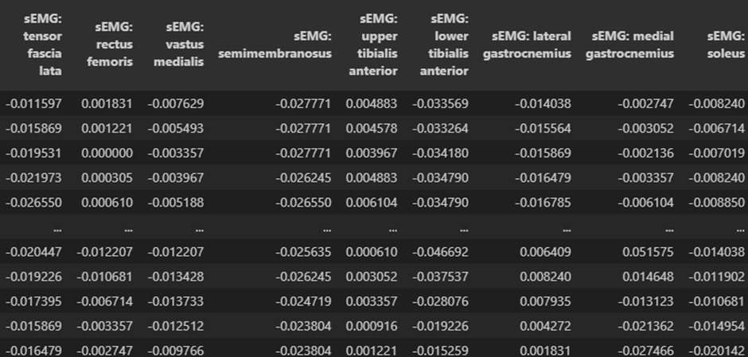
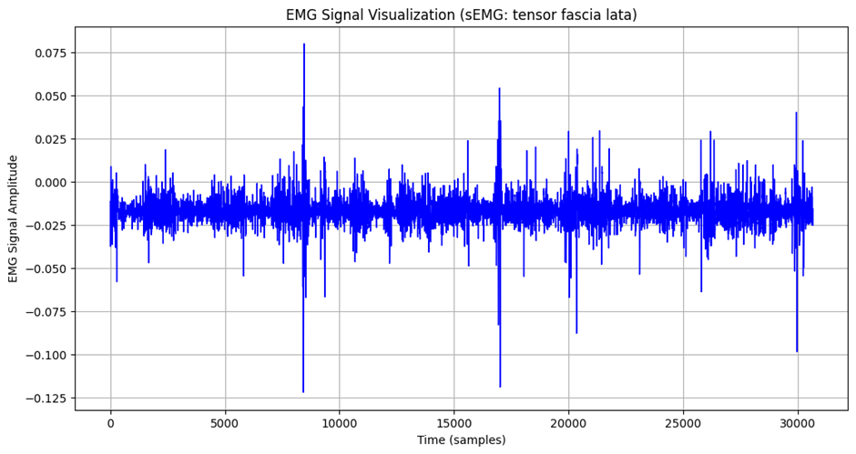

# 1. Dataset Information

이 데이터셋은 Shenzhen Institute of Advanced Technology Lower Limb Motion Dataset으로 하지 운동 데이터를 제공하는 공개 데이터셋이다. 본 연구의 목적은 보행 및 하지 움직임을 정량적으로 분석하고, 보행 보조기기, 재활 로봇, 운동 의수/의족, 신경기계 인터페이스 연구를 지원하며 또한 데이터를 통해 운동 의도 예측 및 보행 패턴 분석을 위한 새로운 알고리즘 개발 가능성 분석이다.

# 2. Dataset Basic Information

## 2.1 Data information

이 데이터셋은 40명의 비환자 피험자들을 대상으로 16가지 하지운동으로 진행된 실험의 데이터를 담고 있다. 각 데이터는 지면반력 및 운동학 데이터를 이용해 보정되었으며 총 9채널의 Delsys 무선 sEMG 전극을 사용하여 측정되었다.

| **Channels** | **Sampling Frequency** | **Recording Duration** | **File Format** |
| --- | --- | --- | --- |
| 9 | 1926 Hz | 90 ~ 140 minutes | csvt |

SIAT-LLMD의 데이터 획득 실험 과정 순서도

## 2.2 Data Statistics

| Mark | #recording |
| --- | --- |
| Walking, WAK | 10 trials |
| Upstairs, UPS | 10 trials |
| Downstairs, DNS | 10 trials |
| 기타 하지 운동 | 5~10 trials |

기타 하지운동에는 13가지의 활동이 포함된다

Standing : 정지

Sitting, Standing up, Knee Lift, Tip Toe, Leg Lift Forward, Leg Lift Backward, Leg Lift Sideward, Heel Strike, Toe-Off, Lunge Forward, Lunge Backward, Maximum Swing Flexion

## 2.3 Raw Dataset

각 데이터 파일은 subject별로 분류되어있으며 한 파일내에 운동데이터와 sEMG데이터가 모두 포함되어있다. sEMG데이터는 전극 부착 근육 종류별로 시간순서대로 나타나있다. 뿐만 아니라 파일 단위로 각 참가자 subject의 실제 사진과 EMG 데이터셋의 시간에 맞게 하지 움직임의 활성 상태와 보행 단계 레이블을 Label로 제공한다.

## 2.4 Raw dataset Example

이 그래프는 Sub01_DNS_DATA.csv에서 sEMG : tensor fascia lata열만 시각화한 그래프이다. Sub01은 1번째 subject, DNS는 Downstair 행동을 나타낸다.

# 3. References

Wei, W., Tan, F., Zhang, H., Mao, H., Fu, M., Samuel, O. W., & Li, G. (2023). Surface electromyogram, kinematic, and kinetic dataset of lower limb walking for movement intent recognition. *Scientific data*, *10*(1), 358. [https://doi.org/10.1038/s41597-023-02263-3](https://doi.org/10.1038/s41597-023-02263-3)
