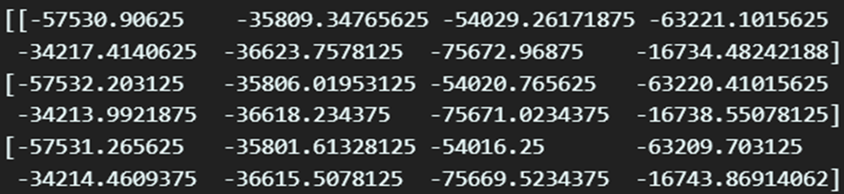
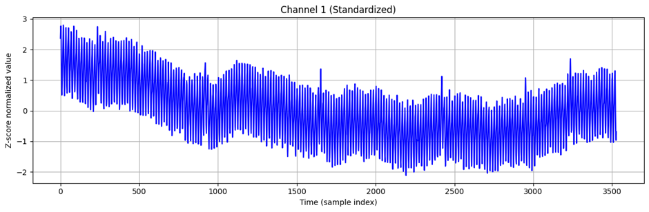

# Silent speech

# 1. Dataset Information

본 데이터셋은 무성 발화(Silent Speech)의 전기 근전도(EMG) 신호를 활용하여 디지털 음성 합성을 연구하기 위해 University of California, Berkeley에서 수집되었다. 연구 목적은 EMG 센서를 활용하여 무성 발화를 감지하고 이를 가청 음성으로 변환하는 것으로, 특히 무성 발화에서의 근전도 신호를 분석하여 보다 높은 정확도의 음성 합성 모델을 개발하는 데 초점을 맞추고 있다

# 2. Dataset Basic Information

## 2.1 Data information

이 데이터셋은 1명의 참가자가 약 20시간동안 다양한 문장들을 발화하면서 EMG 신호를 기록한 것이다. 실험은 두가지 조건(무성 발화, 발성 발화)에서 진행되었으며 각 발화는 텍스트와 함께 제공된다. 또한 각 샘플은 문장 단위로 구분된다.

| **Channel** | **Sampling frequency** | **Recording duration** | **File format** |
| --- | --- | --- | --- |
| 5 | 1000 Hz | 10 seconds | .csv .mat |

## 2.2 Data Statistics

| **Label** | **Description** | **# of recording** |
| --- | --- | --- |
| Positive | 긍정적 감정상태 | 40% |
| Neutral | 중립적 감정상태 | 36% |
| Negative | 부정적 감정상태 | 24% |

## 2.3 Raw Dataset

각 문장의 오디오와 해당 문장을 발화 중에 측정된 emg 데이터셋을 같이 담고있다. 문장 하나 별로 한 개의 데이터셋이 존재한다.

## 2.4 Raw dataset Example

# 3. References