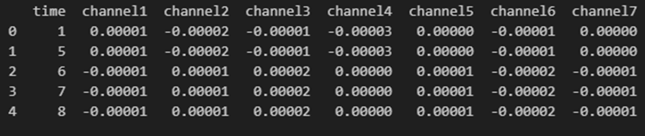
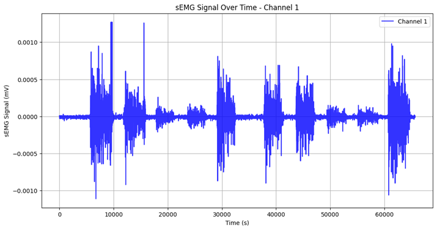

# UCI EMG Data for Gestures

# 1. Dataset Information

이 데이터셋은 Myo Thalmic 손목 밴드를 사용하여 36명의 피험자로부터 측정한 EMG 신호 데이터를 포함하고 있다. Myo Thalmic 손목 밴드는 사용자의 팔뚝에 착용되며 8개의 센서가 고르게 배치되어 동시에 근전도 신호가 측정되었다. 피험자들은 정적 손동작을 수행하는 동안 신호가 기록되었다. 실험은 두 개의 세트로 구성되며, 각 세트는 6개, 7개의 기본 손동작으로 이루어졌다. 각 손동작은 3초 동안 유지되었으며 다음 동작 전 3초간의 휴식이 포함되었다.

# 2. Dataset Basic Information

## 2.1 Data information

총 36명의 피험자가 참여하였고 8개의 센서를 통해 팔뚝의 근전도 신호를 동시 측정하여 저장되었습니다. Extended palm의 경우 모든 subject들에 의해 실험이 진행되지는 않았다.

| Channel | Sampling Frequency | Recording Duration | File Format |
| --- | --- | --- | --- |
| 8 | 250Hz | 3. seconds | .txt |

## 2.2 Data Statistics

| Mark | # recordings |
| --- | --- |
| 0.     Unmarked | 65 ± 5% |
| 1.     Hand at rest | 5 ± 2.5% |
| 2.     Hand clenched in a fist | 5 ± 2.5% |
| 3.     Wrist flexion | 5 ± 2.5% |
| 4.     Wrist extension | 5 ± 2.5% |
| 5.     Radial deviations | 5 ± 2.5% |
| 6.     Ulnar deviations | 5 ± 2.5% |

## 2.3 Raw Dataset

텍스트파일로 저장되어 있으며, emg 신호는 시간순서로 기록되어있다. 또한 10번째 열의 class열을 통해 어떤 동작 진행중에 측정된 신호인지 확인 가능하다.

## 2.4 Raw dataset Example

# 3. References