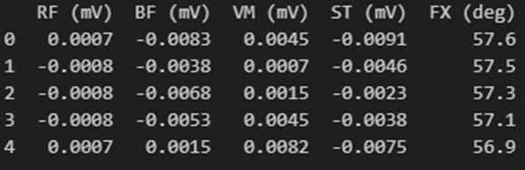
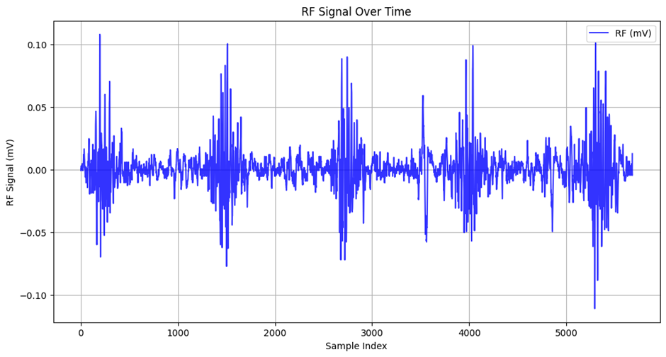

# UCI EMG dataset in lower limb

# 1. Dataset Information

이 데이터셋은 공개 데이터셋으로 22명의 피험자를 대상으로 4 채널의 Biometrics사의  MWX8 Datalog 센서와 1개의 관절각 센서를 사용하여 측정되었다. 11명의 비환자와 11명의 무릎 이상이 진단된 피험자로 이루어졌으며 이들은 무릎 근육의 움직임 분석을 위해 실험에 참가하였다.

# 2. Dataset Basic Information

## 2.1 Data information

데이터 획득 과정에서는 4개의 근전도 전극이 내측광근, 반힘줄근, 대퇴이두근, 대퇴직근에 사용되었다.

| **Channels** | **Sampling Frequency** | **Recording Duration** | **File Format** |
| --- | --- | --- | --- |
| 4 | 1000 Hz
 | 5 trials | .txt |

## 2.2 Data Statistics

| **Mark** | **#recording** |
| --- | --- |
| Gait | 5 |
| Leg extension from a sitting position | 5 |
| Flexion of the leg up | 5 |

## 2.3 Raw Dataset

각 데이터 파일은 5개의 열로 구성되며 5개의 채널로 이루어져있다. 1~4 채널은 근육의 EMG신호를 담고있고 5번째 채널은 무릎관절의 각도를 다루고 있다.

## 2.4 Raw dataset Example

# 3. References