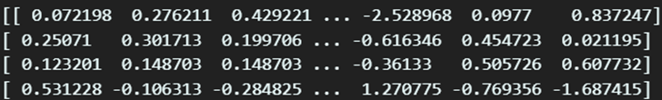
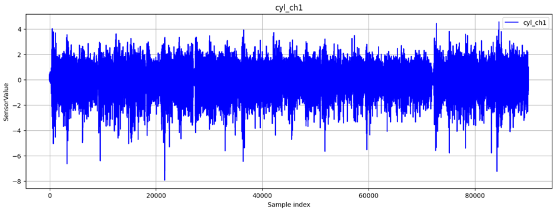

# 1. Datset Information

이 데이터셋은 기본 손움직임을 위한 sEMG 데이터로 Delsys의 EMG 시스템을 사용하여 수집된 표면 근전도 신호 데이터베이스 2개로 구성되어 있다. 건강한 피험자들이 일상에서 사용하는 6가지 손 동작을 수행하면서 데이터를 기록하였다

# 2. Dataset Basic Information

## 2.1 Data Information

본 데이터셋은 다음과 같은 특징을 가진다. 데이터셋은 6개의 손동작이 각각 30회씩 측정되었고, 각 측정은 6초간 지속되었다.

| **Channel** | **Sampling frequency** | **Recording duration** | **File format** |
| --- | --- | --- | --- |
| 2 | 500Hz | 6 seconds | .mat |

## 2.2 Data Statistics

### Label

| CyrindaricalGrasp | Tip | Hookorsnap | Palmar | Spherical | Lateral |
| --- | --- | --- | --- | --- | --- |

## 2.3 Raw Dataset

각 subject별로 파일이 존재하며 파일 내에는 행동별 전극부착위치의 EMG신호가 시간순으로 나타나있다.

## 2.4 Raw dataset Example

# 3. References
